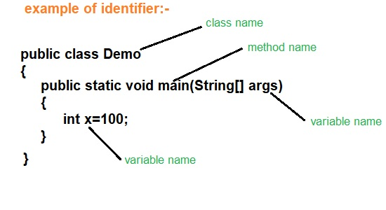

## Identifiers in Java
An identifier is a sequence of one or more characters. Identifiers are programmer-designed tokens. They are used for naming classes, methods, variables, objects, labels, packages and interfaces in a program. Java identifiers follow the following rules:

- They can have alphabets, digits, and the underscore and dollar sign characters.
- They must not begin with a digit.
- Uppercase and lowercase letters are distinct.
- They can be of any length.

## Conventions for Identifier
- Identifier must he meaningful, short enough to be quickly and easil typed and long enough to he descriptive and easily read. Java developers have followed some naming conventions.
- Names of all public methods and instance variables start with a leading lowercase letter,
   - Examples: average , sum
- When more than one word are used in a name, the second and subsequent words are marked with a leading uppercase letters.
   - Examples: dayTemperature , firstDayOfMonth, totalMarks
- All private and local variables use only lowercase letters combined with underscores,
   - Examples: length,batch_strength
- All classes and interfaces start with a leading uppercase letter(and each subsequent word with a leading uppercase letter).
   - Examples: Student, HelloJava, Vehicle, MotorCycle
- Variables that represent constant values use all uppercase letters and underscores between words.
   - Examples: TOTAL, F_MAX, PRINCIPAL_AMOUNT
- They are like symbolic constants in C. All these are conventions and not rules.
- User may follow our own conventions as long as we do not break the basic rules of naming identifiers.