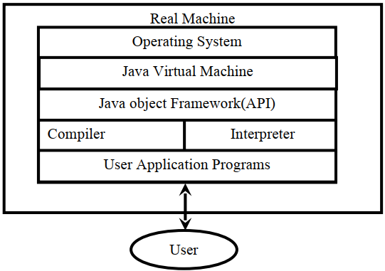
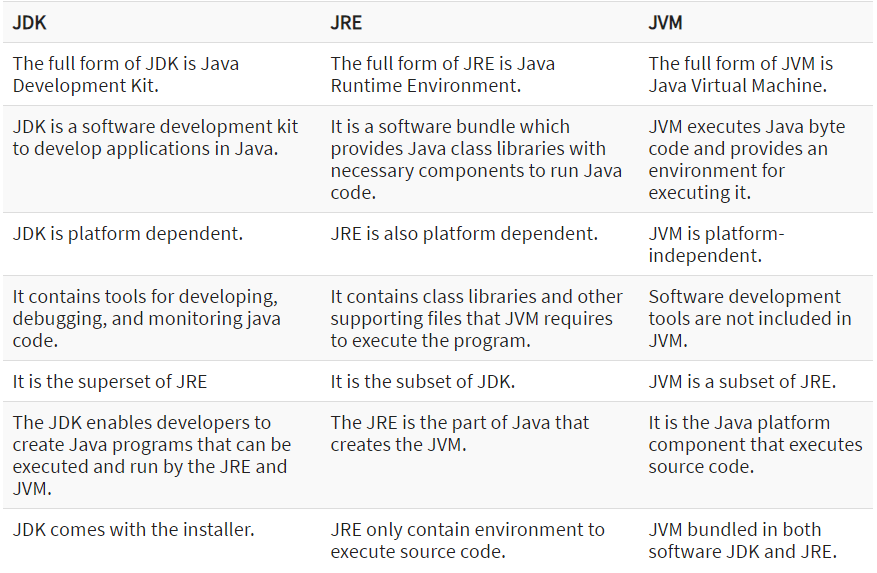

## Java Development Kit
JDK is abbreviation for Java Development Kit which includes all the tools, executable and binaries required to compile, debug and execute a Java Program. JDK is platform dependent i.e there is separate installers for Windows, Mac, and Unix systems. JDK includes both JVM and JRE and is entirely responsible for code execution. It is the version of JDK which represent version of Java.

- It contains tools required to write Java programs, and JRE to execute them.
- It includes a compiler, Java application launcher, Applet viewer, etc.
- Compiler converts code written in Java into byte code.
- Java application launcher opens a JRE, loads the necessary class, and executes its main method.
- It enables you to handle multiple extensions in a single catch block.
- JDK includes all features that JRE has.
- It contains development tools such as a compiler, debugger, etc.
- JDK provides the environment to develop and execute Java source code.
- It can be installed on Windows, Unix, and Mac operating systems.
- Diamond operator can be used in specifying a generic type interface instead of writing the exact one.

## Java Runtime Environment
- JRE is Java runtime environment which is the implementation of JVM i.e the specifications which are defined in JVM are implemented and creates corresponding environment for the execution of code. JRE comprises mainly java binaries and other classes to execute the program alike of JVM it physically exists.
- JRE contains class libraries, JVM, and other supporting files. It does not contain any tool for Java development like a debugger, compiler, etc.
- It uses important package classes like math, swing etc, util, lang, awt, and runtime libraries.
- If you have to run Java applets, then JRE must be installed in your system.
- Java Runtime Environment is a set of tools using which the JVM actually runs.
- It contains deployment technology, including Java Web Start and Java Plug-in.
- Developers can easily run the source code in JRE, but he/she cannot write and compile the Java program.
- It includes integration libraries like Java Database Connectivity (JDBC), Remote Method Invocation (RMI), Java Naming and Directory Interface (JNDI), and more.
- JRE has JVM and Java HotSpot virtual machine client.

## Java Virtual Machine
- Compilers translate source code into machine code for a specific computer. Java compiler also does the same. Java compiler produces an intermediate code known as bytecode for a machine that does not exist. This machine is called the Java Virtual Machine and it exists only inside the computer memory. It is a simulated computer within the computer and does all major functions of a real computer.

- The virtual machine code is not machine specific. The machine specific code (known as machine code) is generated by the Java interpreter by acting as an intermediary between the virtual machine and the real machine.
- The interpreter  is different for different machines. It enables you to run applications in a cloud environment or in your device.
- Java Virtual Machine converts byte code to the machine-specific code.
- It provides basic java functions like memory management, security, garbage collection, and more.
- JVM runs the program by using libraries and files given by Java Runtime Environment.
- JDK and JRE both contain Java Virtual Machine. It can execute the java program line by line hence it is also called as interpreter.
- JVM is easily customizable for example, you can allocate minimum and maximum memory to it.
- It is independent from hardware and the operating system. So, you can write a java program once and run anywhere.

## Difference Among JDK, JRE and JVM difference
