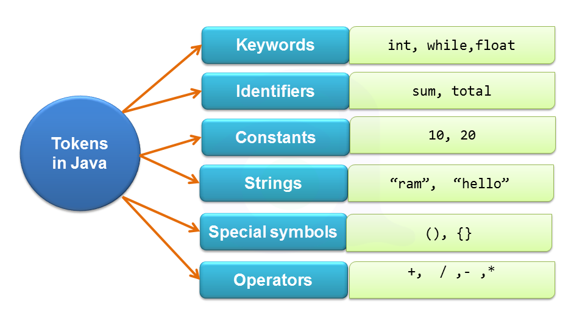

## Token in Java
A Java program is basically a collection of classes. A class is defined by a set of declaration statements and methods containing executable statements. Smallest individual units in a program are known as tokens. Most of the statements contain expressions, which describe the actions carried out on data.

- Token is basically smallest element that can identified by the compiler. Java expressions and statements are constructed using java tokens.
- A java program is basically made up of different types of tokens that can either be a keyword, an identifier, a constant, a string literal, or a symbol.
- The compiler recognizes them for building up expressions and statements.
- In simple terms, a Java program is a collection of tokens, comments and white spaces. Java language includes five types of tokens. token

## Reserved Keywords
- The keywords, combined with operators and separators according to a syntax, form definition of the Java language.
- Since keywords have specific meaning in Java, we cannot use them as names for variables, classes, methods and so on.
## Identifiers
- Identifier is basically used as variable names such as sum, total etc.
## Constants
- Constants are expressions with a immutable value.
## Operators
- Separator is a token used to separate two individual tokens used in a java program. Separators are also knows as punctuators. In Java, we have the brace { and }, parenthesis ( and ), and brackets [ and ], comma (,), semicolon (;), asterisk (*), colon (:), number sign #(hash) as punctuators.
## Separators
- An operator is symbol that represents a specific mathematical or non-mathematical operation.