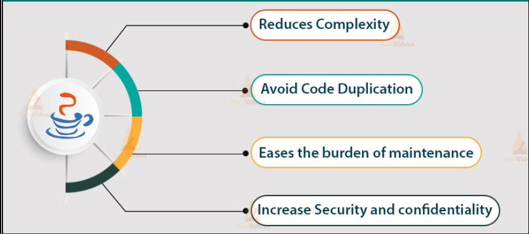

## Abstraction in Java
Abstraction refers to the representation of essential features without including background details or explanations. Classes use the concept of abstraction and are defined as a list of abstract attributes such as size, cost, etc. It avoids undesired side effects of the member data when it is defined out of the class and also protects the intentional misuse of important data. Classes efficiently manage the complexity of large programs through encapsulation.

- Abstraction is a process of hiding the implementation details and showing only functionality to the user.
- It shows only important things to the user and hides the internal details for example sending sms, you just type the text and send the message.
- You don’t know the internal processing about the message delivery.
- Abstraction lets you focus on what the object does instead of how it does it.
- There are two ways to achieve abstraction in java are Abstract class (0-100%) and Interface (100%).

## Abstract Class in Java
- A class that is declared using “abstract” keyword is known as abstract class.
- It can have abstract methods (methods without body) as well as concrete methods (regular methods with body).
- A normal class (non-abstract class) cannot have abstract methods.
- An abstract class cannot be instantiated, which means you are not allowed to create an object of it.
- If a class contain any abstract method then the class is declared as abstract class. It is used to provide abstraction.
- Although it does not provide 100% abstraction because it can also have concrete method.

~~~
Syntax: abstract class class_name { }.
~~~
## Abstract Method
- Method that are declared without any body within an abstract class are called abstract method.
- The method body will be defined by its subclass.
- Abstract method can never be final and static.
- Any class that extends an abstract class must implement all the abstract methods declared by the super class.
~~~
Syntax: abstract return_type function_name (); //No definition
~~~
## Example-1: Write a Java program to implement the scenario that object can not initiated in abstract class.
~~~js
//Write a Java program to implement the scenario that object can not initiated in abstract class.
  abstract class Funycode{
    public static void main(String ar[]) {
      Funycode funycode=new Funycode();// Compile time error
     }
    }
~~~
~~~
Output:
Compile time error.
~~~
## Example-2: Write a Java program to implement the scenario that  abstract class may have abstract method.
~~~js
//Write a Java program to implement the scenario that  abstract class may have abstract method.
  abstract class Demo{
    abstract void show(); //method without implementation
    }

  public class Funycode extends Demo{
    //show method must be implemented here
     void show() {
       System.out.println("I am from abstract show method");
       }
  public static void main(String ar[]) {
    Funycode funycode=new Funycode();
    funycode.show();
    }
   }
~~~
~~~
Output:
I am from abstract show method
~~~
### Example-3: Write a Java program to implement the scenario that  abstract class may have abstract method and normal method.
~~~js
//Write a Java program to implement the scenario that  abstract class may have abstract method and normal method.
  abstract class Demo{
     abstract void show(); //method without implementation
     //normal method in abstract class
     void display() {
        System.out.println("I am from normal display method");
       }
     }
  public class Funycode extends Demo{
  //show method must be implemented here
  void show() {
        System.out.println("I am from abstract show method");
     }
  public static void main(String ar[]) {
    Funycode funycode=new Funycode();
    funycode.show();
    funycode.display();
   }
  }
~~~
~~~
Output:
I am from abstract show method
I am from normal display method
~~~

### Example-4: Write a Java program to illustrate the scenario that abstract class should not compulsory to implement base class abstract method.
~~~js
//Write a Java program to illustrate the scenario that abstract class should not compulsory to implement base class abstract method.
  abstract class Demo{
    abstract void show(); //method without implementation
    //normal method n abstract class
    void display() {
        System.out.println("I am from normal display method");
      }
    }
  abstract class DerivedClass extends Demo{
     //since DerivedClass abstract class, its not compulsory to implement show method here
     }

  public class Funycode extends DerivedClass{
  //show method must be implemented here
     void show() {
        System.out.println("I am from abstract show method");
      }
  public static void main(String ar[]) {
        Funycode funycode=new Funycode();
        funycode.show();
        funycode.display();
       }
    }
~~~
~~~
Output:
I am from abstract show method
I am from normal display method
~~~
### Example-5: Write a Java program to illustrate the scenario of abstraction.
~~~js
//Write a Java program to illustrate the scenario of abstraction.
  abstract class Shape{
     abstract void draw(); //method without implementation
     }

  class Circle extends Shape{
    void draw() {
    System.out.println("Drawing Circle");
    }
   }

  class Rectangle extends Shape{
    void draw() {
        System.out.println("Drawing Rectangle");
     }
    }

  public class Funycode{
    public static void main(String ar[]) {
        Shape sp;
        sp=new Circle();
        sp.draw();
        sp=new Rectangle();
        sp.draw();
      }
    }
~~~
~~~
Output:
Drawing Circle
Drawing Rectangle
~~~