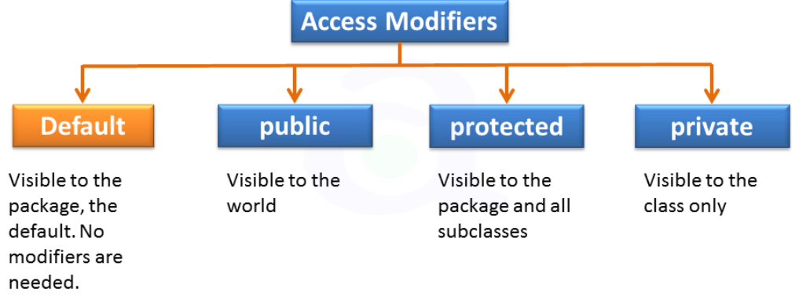
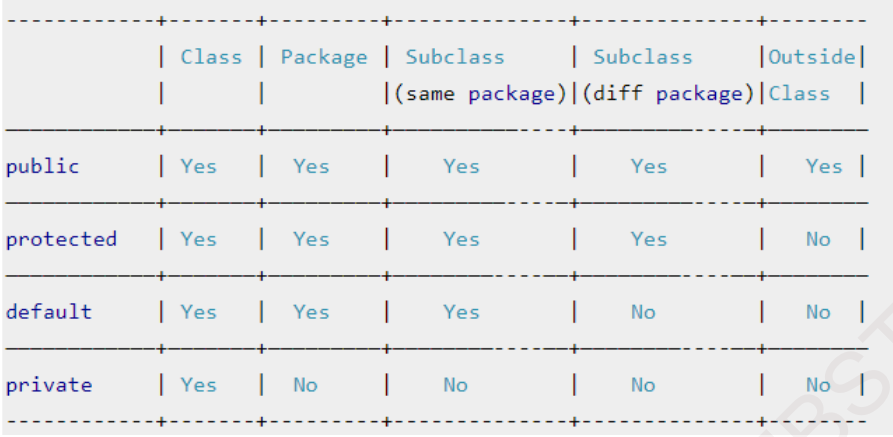

## Access Modifier in Java
Inheritance allow to inherit all the members of a class by a subclass using the keyword extends. Generally variables and methods of a class are visible everywhere in the program. However, it may be necessary in some situations to restrict the access to certain variables and methods from outside the class. We can achieve this in Java by applying visibility modifiers to the instance variables and methods. The visibility modifiers are also known as access modifiers.

- An access modifier restricts the access of a class, constructor, data member and method in another class.
- There are two types of modifiers in java: access modifiers and non-access modifiers.
- The access modifiers in java specifies accessibility (scope) of a data member, method, constructor or class.
- There are many non-access modifiers such as static, abstract, synchronized, native, volatile, transient etc. Here, we will learn access modifiers.
- There are 4 types of java access modifiers
   1. private
   2. default
   3. protected
   4. public
  

## Default Access Modifier
- The default access modifier is specified using the keyword default.
- When we do not mention any access modifier, it is called default access modifier.
- The scope of this modifier is limited to the package only.
- This means that if we have a class with the default access modifier in a package, only those classes that are in this package can access this class.
- No other class outside this package can access this class.
- Similarly, if we have a default method or data member in a class, it would not be visible in the class of another package.

### Example-1: Write a Java program to illustrate default access modifier.
~~~js
//Funycode.java
//Write a Java program to illustrate default access modifier.
  package packagOne;
  class Funycode {
     void show() {
       System.out.println("I am from packageOne");
       }
     }

//MainClass.java
package packageTwo;
import packagOne.Funycode;
  public class MainClass {
     public static void main(String[] args) {
        Funycode funycode=new Funycode(); //Compile time error
        funycode.show(); //compile time error
       }
      }
~~~
~~~
Output:
Compile time error
~~~
- In this example, we have created two packages packageOne and packageTwo.
- We are accessing the Funycode class from outside its package, since Funycode class is not public, so it cannot be accessed from outside the package.
- In the above example, the scope of class Funycode and its method show() is default so it cannot be accessed from outside the package in packageTwo.

## Private Access Modifier
- The private access modifier is specified using the keyword private.
- Private fields have the highest degree of protection. Private Data members and methods are only accessible within the class
- They cannot be inherited by subclasses and therefore not accessible in subclasses. The scope of private modifier is limited to the class only.
- A method declared as private behaves like a method declared as final. It prevents the method from being subclassed.
- We cannot override a non-private method in a subclass and then make it private.
- Class and Interface cannot be declared as private
- If a class has private constructor, then you cannot create the object of that class from outside of the class.
## Example-2: Write a Java program to illustrate private access modifier.
~~~js
//Write a Java program to illustrate private access modifier.
  class Demo{
     private int a=100;
     private void show() {
        System.out.println("I am from show method");
        }
     }

  class Funycode {
     public static void main(String arg[]) {
        Demo funycode=new Demo();
        funycode.a=200; //can not access due to private declaration of a
        funycode.show(); ////can not access due to private declaration of method show
       }
      }
~~~
~~~
Output:
Compile time error
~~~
## Example-3: Write a Java program to illustrate private access modifier in constructor.
~~~js
//Write a Java program to illustrate private access modifier in constructor.
  class Demo{
   private Demo() {
      System.out.println("I am from show method");
      }
   }

  class Funycode {
     public static void main(String arg[]) {
       Demo funycode=new Demo(); //compile time error
      }
     }
~~~
~~~
Output:
Compile time error
Protected Access Modifier
~~~

- The visibility level of a “protected” is between the public access and default access.
- The protected access modifier is specified using the keyword protected.
- The protected access modifier is accessible within package and outside the package but through inheritance only.
- Non-subclasses in other packages cannot access the “protected” members.
- We can also say that the protected access modifier is similar to default access modifier with one exception that it has visibility in sub classes.
- This access modifier is generally used in a parent child relationship.
- The protected access modifier can be applied on the data member, method and constructor.
- It can’t be applied on the class

## Example-4: Write a java program to illustrate protected access modifier.
~~~js
//Funycode.java
//Write a java program to illustrate protected access modifier.
package packagOne;

  public class Funycode {
     protected void show() {
       System.out.println("I am from protected show method");
      }
  public void display() {
       System.out.println("I am from public display method");
       }
     }

//MainClass.java
package packageTwo;
import packagOne.Funycode;

  public class MainClass extends Funycode{
      public static void main(String[] args) {
        MainClass funycode=new MainClass();
        funycode.show(); //can access protected method bcz MainClass inherits Funycode class
        funycode.display();
      }
   }
~~~
~~~
Output:
I am from protected show method
I am from public display method
~~~

## Public Access Modifier
- The public access modifier is specified using the keyword public.
- The members, methods and classes that are declared public can be accessed from anywhere.
- This modifier doesn’t put any restriction on the access.
- It has the widest scope among all other modifiers.

## Private Protected Access
- A field can be declared with two keywords private and protected together like: private protected int codeNumber;
- This gives a visibility level in between the “protected” access and “private” access.
- This modifier makes the fields visible in all subclasses regardless of what package they are in.
- These fields are not accessible by other classes in the same package.

## Java Access Modifiers with Method Overriding
If you are overriding any method, overridden method (i.e. declared in subclass) must not be more restrictive.
The default modifier is more restrictive than protected. That is why there is compile time error.
~~~js
  class Demo{
    protected void show(){
      System.out.println("Hello java");}
    }
  public class Simple extends Demo{
    void show(){
    System.out.println("Hello java");
    }//Compile Error, show method is default here

  public static void main(String args[]){
    Simple obj=new Simple();
    obj.show();
    }
  }
~~~
~~~
Output:
Compile time error
~~~
Comparison Among All Access Modifier
