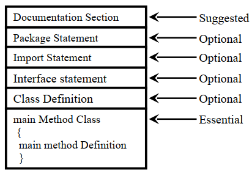
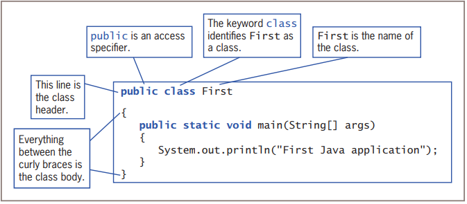
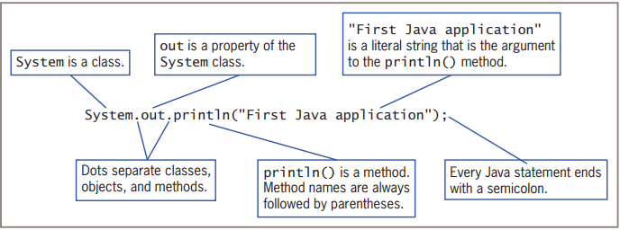

## Structure of Java Program
Classes contain data members and methods that operate on the data members of the class. Methods may contain data type declarations and executable statements. To write a Java program, we first define classes and then put them together.

## Documentation Section
- The documentation section comprises a set of comment lines giving the name of the program, the author and other details, which the programmer would like to refer to at a later stage.
- Comments must explain why and what of classes and how of algorithms. This would greatly help in maintaining the program.
- Java also uses a third style of comment // known as documentation comment.
- This form of comment is used for generating documentation automatically.
## Package Statement
- The first statement allowed in a Java file is a package statement.
- This statement declares a package name and informs the compiler that the classes defined here belong to this package. Example package student;
- The package statement is optional. That is, our classes do not have to be part of a package.
## Import Statements
- The next thing after a package statement (but before any class definitions) may be a number of import statements.
- This is similar to the #include statement in C. Example import student.test;
- This statement instructs the interpreter to load the test class contained in the package student.
- Using import statements, we can have access to classes that are part of other named packages.
## Interface Statements
- An interface is like a class but includes a group of method declarations.
- This is also an optional section and is used only when we wish to implement the multiple inheritance feature in the program.
## Class Definitions
- A Java program may contain multiple class definitions.
- Classes are the primary and essential elements of a Java program.
- These classes are used to map the objects of real-world problems.
- The number of classes used depends on the complexity of the problem.
## Main Method Class
- Since every Java stand-alone program requires a main method as its starting point, this class is the essential part of a Java program.
- A simple Java program may contain only this part.
- The main method creates objects of various classes and establishes communications between them.
- On reaching the end of main, the program terminates and the control passes back to the operating system.
## First Java Program

## Class Definition
- This line uses the keyword class to declare that a new class is being defined.
~~~
class First
~~~
- First is an identifier that is the name of the class. The entire class definition, including all of its members, will be between the opening curly brace  {  and the closing curly brace  } .

## Main Method
- In Java programming language, every application must contain a main method whose signature is:
~~~
public static void main(String[] args)
~~~
- The keyword public is an access specifier, just as it is when you use it to define the First class.
- The keyword static means that a method is accessible and usable even though no objects of the class exist.
- The keyword void indicates that the main() method does not return any value when it is called.
- The name of the method is main().
- In the method header, the contents between the parentheses, String[] args, represent the type of argument that can be passed to the main() method, just as the string “First Java application” is an argument passed to the println() method.
- The next line of code is shown here. Notice that it occurs inside main( ).
~~~
System.out.println("First Java application");
~~~

## Important Note:
- By convention, the name of the main class(class which contain main method) should match the name of the file that holds the program.
- In the method header public static void main(String[] args), the word public is an access specifier.
- In the method header public static void main(String[] args), the word static means that a method is accessible and usable, even though no objects of the class exist.
- In the method header public static void main(String[] args), the word void means that the main() method is an empty method.