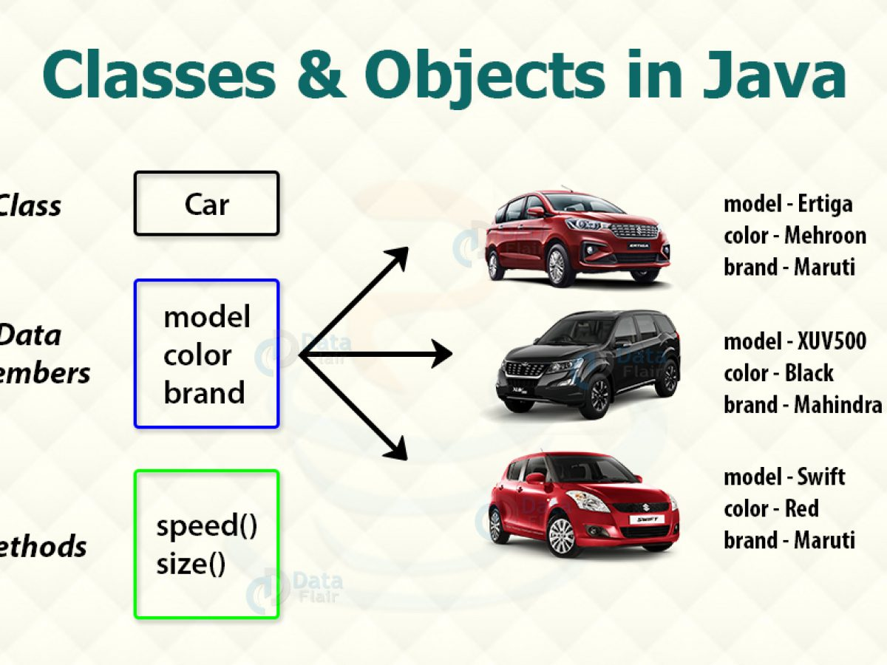

## Class and Object in Java
## Class in Java
Java is a true object-oriented language and therefore the underlying structure of all Java programs is classes. Anything in a Java program must be encapsulated in a class that defines the state and behavior of the basic program components known as objects.

- Thus a class is template of the class and object is the instance of the class.
- A class is a blueprint or prototype that defines the variables and the methods (functions) common to all objects of a certain kind.
- A class is a group of objects which have common properties. It is a template or blueprint from which objects are created.
- Classes create objects and objects use methods to communicate between them and provide a convenient method for packing together a group of logically related data items and functions that work on them.
- In Java, the data items are called fields and the functions are called methods.
- Calling a specific method in an object is described as sending the object a message.
- A class is essentially a description of how to make an object that contains fields and methods.
- It provides a sort of template for an object and behaves like a basic data type.
- Perhaps the most important thing to understand about a class is that it defines a new data type. Once defined, this new type can be used to create objects of that type.
## Class Declaration in Java
A class is declared by use of the class keyword. The classes that have been used up to this point are actually very limited examples of its complete form. Classes can (and usually do) get much more complex. The general format of a class is as follows:
~~~js
class classname
 {
   [ variable declaration ];
   [ methods declaration ];
 }
~~~
- Everything inside the square brackets is optional. Because the body is empty, this class does not contain any properties and therefore cannot do anything. There is no semicolon after closing brace.
- Classname are any valid Java identifiers.
- The data, or variables, defined within a class are called instance variables.
- The code contained within methods. Collectively, the methods and variables defined within class are called members of the class.
- Variable defined within a class are called as instance variables because each instance of the class contain its copy of these variables .
- Thus the data for one object is separate and unique from the data for another
- In most classes, the instance variables are on which action are performed and accessed by the methods defined for that class.
- All methods have the same general form as main(). However, most methods will not be specified as static or public.
- Java classes do not need to have a main( ) method. You only specify one if that class is the starting point for your program.
- Applets don’t require a main() method at all.

## Rules for Java Class
- A class can have only public or default(no modifier) access specifier.
- It can be either abstract, final or concrete (normal class).
- It must have the class keyword, and class must be followed by a legal identifier.
- It may optionally extend one parent class. By default, it will extend java.lang.Object.
- It may optionally implement any number of comma-separated interfaces.
- The class’s variables and methods are declared within a set of curly braces {}.
- Each .java source file may contain only one public class. A source file may contain any number of default visible classes.
- Finally, the source file name must match the public class name and it must have a .java suffix.

## Object in Java
An object is an instance of a class. An object in Java is essentially a block of memory that contains space to store all the instance variables. Creating an object is also referred to as instantiating an object. An object is a real-world entity. An object has three characteristics:
- State: represents the data (value) of an object.
- Behavior: represents the behavior (functionality) of an object such as deposit, withdraw, etc.
- Identity: An object identity is typically implemented via a unique ID. The value of the ID is not visible to the external user. However, it is used internally by the JVM to identify each object uniquely.
- For Example, Pen is an object. Its name is Reynolds; color is white, known as its state. It is used to write, so writing is its behavior.
- If we consider the real-world, we can find many objects around us, cars, dogs, humans, etc.
- All these objects have a state and a behavior.
- If we consider a dog, then its state is – name, breed, color, and the behavior is – barking, wagging the tail, running.
- If you compare the software object with a real-world object, they have very similar characteristics.
- Software objects also have a state and a behavior. A software object’s state is stored in fields and behavior is shown via methods.
- So in software development, methods operate on the internal state of an object and the object-to-object communication is done via methods.
## Declaration of Object in Java
We can create a object of any class in the following ways
~~~
className ObjectName;
ObjectName=new className();
~~~
- The first statement declares a variable to hold the object reference , here ObjectName will contain null which indicate that it does not contain point to an actual object.
- If ObjectName is used at this point it will result an error at compile time
- The second one actually assigns the object reference to the variable.
- The variable ObjectName is now an object of the Rectangle class.
- In reality ObjectName simply holds the memory address of the actual rectangle object.
- Both statements can be combined into one as shown below
~~~
className ObjectName = new className ();
~~~
- The method className () is the default constructor of the class. We can create any number of objects of className. Example:

~~~
className ObjectName1 = new className ();
className ObjectName2 = new className ();
~~~
### Example-1: Write a java program print a message which demonstrates the structure of Class
~~~js
//Write a java program to print a message which demonstrates the structure of Class
  class HelloWorld{
     public static void main(String args[]){
        System.out.println("Hello World");
     }
  }
~~~
~~~
Output: Hello World
~~~
### Example-2: Write a java program to print message which demonstrates the structure of Class and object.
~~~js
//Write a java program to print message which demonstrates the structure of Class and object.
  class HelloWorld{
     void show(){
       System.out.println("i am from show");
   }
  public static void main(String args[]){
     HelloWorld ob1=new HelloWorld();
     ob1.show();
     System.out.println("i am from main method");
  }
 }
~~~
~~~
Output:
i am from show
i am from main method
~~~
### Example-3: Write a java program to compute the area of a circle which demonstrates the structure of Class and object.
~~~js
//Write a java program to compute the area of a circle which demonstrates the structure of Class and object.
  class HelloWorld{
     double radius;
     void calculateRadius(float r){
        radius=3.1416*r*r;
        System.out.println("Radius="+radius);
     }
  public static void main(String args[]){
     HelloWorld ob1=new HelloWorld();
     float r=5;// radius 5;
     ob1.calculateRadius(5);
    }
  }
~~~
~~~
Output:
Radius=78.54
~~~