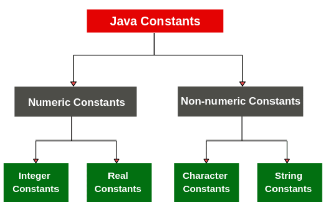

## Constants in Java
Constants in Java refer to fixed values that do not change during the execution of a program. A constant can make our program more easily read and understood by others. In addition, a constant is cached by the JVM as well as our application, so using a constant can improve performance. In Java Constant are of two types-

1. Numeric Constant and
2. Character Constant

## Integer Constants
An integer constant refers to a sequence of digits. There are three types of integers, namely, Decimal integer, Octal integer and Hexadecimal integer.

- Decimal integers consist of a set of digits, 0 through 9, preceded by an optional minus sign. Examples 123, -321, 0, 654321, etc. spaces, commas, and non-digit characters are not permitted between digits.
   - Example 15,750, $1000 and 20,000 are illegal numbers.
- Octal integer constant consists of any combination of digits from the set 0 through 7, with a leading 0.
   - Examples : 037 00 04350551 .
- Hexadecimal integer (hex integer) is a sequence of digits preceded by Ox or OX. They may also include alphabets A through F or a through f. A letter A through F represents the numbers 10 through 15.
   - Example : 0X2 OX9F Oxbcd Ox
## Real Constant
These quantities are represented by numbers containing fractional parts like 17.548. Such numbers are called real (or floating point) constants. Examples : 0.0083 -0.75 435.36 215.

- These numbers are shown in decimal notation, having a whole number followed by a decimal point and the fractional part, which is an integer.
- It is possible that the number may not have digits before the decimal point or digits after the decimal point.
   - Examples .95 -.71 are all valid real numbers.
- A real number may also be expressed in exponential (or scientific) notation.
   - For example, the value 215.65 may be written as 2.1565e2 in exponential notation. e2 means multiply by 102.
## Mantissa e exponent
- Mantissa is either a real number expressed in decimal notation or an integer. Exponent is an integer with an optional plus or minus sign. Letter ‘e’ separating the mantissa and the exponent can be written in either lowercase or uppercase.
- Since the exponent causes the decimal point to “float”, this notation is said to represent a real number in floating, point form.
   - Examples 0.65e4 , 12e-2 , 1.5e+5 , 3.18E3, -1 .2E-1 are valid constant. White (blank) space are not allowed.
- Exponential notation is useful for representing numbers that are either very larger or very small in magnitude.
   - Example, 7500000000 may be written as 7.5E9 or 75E8. Similarly, -0.000000368 is equivalent to -3.68E-7.
- A floating point constant may thus comprise four parts:
   - A whole number
   - A decimal point
   - A fractional part
   - An exponent
## Single Character Constants
- Single character constant (or simply character constant) contains a single character enclosed within a pair of single quote marks.
   - Examples ‘5’ ‘x’ ‘;’ ‘ ‘ .
- The character constant ‘5’ is not the same as the number 5.
- The last constant is a blank space.

## String Constants
- String constant is a sequence of characters enclosed between double quotes.
- The characters may be alphabets, digits, special characters and blank spaces.
   - Examples “Hello Java” “1997” “WELL DONE” “?…!“ “5 +3”.

