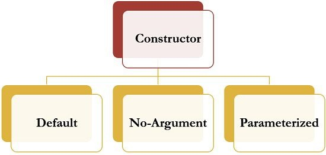

## Constructor in Java
It can be tedious to initialize of the variables in a class each time an instance is created. It would be simpler and more concise to have all of the setup done at the time the object is first created rather than creating functions. Because the requirement for initialization is so common, Java allows objects to initialize themselves when they are created. This automatic initialization is performed through the use of a constructor.

- A constructor initializes an object immediately upon creation.
- It has the same name as the class in which it resides and is syntactically similar to a method.
- Once defined, the constructor is automatically called immediately after the object is created, before the new operator completes.
- Constructors have no return type, not even void. This is because the implicit return type of a class’s constructor is the class type itself.
- It is the constructor’s job to initialize the internal state of an object so that the code creating an instance will have a fully initialized, usable object immediately.
- When you do not explicitly define a constructor for a class, then Java creates a default constructor for the class.
- The default constructor automatically initializes all instance variables to zero. Once you define your own constructor, the default constructor is no longer used.
## Rules for creating Java constructor
- There are some rules defined for the constructor.
- Constructor name must be the same as its class name
- A Constructor must have no explicit return type
- A Java constructor cannot be abstract, static, final, and synchronized
## Types of Constructor
There are three types of constructors
- Default constructor
- No-arg constructor
- Parameterized constructor

## Default Constructor
- A default constructor is a constructor which can be called with no arguments (either defined with an empty parameter list, or with default arguments provided for every parameter).
- Default constructor can refer to a constructor that is automatically generated by the compiler in the absence of any programmer-defined constructors.
- A constructor is called “Default Constructor” when it doesn’t have any parameter.
- If there is no constructor in a class, compiler automatically creates a default constructor.
- The default constructor is used to provide the default values to the object like 0, null, etc., depending on the type.

## Example-1: Write a Java program to implement default constructor.
~~~js
//Write a Java program to implement default constructor.
  public class MainClass{
  //creating default constructor, if you don't create it, compiler atomically do it
  public MainClass() {
  }

  public static void main(String[] args) {
     MainClass mainClass=new MainClass();
    }
  }
~~~

 ### Example-2: Write a Java program to implement another default constructor with their uses.
~~~js
//Write a Java program to implement another default constructor with their uses.
  public class MainClass{
     int a;
    double b;
    String c;
    //we did not create any constructor but compiler will create default constructor and will initialize the values
    void show() {
        System.out.println("default value of a="+a);
        System.out.println("default value of b="+b);
        System.out.println("default value of c="+c);
      }

  public static void main(String[] args) {
    MainClass mainClass=new MainClass();
    mainClass.show();
   }
  }
~~~
~~~
Output:
default value of a=0
default value of b=0.0
default value of c=null
~~~

## No-arg Constructor
- It similar to default constructor.
- Constructor with no arguments is known as no-arg constructor.
- The signature is same as default constructor, however body can have any code unlike default constructor where the body of the constructor is empty
### Example-3: Write a Java program to implement no argument constructor.
~~~js
//Write a Java program to implement no argument constructor.
  public class MainClass{
  //creating no argument constructor
     public MainClass() {
     System.out.println("I am from no argument Constructor");
     }

  public static void main(String[] args) {
     MainClass mainClass=new MainClass();
   }
  }
~~~
~~~
Output:
I am from no argument Constructor
~~~
## Parameterized Constructor
- Constructor with arguments(or you can say parameters) is known as parameterized constructor. It is possible to pass arguments to constructors. Typically, these arguments help initialize an object when it is created. To create a parameterized constructor, simply add parameters to it the way you would to any other function.
- When you define the constructor’s body, use the parameters to initialize the object.
- A constructor which has a specific number of parameters is called a parameterized constructor.
- The parameterized constructor is used to provide different values to distinct objects.
- However, you can provide the same values also.
### Example-4: Write a Java program to implement parameterized constructor.
~~~js
//Write a Java program to implement parameterized constructor.
  public class MainClass{
    int id;
    String name;
    String dept;
    MainClass(int a, String nm, String d) {
        id=a;
        name=nm;
        dept=d;
      }
    void show() {
        System.out.println("ID="+id+" Name="+name+" Dept="+dept);
      }

  public static void main(String[] args) {
MainClass mainClass1=new MainClass(101,"Abdur Rahim","CSE");
        MainClass mainClass2=new MainClass(102,"Karim Sardar","BBA");
        mainClass1.show();
        mainClass2.show();
       }
    }
~~~
~~~
Output:
ID=101 Name=Abdur Rahim Dept=CSE
ID=102 Name=Karim Sardar Dept=BBA
~~~

## Constructor Overloading in Java
- A constructor is just like a method but without return type.
- It can also be overloaded like Java methods.
- Constructor overloading in Java is a technique of having more than one constructor with different parameter lists.
- They are arranged in a way that each constructor performs a different task.
- They are differentiated by the compiler by the number of parameters in the list and their types.
### Example-5: Write a java program to implement constructor overloading.
~~~js
//Write a java program to implement constructor overloading.
  public class MainClass{
    int id;
    String name;
    String dept;

  MainClass(int a) {
    id=a;
   }
   MainClass(int a, String nm) {
    id=a;
    name=nm;
   }
   MainClass(int a, String nm,String d) {
    id=a;
    name=nm;
    dept=d;
   }

  void show() {
     System.out.println("ID="+id+" Name="+name+" Dept="+dept);
    }

  public static void main(String[] args) {
        MainClass mainClass1=new MainClass(101);
        MainClass mainClass2=new MainClass(102,"Abdur Rahim");
        MainClass mainClass3=new MainClass(103,"Karim Sardar","BBA");
        mainClass1.show();
        mainClass2.show();
        mainClass3.show();
      }
    }
~~~
~~~
Output:
ID=101 Name=null Dept=null
ID=102 Name=Abdur Rahim Dept=null
ID=103 Name=Karim Sardar Dept=BBA
~~~
## Copy Constructor in Java
- A copy constructor is a member function which initializes an object using another object of the same class.
- It is used for copying the values of one object to another object
## Example-6: Write a java program to implement copy constructor.
~~~js
//Write a Java program to implement no argument constructor.
  public class MainClass{
    int id;
    String name;
    String dept;

    MainClass(int a, String nm,String d) {
        id=a;
        name=nm;
        dept=d;
     }
  MainClass(MainClass mc) {
        id=mc.id;
        name=mc.name;
        dept=mc.dept;
      }

  void show() {
        System.out.println("ID="+id+" Name="+name+" Dept="+dept);
      }

  public static void main(String[] args) {
        MainClass mainClass1=new MainClass(103,"Karim Sardar","BBA");
        MainClass mainClass2=new MainClass(mainClass1);
        mainClass1.show();
        mainClass2.show();
      }
    }
~~~
~~~
Output:
ID=103 Name=Karim Sardar Dept=BBA
ID=103 Name=Karim Sardar Dept=BBA
~~~
## Constructor in Inheritance
- A subclass constructor is used to construct the instance variables of both the subclass and the superclass. The subclass constructor uses the keyword super to invoke the constructor method of the superclass.
- The keyword super is used subject to the following conditions.
- Super may only be used within a subclass constructor method
- The call to superclass constructor must appear as the first statement within the subclass constructor
- The parameters in the super call must match the order and type of the instance variable declared in the superclass.

## Example-7: Write a java program to implement constructor with inheritance.
~~~js
////Write a java program to implement constructor with inheritance.
  class DemoClass{
     String name;
     DemoClass(String nm){
       name=nm;
       System.out.println("I am from Demo Class Constructor and name="+name);
       }
    }
  public class MainClass extends DemoClass {
    int id;
    String name;
    MainClass(int a, String nm) {
     super(nm);
     id=a;
     name=nm;
     System.out.println("I am From MainClass Constructor and id="+id +" name="+name);
    }

  public static void main(String[] args) {
     MainClass mainClass1=new MainClass(103,"Karim Sardar");
    }
   }
~~~
~~~
Output:
I am from Demo Class Constructor and name=Karim Sardar
I am From MainClass Constructor and id=103 name=Karim Sardar
~~~
## Summary of Constructor in Java
- Every class has a constructor whether it’s a normal class or a abstract class.
- Constructors are not methods and they don’t have any return type and its name should match with class name .
- Constructor can use any access specifier, they can be declared as private also. Private constructors are possible in java but there scope is within the class only.
- Like constructors method can also have name same as class name, but still they have return type, though which we can identify them that they are methods not constructors.
- If you don’t implement any constructor within the class, compiler will do it for.
- this() and super() should be the first statement in the constructor code. If you don’t mention them, compiler does it for you accordingly.
- Constructor overloading is possible but overriding is not possible.
- Constructors can not be inherited.
- If Super class doesn’t have a no-arg(default) constructor then compiler would not insert a default constructor in child class as it does in normal scenario.
- Interfaces do not have constructors.
- Abstract class can have constructor and it gets invoked when a class, which implements interface, is instantiated. (i.e. object creation of concrete class).
- A constructor can also invoke another constructor of the same class – By using this().
## Difference Between Constructor and Method in Java

