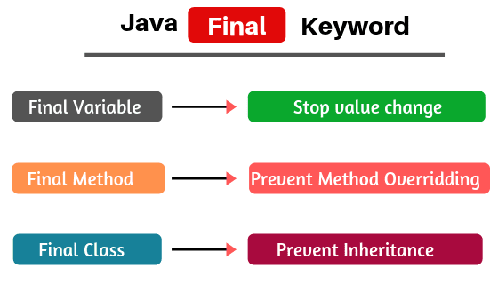

## Final Keyword in Java
The final keyword in java is used in several contexts to define an entity that can only be assigned once. The final keyword in java is used to restrict the user and this can be used in many contexts. The final modifier can be applied to four Java constructs:

- Variables: a final variable can be set once and only once.
- Fields: a final field can also be set only once, by the constructor of the class which defines it.
- Methods: a final method cannot be overridden nor hidden.
- Classes: a final class cannot be extended

## Final Variables / Data
- Final variables are nothing but constants.
- We cannot change the value of a final variable once it is initialized.
- It is considered as a good practice to have constant names in UPPER CASE(CAPS).
- A final variable that is not initialized at the time of declaration is known as blank final variable.
- We must initialize the blank final variable in constructor of the class
- Otherwise it will throw a compilation error (Error: variable MAX_VALUE might not have been initialized).
- A static final variable that is not initialized during declaration can only be initialized in static block.
## Why Final Variable Used
- A constant/final variable is useful for two reasons:
- It can be a compile-time constant that won’t ever change.
- It can be a value initialized at run-time that you don’t want changed.
## When to Use Final Variable
- The only difference between a normal variable and a final variable is that we can re-assign value to a normal variable but we cannot change the value of a final variable once assigned.
- Hence final variables must be used only for the values that we want to remain constant throughout the execution of program

### Example-1: Write a java program to illustrate that final variable are not changeable.
~~~js
//Write a java program to illustrate that final variable are not changeable.
  public class Funycode {
    final int a=100;
    public static void main(String ar[]) {
        Funycode funycode=new Funycode();
        funycode.a=500;// value can not be changed
     }
   }
~~~
~~~
Output:
Compile time error
~~~

### Example-2: Write a java program to implement that blank final variable must be initialized in constructor.
~~~js
//Write a java program to implement that blank final variable must be initialized in constructor.
  public class Funycode {
    final int a;
    public Funycode() {
    a=100;
  }
  void show () {
    System.out.println("Value of Final variable a="+a);
   }
  public static void main(String ar[]) {
    Funycode funycode=new Funycode();
    funycode.show();
   }
  }
~~~
~~~
Output:
Value of Final variable a=100
~~~
### Example-3: Write a java program to implement that blank static final variable must be initialized in static block.
~~~js
//Write a java program to implement that blank static final variable must be initialized in static block.
  public class Funycode {
    final static int a;
    static {
      a=100;
    }
  void show () {
    System.out.println("Value of Final variable a="+a);
   }
  public static void main(String ar[]) {
    Funycode funycode=new Funycode();
    funycode.show();
   }
  }
~~~
~~~
Output:
Value of Final variable a=100
~~~
## Final method
- A final method cannot be overridden.
- Which means even though a sub class can call the final method of parent class without any issues but it cannot override it.
- There are two reasons for final methods.
- The first is to put a “lock” on the method to prevent any inheriting class from changing its meaning.
- This is done for design reasons when you want to make sure that a method’s behavior is retained during inheritance and cannot be overridden.
- The second reason for final methods is efficiency. If you make a method final, you are allowing the compiler to turn any calls to that method into inline calls.

### Example-4: Write a java program to illustrate that final method can be called from derived class.

~~~js
// Write a java program to illustrate that final method can be called from derived class.
  class Demo{
    final void show() {
    System.out.println("I am from final show method");
   }
  }
  public class Funycode extends Demo {
    public static void main(String ar[]) {
     Funycode funycode=new Funycode();
     funycode.show();
    }
  }
~~~
~~~
Output:
I am from final show method
~~~
### Example-5: Write a java program to illustrate that final method can not be overridden in derived class.
~~~js
//Write a java program to illustrate that final method can not be overridden in derived class.
  class Demo{
    final void show() {
      System.out.println("I am from final show method");
     }
  }

  public class Funycode extends Demo {
// can not override show method, compile time error
  void show() {
    System.out.println("I am from overridden final show method");
   }
  public static void main(String ar[]) {
    Funycode funycode=new Funycode();
    funycode.show();
   }
 }
~~~
~~~
Output:
compile time error, Can not override final method
~~~
## Final class
- When an entire class is declared as final, then its not possible to inherit from this class or allow anyone else to do so. In other words, for some reason the design of a class is such that there is never need to make any changes, or for safety or security reasons or don’t want sub classing.
- When a class is declared with final keyword, it is called a final class.
- A final class cannot be extended (inherited).
- There are two uses of a final class
- One is definitely to prevent inheritance; as final classes cannot be extended.
- For example, all Wrapper Classes like Integer, Float etc. are final classes.
- The other use of final with classes is to create an immutable class like the predefined String class.
- We cannot make a class immutable without making it final.

### Example-6: Write a java program to illustrate that final class can not extend.
~~~js
//Write a java program to illustrate that final class can not extend.
  final class Demo{
    final void show() {
      System.out.println("I am from final show method");
     }
   }

  public class Funycode extends Demo {
    public static void main(String ar[]) {
    Funycode funycode=new Funycode();
    funycode.show();
   }
  }
~~~
~~~
Output:
Compile time error, final class demo can be extended
~~~
## Summary Regarding Final Keyword
- Local final variable must be initializing during declaration and all variables declared in an interface are by default final.
- A constructor cannot be declared as final.
- We cannot change the value of a final variable.
- A final method cannot be overridden.
- A final class not be inherited.
- If method parameters are declared final, then the value of these parameters cannot be changed.
- It is a good practice to name final variable in all CAPS.