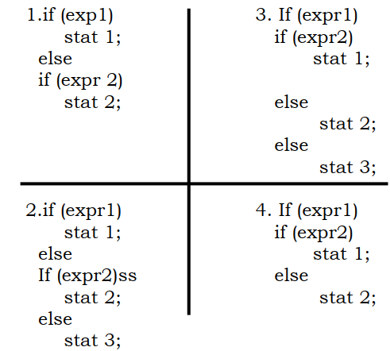
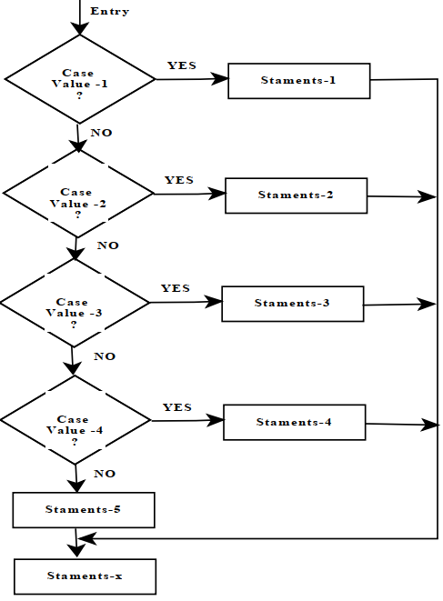

## Conditional Statements  in Java
Conditional statement used to make decisions based on the conditions. Conditional statements execute sequentially when there is no condition around the statements. If you put some condition for a block of statements, the execution flow may change based on the result evaluated by the condition.  Different conditional construct are

1. if
2. if-else
3. if-else-if
4. Switch-case

## If Statement
Java’ allows decision to be made evaluating a given expression as true or false. Such an expression involves the Relational & Logical Operators depending on the outcome of decision program execution proceeds in one direction or in the other such test can be done using if statement

- The if statement is a powerful decision making statement and is used to control the flow of execution of statements.
- It is basically a two-way decision statement and is used in along with an expression.
- The simplest form of if statement is
~~~
if (expression is true)
    statement ; /* Simple statement */

if (expression is true)
   { /*Compound statements */
     statement1 ;
     statement2;
     statement3;
   }
~~~
- The keyword if must be followed by a set of parenthesis containing the expression to be evaluated.
- The parenthesis is followed by single java statement, which is executed only if these expression evaluates to be true.
- If programmer wants more than one statement to be executed, they must be grouped together to form a compound statement surrounded by paired curly braces.
- It’s format is as shown above. Some Valid if conditions :-
~~~
(a)	if ( qty < 100 )
     {…………}
(b) if (Bs >=100 && BS <= 200)
     {…………}
(c) if ( ch==’a’ && ch==’A’)
     {…………}
(d) if (c-d != 0)
     {…………}
(e) if ( (a*b <=n d*f )|| (a+b == c+d ))
     {…………}
~~~
## If -Else Statement
The if else statement is used to carry out a logical test expression & then take one of the two possible actions depending on the outcome of the test expression (i.e whether the outcome is true or false) the else portion of this statement is optional. the general form of this statement which includes the else clause is-
~~~
If (test expression)
    statement -X;
else
    statement-Y;
Statement- ABC ;
~~~
- If the expression has nonzero value(if expr. Is true) than statement.-x will be executed otherwise statement-Y will be executed.
- In either case the statement-ABC is executed.
- If more than one statement is to be executed in one condition then all the statements are enclosed in brace bracket and those statements are called as compound statement.
~~~
if (test expression)
  {
    statement -X;
    statement-X1; // true Block
    statement – X2;
  }
else
  {
    statement-Y;
    statement-Y1; //false block
    statement-Y2;
  }
Statement- ABC ;
~~~
## Nested if statement
In if statement if the result of evaluating expression inside the parenthesis were true then this statement that immediately follow would be executed .We can write an if as its part it is possible to nest if-else statements. Within one another there are several different forms that nested if statement can take. the most general form of two layer nesting is:-
~~~
If (expr1)
  {
  if (expr2)
     stat 1;
  else
     stat 2;
  }
else
  {
  if (expr3)
     stat 3;
  else
     stat 4;
  }
~~~
- In this situation one complete if-else statement will be executed if expr1 is true & another complete if-else statement will be executed if expr1 is false.
- It is also possible that stat1, stat2, stat3 & stat4 will content another if-else statement Some other forms of two layer nesting are:-

- In first 3 cases the association between else clauses & their corresponding in straight forward.
- In last case it is not clear which expr is associated with else clause the answer is expr2.
- The rule that else clause is always associated with the closest preceding unmatched if i.e (else less if ).

## IF –else-if ladder
There is another way of putting ifs together when multi path decisions are involved. A multi path decision is a chain of ifs in which the statement associated with else an if. Its takes the following general form
~~~
If (condition1)
    Statement 1;
Else If (condition2)
    Statement 2;
Else If (condition3)
    Statement 3;
Else If (condition4)
    Statement 4;
Else If (condition5)
    Statement 5;
Else
    Default condition;
Statement X;
~~~
- This construct is called as the else if ladder .
- The condition are evaluated from the top (of the ladder) to downward .
- As soon as the condition is found the statement associated with it is executed and the control is transferred to the statement X.
- When all the condition are false then the else containing the default statement will be executed.

## Switch Statement
The switch statement tests the value of a given variable (or expression) against a list of case values and when a match is found, a block of statements associated with that case is executed. The general form of the switch statement is
~~~
switch (expression )
 {
  case value1:
     statement-1 ;
     break;
  case value2:
     statement-2;
     break;
  case value3:
     statement-3;
     break;
  case value4:
     statement-4;
      break;
  default:
     statement-5;
 }
statement-x ;
~~~
- The expression is an integer expression or characters.
- Value1, value-2 are constants or constant expressions (evaluable to an integral constant) and are known as case Tables.
- Each of these values should be unique within a switch statement. statment1, statement2, statement3…are statement lists and may contain zero or more statements.
- There is no need to put braces around these statements. Note that case labels end with a colon (:).

- When the switch is executed, the value of the expression is successively compared against the values value-1, value-2, value-3…
- If a case is found whose value matches with the value of the expression, then the block of statements that follows the case are executed.
- The break statement at the end of each block signals the end of a particular case and causes an exit from the switch statement, transferring the control to the statement-x following the switch.
- The default is an optional case. When present, it will be executed if the value of the expression does not match with any of the case values.
- If not present, no action takes place if all matches fail and the control goes to the statement-x.