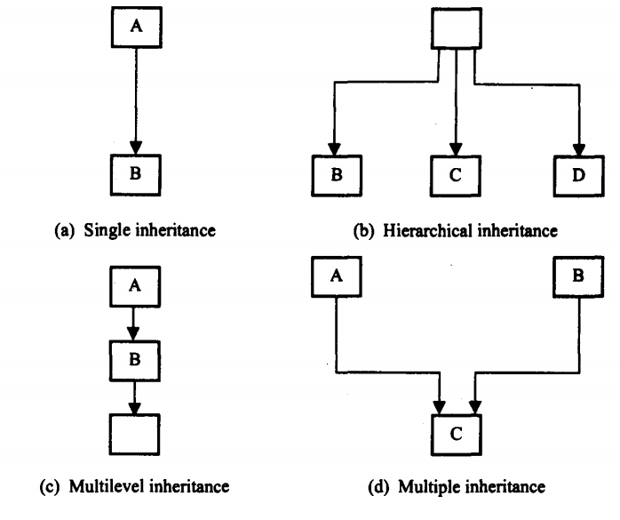

## Inheritance in Java
Inheritance is one of the important concept of object oriented programming because it allows the creation of hierarchical classifications. Reusability is yet another aspect of OOP paradigm. It is always nice if we could reuse something that already exists rather than creating the same all over again. Java supports this concept. Java classes can be reused in several ways. This is basically done by creating new classes, reusing the properties of existing ones. The mechanism of deriving a new class from an old one is called inheritance.

- The process by which one class acquires the properties (data members) and functionalities (methods) of another class is called inheritance.
- The aim of inheritance is to provide the reusability of code so that a class has to write only the unique features and rest of the common properties and functionalities can be extended from the another class.
- Inheritance is a process of defining a new class based on an existing class by extending its common data members and methods.
- Inheritance allows us to reuse of code, it improves reusability in your java application.
- The biggest advantage of Inheritance is that the code that is already present in base class need not be rewritten in the child class.
- This means that the data members (instance variables) and methods of the parent class can be used in the child class.
## Child Class
- The class that extends the features of another class is known as child class, sub class or derived class.
## Parent Class
- The class whose properties and functionalities are used(inherited) by another class is known as parent class, super class or Base class.

## Syntax of Inheritance in Java
To inherit the property of super class extends keyword is used in the following ways
~~~js
class subClassName extends superClassName{
variable declaration;
method declaration;
}
~~~
- The keyword extends signifies that the properties of superClassName are extended to the subClassName.
- The subclass will now contains its own variable and methods as well those of the superclass.
- This kind of situation occurs when we want to add some more properties to an existing class without actually modifying it.
## Types of Inheritance
The inheritance allows subclasses to inherit all the variables and methods of their parent classes. Inheritance may take different forms:
1. Single inheritance (only one super class)
2. Multiple inheritance (several super classes)
3 Hierarchical inheritance (one super class, many subclasses)
4. Multilevel inheritance (Derived from a derived class)

- Java does not directly implement multiple inheritance.
- However, this concept is implemented using a secondary inheritance path in the form of interfaces.

## Single Inheritance
- A subclass with only one super class is called single inheritance.
- It  refers to a child and parent class relationship where a class extends the another class. Single inheritance is damn easy to understand.
- In the above diagram in (a) shows that class B extends only one class which is A.
- Here A is a parent class of B and B would be a child class of A.
## Multilevel Inheritance
- The mechanism of deriving a class from another derived class is known as Multilevel inheritance.
- For example, in the above figure (c) class C extends class B and class B extends class A then this type of inheritance is known as multilevel inheritance.
- It’s pretty clear with the diagram that in Multilevel inheritance there is a concept of grand parent class.
- If we take the example of this diagram, then class C inherits class B and class B inherits class A which means B is a parent class of C and A is a parent class of B.
- So in this case class C is implicitly inheriting the properties and methods of class A along with class B that’s what is called multilevel inheritance.
## Multiple Inheritance
- The features of more one class may be inherited by one class; this process is known as Multiple inheritance.
- It refers to the concept of one class extending more than one classes, which means a child class has two parent classes.
- For example in the above figure (d), class C extends both classes A and B.
- Java doesn’t support multiple inheritance
## Hierarchical inheritance
- The features of one class may be inherited by more than one class.
- When more than one classes inherit a same class then this is called hierarchical inheritance.
- For example in the above figure (b),  class B, C and D extends a same class A.
- When a class has more than one child classes (sub classes) or in other words more than one child classes have the same parent class then this type of inheritance is known as hierarchical inheritance.

### Example-1: Write a Java program to implement single inheritance in java.
~~~js
//Write a Java program to implement single inheritance in java.
  class A{
     void show() {
     System.out.println("I am from class A");
    }
  }
  public class MainClass extends A{
  void display() {
     System.out.println("I am from Mainclass");
   }

  public static void main(String[] args) {
     MainClass mainClass=new MainClass();
     mainClass.show(); //derived class object can access base class property
     mainClass.display(); // //derived class object can access its own property
    }
  }
~~~
~~~
Output:
I am from class A
I am from Mainclass
~~~

### Example-2: Write a Java program to implement multilevel inheritance in java.
~~~js
//Write a Java program to implement multilevel inheritance in java.
  class A{
     void show() {
     System.out.println("I am from super class A");
    }
   }
  class B extends A{
     void showAll() {
     System.out.println("I am from sub class B");
     }
   }
  public class MainClass extends B{
     void display() {
     System.out.println("I am from Mainclass");
    }

  public static void main(String[] args) {
     MainClass mainClass=new MainClass();
     mainClass.show(); //derived class object can access super class property
     mainClass.showAll();//derived class object can access its base class property
     mainClass.display(); // //derived class object can access its own property
    }
   }
~~~
~~~
Output:
I am from super class A
I am from sub class B
I am from Mainclass
~~~
### Example-3: Write a Java program to implement hierarchical inheritance in java.
~~~js
//Write a Java program to implement hierarchical inheritance in java.
  class A{
     void showA() {
        System.out.println("I am from super class A");
    }
   }

  class B extends A{
   void showB() {
        System.out.println("I am from sub class B");
      }
   }

  class C extends A{
     void showC() {
       System.out.println("I am from sub class C");
      }
    }

  public class MainClass extends A{
     void display() {
     System.out.println("I am from Mainclass");
     }

  public static void main(String[] args) {
     MainClass mainClass=new MainClass();
     B b=new B();
     C c=new C();
     //all class inherit the property of class A
     mainClass.showA();
     b.showA();
     c.showA();
    }
   }
~~~
~~~
Output:
I am from super class A
I am from super class A
I am from super class A
~~~