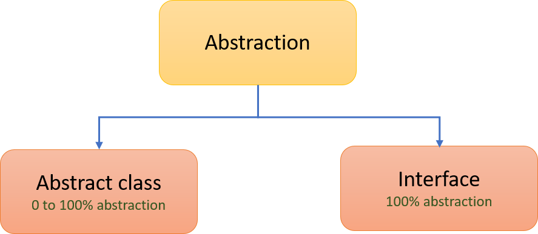
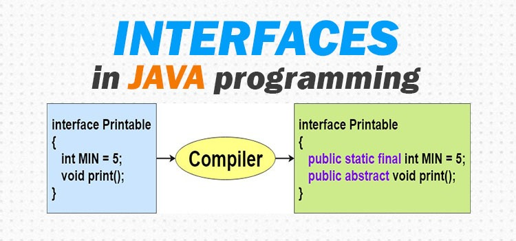

## Interface in Java
Abstraction is a process of hiding the implementation details and showing only functionality to the user. There are two ways to achieve abstraction in java are Abstract class (0-100%) and Interface (100%). An interface in Java is a blueprint of a class. It has static constants and abstract methods. The interface in Java is a mechanism to achieve abstraction. There can be only abstract methods in the Java interface, not method body. It is used to achieve abstraction and multiple inheritance in Java.

## Interface in Java
- Interface looks like a class but it is not a class.
- An interface can have methods and variables just like the class but the methods declared in interface are by default abstract (only method signature, no body.
- Since methods in interfaces do not have body, they have to be implemented by the class before access them.
- The class that implements interface must implement all the methods of that interface.
- Also, java programming language does not allow to extend more than one class,
- However, you can implement more than one interfaces in your class.
- Interfaces are declared by specifying a keyword “interface.

## Rules for using Interface
- Methods inside Interface must not be static and final
- All variables declared inside interface are implicitly public static final variables (constants).
- All methods declared inside Java Interfaces are implicitly public and abstract, even if you don’t use public or abstract keyword.
- Interface can extend one or more other interface.
- Interface cannot implement a class.
- Interface can be nested inside another interface.

## Example-1: Write a java program to implement simple scenario of interface.
~~~js
// Write a java program to implement simple scenario of interface.
  interface Shape{
    int a=200;
    void show();
   }

  public class Funycode implements Shape {
    public void show() {
        System.out.println("I am from show method implementation");
    }
  public static void main(String ar[]) {
    Funycode funycode=new Funycode();
    funycode.show();
   }
  }
~~~
~~~
Output:
I am from show method implementation
~~~
### Example-2: Write a java program to implement that one interface can extend another interface.
~~~js
//Write a java program to implement that one interface can extend another interface.
  interface Shape{
    void show();
   }
  interface Rectangle extends Shape{
    void display();
   }
  public class Funycode implements Rectangle {
   public void show() {
      System.out.println("I am from show method implementation of shape interface");
   }
   public void display() {
      System.out.println("I am from display method implementation of Rectangle interface");
   }
   public static void main(String ar[]) {
    Funycode funycode=new Funycode();
    funycode.show();
    funycode.display();
   }
  }
~~~
~~~
Output:
I am from show method implementation of shape interface
I am from display method implementation of Rectangle interface
~~~
### Example-3: Write a java program to implement that one interface can extend multiple interface.

~~~js
//Write a java program to implement that one interface can extend multiple interface.
  interface Rectangle{
    void show();
   }
  interface Circle {
    void display();
  }
  interface Shape extends Rectangle,Circle {
    void draw();
  }

  public class Funycode implements Shape {
   public void show() {
     System.out.println("I am from show method implementation of Rectangle interface");
   }
   public void display() {
     System.out.println("I am from display method implementation of Circle interface");
   }
   public void draw() {
     System.out.println("I am from draw method implementation of Shape interface");
   }
   public static void main(String ar[]) {
    Funycode funycode=new Funycode();
    funycode.show();
    funycode.display();
    funycode.draw();
   }
  }
~~~
~~~
Output:
I am from show method implementation of Rectangle interface
I am from display method implementation of Circle interface
I am from draw method implementation of Shape interface
~~~

### Example-4: Write a java program to illustrate that one class may implement more than one interface / multiple inheritance.
~~~js
//Write a java program to illustrate that one class may implement more than one interface / multiple inheritance.
  interface Rectangle{
    void show();
   }

  interface Circle {
    void show();
    void display();
   }

  public class Funycode implements Circle, Rectangle {
     public void show() {
       System.out.println("I am from show method implementation of either Circle/Rectangle interface");
     }
     public void display() {
       System.out.println("I am from display method implementation of Circle interface");
     }

     public static void main(String ar[]) {
    Funycode funycode=new Funycode();
    funycode.show();
    funycode.display();
    }
   }
~~~
~~~
Output:
I am from show method implementation of either Circle/Rectangle interface
I am from display method implementation of Circle interface
~~~
## Important Summary
- An interface can extend any interface but cannot implement it. Class implements interface and interface extends interface.
- Variable names conflicts can be resolved by interface name.
- A class can implement any number of interfaces. We can’t instantiate an interface in java. That means we cannot create the object of an interface
- Interface provides full abstraction as none of its methods have body. On the other hand abstract class provides partial abstraction as it can have abstract and concrete(methods with body) methods both.
- Implements keyword is used by classes to implement an interface. While providing implementation in class of any method of an interface, it needs to be mentioned as public.
- Class that implements any interface must implement all the methods of that interface, else the class should be declared abstract.
- All the interface methods are by default abstract and public.  Interface cannot be declared as private, protected or transient. Variables declared in interface are public, static and final by default.
- If there are two or more same methods in two interfaces and a class implements both interfaces, implementation of the method once is enough.
- A class cannot implement two interfaces that have methods with same name but different return type.