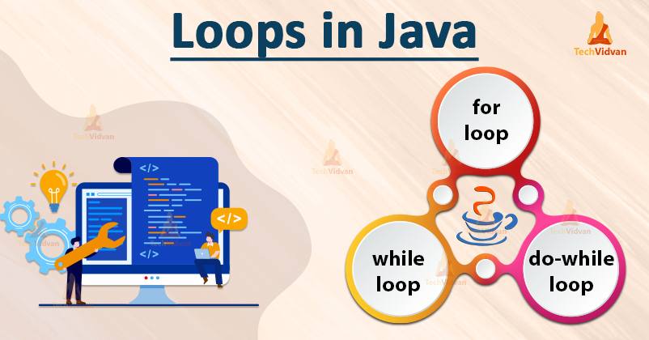
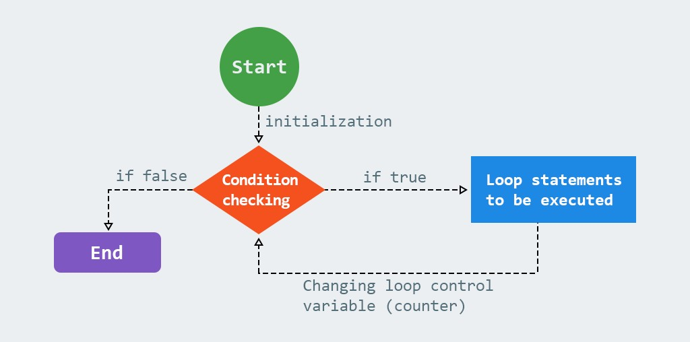
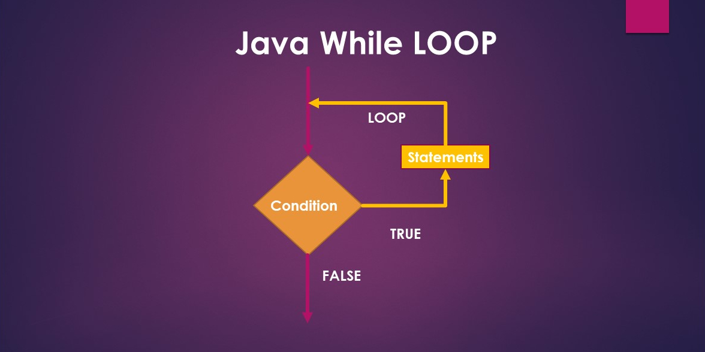
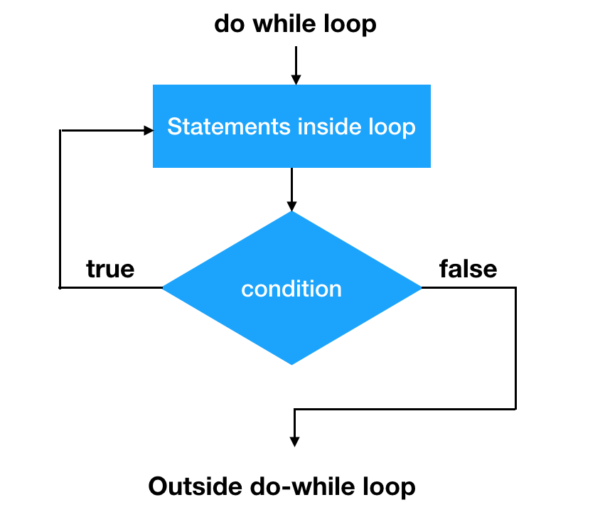

## Loop Statement in Java
Loops are used to execute a set of statements repeatedly until a particular condition is satisfied. In Java we have three types of basic loops: for, while and do-while.

## For Loop
Java for loop is used to run a block of code for a certain number of times. The syntax of for loop is:
~~~
  for (initialExpression; testExpression; updateExpression) {
    // body of the loop
    }

  for (initialization; testCondition; modifier)
  {
    statements ;
   }
~~~

- initialExpression is the initialization statement which is an assignment statement which is performed only once before the loop actually begins the execution i.e initialization.
- testExpression is the test expression which is evaluated before each iteration of loop and which determines whether the loop should be continued or be terminated The test-condition is a relational expression, that determines when the loop will exit. if the condition is true, the body of the loop is executed; otherwise the loop is terminated and the execution continues with the statement that immediately follows the loop.
- updateExpression is modifier statement, which changes the value of the variable used in the test, this expression is executed at the end of each iteration after the body of the loop is executed. The modifier can be incremented or decrement. The new control variable is again tested to see whether it satisfies the loop condition. If the condition is satisfied, the body of the loop is again executed. This process continues till condition is satisfied, the body of the loop is again executed. This process continues till the value of the control variable fails to satisfy the test-condition.

## While Loop
While is an entry-controlled loop statement. The test-condition is evaluated and if the condition is true, then the body of the loop is executed i.e body of the loop.
~~~
  while( test condition)
   {
    body of the loop ;
   }
~~~

- After execution of the body, the test condition is once again evaluated and if it is true, the body is executed once again.
- This process of repeated execution of the body continues until the test-condition finally becomes false and the control is transferred out of the loop.
- On exit, the program continues with the statement immediately after the body of the loop.
- The body of the loop may have one or more statements i.e compound statement.
- The braces are needed only if the body contains two or more statements. However, it is a good practice to use braces even if the body has only one statement.

## Do While Loop
The while loop makes a test of condition before the loop is executed. Therefore, the body of the loop may not be executed at all if the condition is not satisfied at the very first attempt.
~~~
  do
   {
    body of the loop
   } while (test-condition);
~~~

- On some occasions it might be necessary to execute the body of the loop before the test is performed.
- Such situations can be handled with the help of the do statement. This takes the form: On reaching the do statement, the program proceeds to execute the body of the loop first.
- At the end of the loop the test-condition in the while statement is executed.
- If the condition is true, the program continues to execute the body of the loop once again.
- This process continues as long as the condition is true. When the condition becomes false, the loop will be terminated and the control goes to the statement that appears immediately after the while statement.
- Since the test-condition is executed at the bottom of the loop, the do… while construct provides an exit-controlled loop and therefore the body of the loop is always executed at least once.
- This loop is also post – test loop.