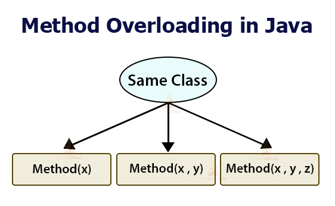
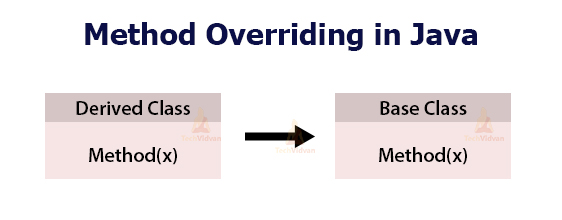

## Method Overloading
Method Overloading is a feature that allows a class to have two or more methods to have the same name, but with different parameter lists.
It is similar to constructor overloading in Java, that allows a class to have more than one constructor having different argument lists.
## Three ways to overload a method
- Number of parameters – add(int, int), add(int, int, int)
- Data type of parameters – add(int, int), add(int, float)
- Sequence of Data type of parameters– add(int, float), add(float, int)
- If two methods have same name, same parameters and have different return type, then this is not a valid method overloading
- Static binding happens at compile time.
- Static Polymorphism is also known as compile time binding or early binding.
- Method overloading is an example of static binding where binding of method call to its definition happens at Compile time.

### Example-1: Write a Java program to implement method overloading with different number of parameter as a function argument.
~~~js
//Write a Java program to implement method overloading with different number of parameter as a function argument.
  class A{
  //method overloading with one parameter
     void showA(int a) {
        System.out.println("A="+a);
     }
    //method overloading with two parameter
    void showA(int a , int b) {
       System.out.println("A="+a+" B="+b);
     }
    //method overloading with three parameter
    void showA(int a, int b ,int c) {
        System.out.println("A="+a+" B="+b+" C="+c);
     }
    }
  public class MainClass extends A{
    public static void main(String[] args) {
     MainClass mainClass=new MainClass();
     mainClass.showA(100); // method with one parameter will be called
     mainClass.showA(100,200); // // method with two parameter will be called
     mainClass.showA(100,200,300); // // method with three parameter will be called
    }
  }
~~~
~~~
Output:
A=100
A=100 B=200
A=100 B=200 C=300
~~~
### Example-2: Write a Java program to implement method overloading with different data types of parameter as a function argument.
~~~js
//Write a Java program to implement method overloading with different data types of parameter as a function argument.
  class A{
  //method overloading with int parameter
     void showA(int a) {
      System.out.println("Integer Value of A="+a);
     }
   //method overloading with double parameter
    void showA(double a) {
     System.out.println("Float Value of A="+a);
    }
    //method overloading with char parameter
    void showA(char ch) {
     System.out.println("Character Value of A="+ch);
    }
   }

  public class MainClass extends A{
     public static void main(String[] args) {
     MainClass mainClass=new MainClass();
     mainClass.showA(100); // method with int parameter will be called
     mainClass.showA(100.200); // // method with double parameter will be called
     mainClass.showA('S'); // // method with char parameter will be called
     }
   }
~~~
~~~
Output:
Integer Value of A=100
Float Value of A=100.2
Character Value of A=S
~~~

### Example-3: Write a Java program to implement method overloading with different sequence of data types as a function argument.
~~~js
//Write a Java program to implement method overloading with different sequence of data types as a function argument.
  class A{
     void showA(int a,double b) {
       System.out.println("Integer Value of A="+a+" Double Value of B="+b);
      }

  void showA(double b, int a) {
      System.out.println("Double Value of B="+b+" Integer Value of A="+a);
    }

   void showA(int a, double b,char ch) {
      System.out.println("Integer Value of A="+a+" Double Value of B="+b+" Character valueof C="+ch);
    }

    void showA(double b, int a, char ch) {
      System.out.println("Double Value of B="+b+" Integer Value of A="+a+" Character valueof C="+ch);
    }
  }

  public class MainClass extends A{
     public static void main(String[] args) {
        MainClass mainClass=new MainClass();
        mainClass.showA(100,200.555);
        mainClass.showA(200.555,100);
        mainClass.showA(100, 200.555,'S');
        mainClass.showA(200.555,100,'S');
      }
   }
~~~
~~~
Output:
Integer Value of A=100 Double Value of B=200.555
Double Value of B=200.555 Integer Value of A=100
Integer Value of A=100 Double Value of B=200.555 Character valueof C=S
Double Value of B=200.555 Integer Value of A=100 Character valueof C=S
~~~

## Method Overriding
- If subclass (child class) has the same method as declared in the parent class, it is known as method overriding in java.
- Overriding is a feature that allows a subclass or child class to provide a specific implementation of a method that is already provided by one of its super-classes or parent classes.
- Method overriding is used to provide specific implementation of a method that is already provided by its super class.
- When a method in a subclass has the same name, same parameters or signature, and same return type (or sub-type) as a method in its super class, then the method in the subclass is said to override the method in the super-class.
- Method overriding is one of the way by which java achieve Run Time Polymorphism.
- The version of a method that is executed will be determined by the object that is used to invoke it.
- If an object of a parent class is used to invoke the method, then the version in the parent class will be executed, but if an object of the subclass is used to invoke the method, then the version in the child class will be executed.

## Rules for Java Method Overriding
- Method must have same name as in the parent class
- Method must have same parameter as in the parent class.
- Final methods can not be overridden
- Static methods can not be overridden(Method Overriding vs Method Hiding)
- Private methods can not be overridden
- The overriding method must have same return type (or subtype).

## Example-4: Write a Java program to implement method overriding or run time polymorphism.
~~~js
//Write a Java program to implement method overriding or run time polymorphism.
  class BaseClass{
     void show() {
       System.out.println("I am from BaseClass show method");
     }
   }
  class DerivedClass extends BaseClass{
     void show() {
        System.out.println("I am from DerivedClass show method");
     }
   }
  public class MainClass{
     public static void main(String[] args) {
       //BaseClass refers BaseClass object, so BaseClass show method invoked
        BaseClass object=new BaseClass();
        object.show();
        //BaseClass refers DerivedClass, so DerivedClass show method invoked
        BaseClass object2=new DerivedClass();
        object2.show();
      }
    }
~~~
~~~
Output:
I am from BaseClass show method
I am from DerivedClass show method
~~~