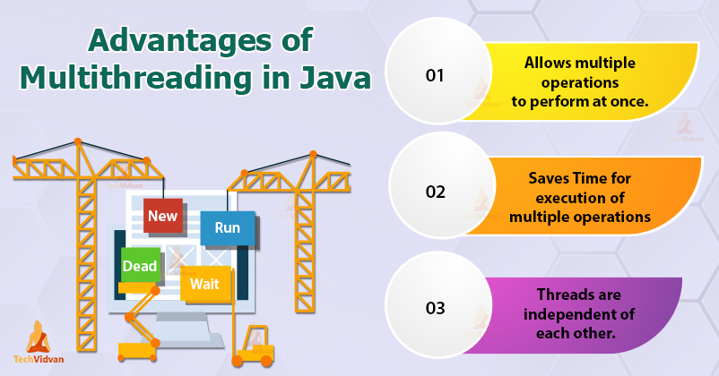
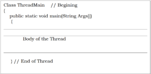
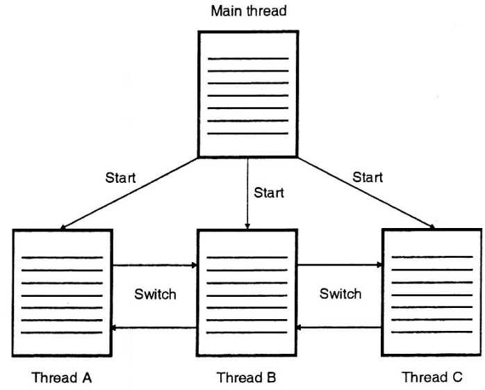
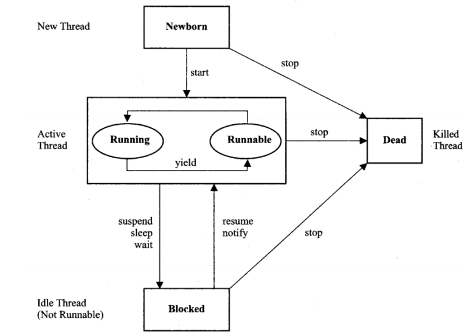

## Multithreading in Java
Multithreading (MT) is a modern programming paradigm for implementing parallel applications on shared memory multiprocessors. The modern operating systems such as Windows 95, Windows XP , Windows 200 etc may recognize that they can execute several programs simultaneously. This ability is known as multitasking. In system’s terminology, it is called multithreading.

- A computer that has just a single central processing unit can’t literally do two things at the same time.
- It does only one thing at a time. However, the processor switches between the processes so fast that it appears to human beings that all of them are being executed simultaneously.
- Java Multithreading is mostly used in games, animation, etc
## Advantage of Multithreading in Java
- The benefit of Java’s multithreading is that the main loop/polling mechanism is eliminated. One thread can pause without stopping other parts of your program. Multithreading allows animation loops to sleep for a second between each frame without causing the whole system to pause. When a thread blocks in a Java program, only the single thread that is blocked pauses. All other threads continue to run.
- It doesn’t block the user because threads are independent and you can perform multiple operations at the same time.
- It’s possible to perform many operations together, so it saves time.
- Threads are independent, so it doesn’t affect other threads if an exception occurs in a single thread.
- They share the common memory space.

## Type of Multithreading
- Multithreading is a form of multitasking. There are two different types of multitasking.
1. Process-based multitasking
2. Thread based multitasking.

## Thread in Java
- A single task is called a thread. The term ‘thread” refers to a “thread of control” or “thread of execution,” meaning a sequence of instructions that are executed one after another – the thread extends through time, connecting each instruction to the next. In a multithreaded program, there can be many threads of control, weaving through time in parallel and forming the complete fabric of the program.

- A thread is similar to a program that has a single flow of control. It has a beginning, a body, and an end, and executes commands sequentially.
- In fact, all main programs in our earlier examples can be called single threaded programs.
- Every Java program his at least one thread, when the Java virtual machine runs your program, it creates a thread that is responsible for executing the main routine of the program.
- A program that contains multiple flows of control is known as multithreaded program.
- Following figure illustrates a Java program with four threads, one main and three others.

- The main thread is actually the main method module, which is designed to create and start the other three threads, namely Thread-A, Thread-B, and Thread-C.
- Once initiated by the main thread, the Thread-A, Thread-B, and Thread-C run con currently and share the resources jointly.
- The ability of a language to support multithreads is referred to as concurrency.
- Since threads in java are subprograms of a main application program and share the same memory space, they are known as lightweight threads or lightweight processes.
## Thread Life Cycle
- The term ‘thread” refers to a “thread of control” or “thread of execution,” meaning a sequence of instructions that are executed one after another – the thread extends through time, connecting each instruction to the next. A thread is similar to a program that has a single flow of control. It has a beginning, a body, and an end, and executes commands sequentially. A thread can be in various stages of execution :-
1. Newborn state
2. Runnable state
3. Running state
4. Blocked state
5. Dead state

## Newborn state
- After the creations of Thread instance the thread is in this state but before the start() method invocation.
- At this point, the thread is considered not alive. At this state, we can do only one of the following things with it:
- Schedule it for running using start() method.
-  Kill it using stop() method.
## Runnable (Ready-to-run) State
- A thread start its life from Runnable state.
- A thread first enters runnable state after the invoking of start() method but a thread can return to this state after either running, waiting, sleeping or coming back from blocked state also.
- On this state a thread is waiting in a queue for a turn on the processor.
- If all threads have equal priority, then they are given time slots for execution in round robin fashion, i.e., first-come, first-serve manner.
## Running state
- A thread is in running state that means the thread is currently executing.
- There are several ways to enter in Runnable state but there is only one way to enter in Running state: the scheduler select a thread from runnable pool.
- The thread runs until it relinquishes control on its own or it is preempted by a higher priority thread.
## Blocked
- A thread is said to be blocked when it is prevented from entering into the runnable state and subsequently the running state.
- This happens when the thread is suspended, sleeping, or waiting in order to satisfy certain requirements.
- A blocked thread is considered “not runnable” but not dead and therefore fully qualified to run again.
## Dead state
- Every thread has a life cycle.
- A running thread ends its life when it has completed executing its run() method. It is a natural death.
- However, we can kill it by sending the stop message to it at any state thus causing a premature death to it.
- A thread can be killed as soon it is born, or while it is running, or even when it is in “not runnable” (blocked) condition.