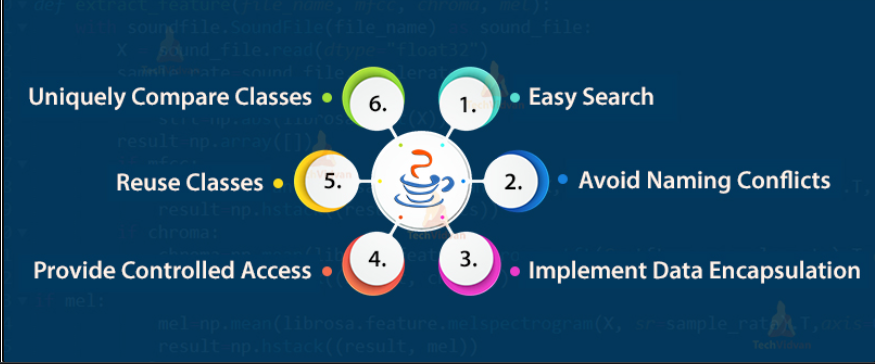
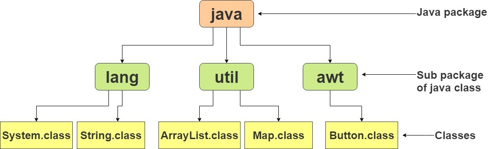

## Packages in Java
Package in Java is a mechanism to encapsulate a group of classes, sub packages and interfaces. A package as the name suggests is a pack(group) of classes, interfaces and other packages. Packages can be considered as data encapsulation (or data-hiding).

- The package keyword is used to create a package in java.
- A class can have only one package declaration.
- Every class is part of some package.
- If no package is specified, the classes in the file goes into a special unnamed package (the same unnamed package for all files).
- All classes/interfaces in a file are part of the same package. Multiple files can specify the same package name.
- If package name is specified, the file must be in a subdirectory called name (i.e., the directory name must match the package name).
## Advantage of Java Package
- Preventing naming conflicts.
   - For example there can be two classes with name Employee in two packages, college.staff.cse.Employee and college.staff.ee.Employee
- Better Organization
   - Making searching/locating and usage of classes, interfaces, enumerations and annotations easier
- Providing controlled access
   - Protected and default have package level access control. A protected member is accessible by classes in the same package and its subclasses.
   - A default member (without any access specifier) is accessible by classes in the same package only.
- Reusability
   - While developing a project in java, we often feel that there are few things that we are writing again and again in our code.
   - Using packages, you can create such things in form of classes inside a package and whenever you need to perform that same task, just import that package and use the class.
  
## Types of packages in Java
- Package in java can be categorized in two form, built-in package and user-defined package.
- Packages are defined by the user called user defined packages.
- These packages consist of a large number of classes which are a part of Java API.

## Some of the commonly used built-in packages are:
- java.lang:
- java.io:
- java.util:
- java.applet:
- java.awt:
- java.net:

### Example-1: Write a java program to implement java packages.
~~~js
package packagOne;
  class Demo{
    void show() {
        System.out.println("I am from final show method");
    }
   }

  public class Funycode extends Demo {
     public static void main(String ar[]) {
        Funycode funycode=new Funycode();
        funycode.show();
     }
   }
~~~
~~~
Output:
I am from final show method
~~~
## Accessing Package From Another Package
- There are three ways to access the package from outside the package.
- Using package name
- Using package name.classname;
- Using fully qualified name
## Using Package Name
- If we import a package, all the classes and interface of that package will be imported excluding the classes and interfaces of the sub-packages.
- Hence, we need to import the sub-package as well.
- If we use package.* then all the classes and interfaces of this package will be accessible but not subpackages.
- The import keyword is used to make the classes and interface of another package accessible to the current package.
### Example-2: Write a java program to import all method from one package to other.
~~~js
//Write a java program to import all method from one package to other.
//Funycode.java
package packagOne;
  public class Funycode{
    public void show() {
        System.out.println("I am from packagOne show method");
      }
    }

//MainClass.java
package packageTwo;
  import packagOne.*;
    public class MainClass extends Funycode{
      public static void main(String[] args) {
        Funycode funycode=new Funycode();
        funycode.show();
      }
    }
~~~
~~~
Output:
I am from packagOne show method
~~~
## Using Package Name . Classname
- If you import package.classname then only declared class of this package will be accessible.

### Example-3: Write a java program to import a class from one package to other using .className.
~~~js
//Write a java program to import a class from one package to other using .className.
//Funycode.java
package packagOne;
  public class Funycode{
   public void show() {
        System.out.println("I am from packagOne show method");
      }
    }

//MainClass.java
package packageTwo;
import packagOne.Funycode;
  public class MainClass extends Funycode{
    public static void main(String[] args) {
        Funycode funycode=new Funycode();
        funycode.show();
     }
   }
~~~
~~~
Output:
I am from packagOne show method
~~~
## Using Fully Qualified Name
- If you use fully qualified name, then only declared class of this package will be accessible.
- Now there is no need to import.
- But you need to use fully qualified name every time when you are accessing the class or interface.
- It is generally used when two packages have same class name e.g. java.util and java.sql packages contain Date class.
### Example-4: Write a java program to import a class from one package to other using full package name.
~~~js
//Write a java program to import a class from one package to other using full package name.
//Funycode.java
package packagOne;
  public class Funycode{
    public void show() {
    System.out.println("I am from packagOne show method");
    }
  }

//MainClass.java
package packageTwo;
  public class MainClass extends Funycode{
    public static void main(String[] args) {
    packagOne.Funycode funycode=new packagOne.Funycode();
    funycode.show();
   }
 }
~~~
~~~
Output:
I am from packagOne show method
~~~
## Sub-Package In Java
- Package inside the package is called the sub-package.
- It should be created to categorize the package further.
- Lets say I have created another package inside mainpackage and the sub package name is subpackage.
- So if I create a class in this sub-package it should have this package declaration in the beginning.
~~~js
package mainpackage.subpackage;
  public class Addition{
    int product(int a, int b){
    return a*b;
   }
  }
~~~
-  Now if I need to use this Multiplication class I have to either import the package like this:
~~~
import mainpackage .subpackage;
or
mainpackage .subpackage.Additionobj = new mainpackage .subpackage.Addition();
~~~
## Summary of Packages in Java
- A class can have only one package declaration but it can have more than one package import statements
- If we import two packages where both of them have same class name, then fully qualified name have to used to avoid naming conflict.
- If we create a class inside a package while importing another package then the package declaration should be the first statement, followed by package import.
- The wild card import like package.* should be used carefully when working with sub-packages.