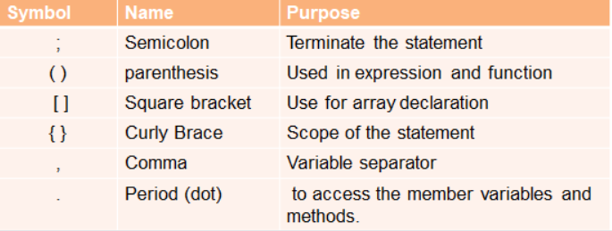

## Separators in Java
Separators are symbols used to indicate where groups of code are divided and arranged. They basically define the shape and function of our code. Every language has a unique set of special symbols that work as separators. In java, separators are used to separating the data values written in java programs.

## Parenthesis()
- Used to enclose parameters in method definition and invocation, also used for defining precedence in expressions, containing expressions for flow control, and surrounding cast types
## Braces{ }
- Used to contain the values of automatically initialized arrays and to define a block of code for classes, methods and local scopes
## Brackets[ ]
- Used to declare array types and for dereferencing array values Semicolon ; Used to separate consecutive identifiers in a variable declaration, also used to chain statements together inside a ‘for’ statement.
## Comma ,
- Used to separate package names from sub-packages and classes; also used to separate a variable or method from a reference variable.
## Period .
- Used to separate package names from sub packages and classes; also used to separate a variable or a method from the reference variable.