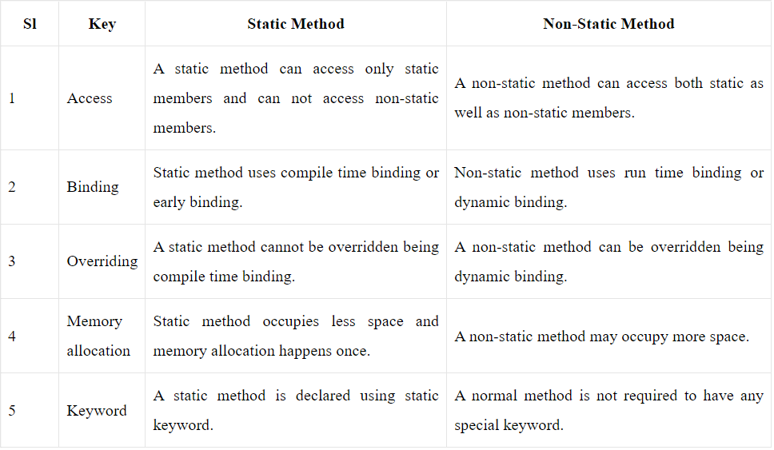

## Static Keyword in Java
The static keyword in java is used for memory management mainly. Static keyword can be used with class, variable, method and block. Static members belong to the class instead of a specific instance, this means if you make a member static, you can access it without object. This can be:
- Static variable (also known as class variable)
- Static method (also known as class method)
- Static block
- Static nested class

## Java Static Variables
- The static variable can be used to refer the common property of all objects
- A static variable is common to all the instances (or objects) of the class because it is a class level variable.
- The static variable gets memory only once in class area at the time of class loading.
- It makes your program memory efficient (i.e it saves memory).
- Only a single copy of static variable is created and shared among all the instances of the class.
- Memory allocation for such variables only happens once when the class is loaded in the memory.
- Static variables are also known as Class Variables.
- Unlike non-static variables, such variables can be accessed directly in static and non-static methods

## Example-1: Write a java program to illustrate difference between static and non static variable.
~~~js
//Write a java program to illustrate difference between static and non static variable.
  public class StaticVariable {
     static int count=0;
     int ncount=0;
     StaticVariable(){
        count++;
        ncount++;
        System.out.println("Static variable Count="+count);
        System.out.println("Non Static variable ncount="+ncount);
       }
  public static void main(String[] args) {
     StaticVariable ob1=new StaticVariable();
     StaticVariable ob2=new StaticVariable();
     StaticVariable ob3=new StaticVariable();
    }
  }
~~~
~~~
Output:
Static variable Count=1
Non Static variable ncount=1
Static variable Count=2
Non Static variable ncount=1
Static variable Count=3
Non Static variable ncount=1
Java static method
~~~
- A static method belongs to the class rather than object of a class.
- If we apply static keyword with any method, it is known as static method.
- Static Methods can access class variables (static variables) without using object of the class
- However non-static methods and non-static variables can only be accessed using objects.
- Static methods can be accessed directly in static and non-static methods.
- static method can access static data member and can change the value of it.
- The static method cannot use non static data member or call non-static method directly.
- This and super cannot be used in static context.
- Java main method is static because object is not required to call static method if it were non-static method, jvm create object first then call main() method that will lead the problem of extra memory allocation.

## Example-2: Write a java program to illustrate that static variable can be accessed directly from static method.
~~~js
//Write a java program to illustrate that static variable can be accessed directly from static method.
  public class StaticVariable {
     static int count=200;
     static int value=100;

     static void show() {
        System.out.println("Count="+count);
        System.out.println("Count="+value);
       }

  public static void main(String[] args) {
     show();
    }
  }
~~~
~~~
Output:
Count=200
Count=100
~~~

### Example-3: Write a java program to illustrate that static method can access static variable directly without creating the object.
~~~js
//Write a java program to illustrate that static method can access static variable directly without creating the object.
  public class StaticVariable {
     static int count=200;
     static int value=100;
  public static void main(String[] args) {
     System.out.println("Count="+count);
     System.out.println("Count="+value);
    }
  }
~~~
~~~
output:
Count=200
Count=100
Static Class/Inner Class
~~~
- A class can be made static only if it is a nested class
- In Java, it is possible to define a class within another class, such classes are known as nested classes.
- The scope of a nested class is bounded by the scope of its enclosing class.
- A nested class has access to the members, including private members, of the class in which it is nested.
- However, the reverse is not true i.e., the enclosing class does not have access to the members of the nested class.
- A nested class is also a member of its enclosing class.
- As a member of its enclosing class, a nested class can be declared private, public, protected, or package private(default).
- Nested classes are divided into two categories:
   - static nested class : Nested classes that are declared static are called static nested classes.
   - Inner class : An inner class is a non-static nested class.
- Nested static class doesn’t need reference of Outer class
- A static class cannot access non-static members of the Outer class

### Example-4: Write a java program to illustrate nested static class.
~~~js
//Write a java program to illustrate nested static class.
  public class StaticVariable {
     static int count=200;
     static int value=100;

     static class Nested{
        void show() {
          System.out.println("Count="+count);
          System.out.println("value="+value);
          }
        }

  public static void main(String[] args) {
     StaticVariable.Nested ob=new StaticVariable.Nested();
     ob.show();
    }
  }
~~~
~~~
output:
Count=200
Count=100
~~~

### Example-5: Write a java program to demonstrate how to implement static and non-static classes.
~~~js
//Write a java program to demonstrate how to implement static and non-static classes.
  class OuterClass{
     static String ms1="I am a static message";
     String ms2="I am a non static message";

     static class NestedInnerclass{
     void show() {
        System.out.println("ms1="+ms1);
        //System.out.println("ms2="+ms2); //can not access non static member
       }
      }// end of nestedinner class
  class Innerclass{
     void display() {
        System.out.println("ms1="+ms1); //can access static and non static member
        System.out.println("ms2="+ms2);
       }
     } //end of innerclass
   }//end of outerclass

  public class StaticVariable {
     public static void main(String[] args) {
     //In order to create instance of Inner class we need an Outer class instance first
     OuterClass.NestedInnerclass ob1=new OuterClass.NestedInnerclass();
     ob1.show();
     OuterClass.Innerclass ob2=new OuterClass().new Innerclass();
     ob2.display();
     }
  }
~~~
~~~
Output:
ms1=I am a static message
ms1=I am a static message
ms2=I am a non static message
~~~
## Difference Between Static and Non Static Method
