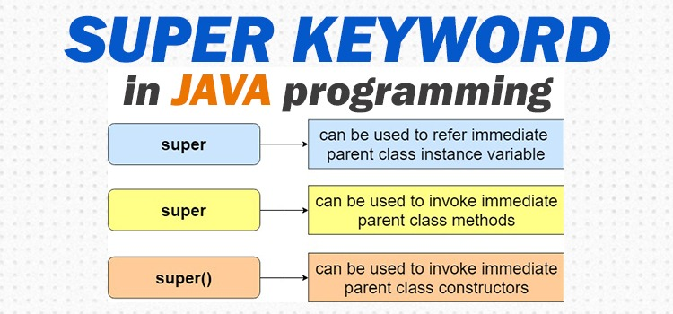

## Super Keyword in Java
The super keyword in Java is a reference variable which is used to refer immediate parent class object. Whenever a subclass needs to refer to its immediate superclass, it can do so by use of the keyword super.
- The super keyword in java is a reference variable that is used to refer parent class objects.
- Whenever you create the instance of subclass, an instance of parent class is created implicitly which is referred by super reference variable.
- The keyword “super” came into the picture with the concept of Inheritance.
- Before learning super keyword, you must have the knowledge of inheritance in Java.

## The Use of Super Keyword
- To access the data members of parent class when both parent and child class have member with same name.
- To explicitly call the no-arg and parameterized constructor of parent class
- To access the method of parent class when child class has overridden that method.
## Super Keyword with Variables
- This scenario occurs when a derived class and base class has same data members.
- In that case there is a possibility of ambiguity for the JVM.
### Example-1: Write a Java program to implement/use the super keyword in terms of variable where base class and derived class has the same variable.
~~~js
//Write a Java program to implement/use the super keyword in terms of variable where base class and derived class has the same variable.
class Demo{
     int a=100;
     String name="Rahim";
    }

  public class Funycode extends Demo{
    int a=200;
    String name="Karim";

    void show() {
        //value of a=200 and name=karim will be invoked
        System.out.println("Value of a="+a +" & Name="+name);
        //value of a=100 and name=Rahim will be invoked
        System.out.println("Value of a="+super.a +" & Name="+super.name);
       }
  public static void main(String ar[]) {
        Funycode funycode=new Funycode();
        funycode.show();
        }
      }
~~~
~~~
Output:
Value of a=200 & Name=Karim
Value of a=100 & Name=Rahim
~~~

## Super Keyword to Invoke Parent Class Constructor
- When we create the object of sub class, the new keyword invokes the constructor of child class, which implicitly invokes the constructor of parent class.
- So the order to execution when we create the object of child class is: parent class constructor is executed first and then the child class constructor is executed.
- It happens because compiler itself adds super()(this invokes the no-arg constructor of parent class) as the first statement in the constructor of child class.

### Example-2: Write a Java program to implement/use the super keyword in terms of no argument constructor.
~~~js
 //Write a Java program to implement/use the super keyword in terms of no argument constructor.
  class Demo{
    Demo(){
      System.out.println("I am from Base Class Demo Constructor");
    }
   }

  public class Funycode extends Demo{
    Funycode() {
      //compiler implicitly call here base class constructor using super here
      System.out.println("I am from Derived Class Funycode Constructor");
     }
  public static void main(String ar[]) {
      Funycode funycode=new Funycode();
     }
   }
~~~
~~~
Output:
I am from Base Class Demo Constructor
I am from Derived Class Funycode Constructor
~~~
### Example-3: Write a Java program to implement/use the super keyword in terms of parameterized constructor.
~~~js
//Write a Java program to implement/use the super keyword in terms of parameterized constructor.
class Demo{
    String name;
    Demo(String st){
      name=st;
      System.out.println("I am from Base Class Demo Constructor and name="+name);
     }
    }

  public class Funycode extends Demo{
    String address;
    Funycode(String nm, String add) {
    super(nm); //this will be the first statement
    address=add;
    System.out.println("I am from Derived Class Funycode Constructor and address="+address);
   }
  public static void main(String ar[]) {
    Funycode funycode=new Funycode("Rahim","New York");
   }
  }
~~~
~~~
Output:
I am from Base Class Demo Constructor and name=Rahim
I am from Derived Class Funycode Constructor and address=New York
~~~
## Important Points
- Call to super() must be first statement in Derived Class constructor.
- If a constructor does not explicitly invoke a superclass constructor, the Java compiler automatically inserts a call to the no-argument constructor of the superclass.
- If the superclass does not have a no-argument constructor, you will get a compile-time error.
- Object does have such a constructor, so if Object is the only superclass, there is no problem.
- If a subclass constructor invokes a constructor of its superclass, either explicitly or implicitly, you might think that a whole chain of constructors called, all the way back to the constructor of Object.
- This, in fact, is the case. It is called constructor chaining
## Super Keyword in Method Overriding
- When a child class declares a same method which is already present in the parent class then this is called method overriding.
- When a child class overrides a method of parent class, then the call to the method from child class object always call the child class version of the method.
- However by using super keyword like this: super.method_name you can call the method of parent class (the method which is overridden).
## Example-4: Write a Java program to implement/use the super keyword in terms of method overriding.
~~~js
 //Write a Java program to implement/use the super keyword in terms of method overriding.
  class Demo{
    void show() {
      System.out.println("I am From Base class Demo show method");
     }
    }

  public class Funycode extends Demo{
    void show() {
      System.out.println("I am From derived class Funycode show method");
    }

  void display() {
    System.out.println("I am From derived class Funycode display method");
    show(); //derived class Funycode show method inoked
    super.show(); //base class Demo show method invoked
    }
  public static void main(String ar[]) {
    Funycode funycode=new Funycode();
    funycode.display();
  }
}
~~~
~~~
Output:
I am From derived class Funycode display method
I am From derived class Funycode show method
I am From Base class Demo show method
~~~