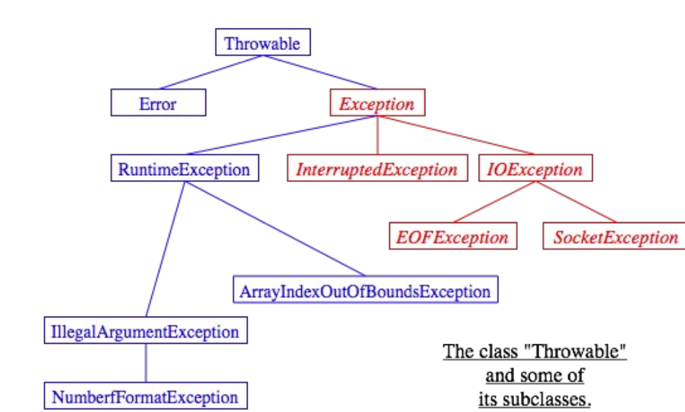

## Throw, Throws and Throwable in Java
The “throw” keyword is used to throw an exception. We can define our own set of conditions or rules and throw an exception explicitly using throw keyword. It is possible for your program to throw an exception explicitly, using the throw statement. The general form of throw is shown here:
## throw Throwableinstance;
- Throwableinstance must be an object of type Throwable or a subclass of Throwable.
- Simple types, such as int or char, as well as non-Throwable classes, such as String and Object, cannot be used as exceptions.
- There are two ways you can obtain a Throwable object: using a parameter into a catch clause, or creating one with the new operator.
- The flow of execution stops immediately after the throw statement; any subsequent statements are not executed.
- The nearest enclosing try block is inspected to see if it has a catch statement that matches the type of the exception.
- If it does find a match, control is transferred to that statement. If not, then the next enclosing try statement is inspected, and so on.
- If no matching catch is found, then the default exception handler halts the program and prints the stack trace.
### Example-1: Write a java program to implement throw keyword in java.
~~~js
//Write a java program to implement throw keyword in java.
  public class FunyCodeException {
    static void throwDemo()
      {
       try
      {
       throw new NullPointerException("demo");
      }
     catch(NullPointerException e)
     {
        System.out.println("Caught inside throwDemo.");
        throw e; // rethrow the exception
      }
    }
    public static void main(String args[])
      {
       try
      {
       throwDemo();
      }
      catch(NullPointerException e)
      {
        System. out .println ("Recaught Exception");
       }
      }
     }
~~~
~~~
Output:
Caught inside throwDemo.
Recaught Exception
~~~
### Example-2: Write a java program to check weather eligible or not in voting registration using throw keyword in java.
~~~js
//Write a java program to check weather eligible or not in voting registration using throw keyword in java.
  public class FunyCodeException {
    static void ageCheck(int age) {
      if (age<18)
        throw new ArithmeticException("Not Elligible for Voting");
      else
        System.out.println("Welcome, Elligible for Voting");
      }
    public static void main(String args[]) {
       ageCheck(10);
      }
    }
~~~
~~~
Output:
Exception in thread "main" java.lang.ArithmeticException: Not Elligible for Voting
at FunyCodeException.ageCheck(FunyCodeException.java:5)
at FunyCodeException.main(FunyCodeException.java:10)
~~~
## Throws in Java
- Throws keyword is used for handling checked exceptions . By using throws we can declare multiple exceptions in one go.
- If a method is capable of causing an exception that it does not handled, it must specify the behavior so that callers of the method can guard themselves against that exception.
- You do this by including a throws clause in the method’s declaration.
- A throws clause lists the types of exceptions that a method might throw.
- This is necessary for all exceptions, except those of type Error or RuntimeException, or any of their subclasses.
- All other exceptions that a method can throw must be declared in the throws clause.
- If they are not, a compile-time error will result.

~~~
Syntax:
type method-name(parameter-list) throws exception-list
{
// body of method
}
~~~
- Exception-list is a comma-separated list of the exceptions that a method can throw.
### Example-3: Write a java program to demonstrate throws’ keyword in java.
~~~js
//Write a java program to demonstrate throws’ keyword in java.
public class FunyCodeException {
    static void throwOne() throws IllegalAccessException
      {
        System.out.println("Inside throwOne");
        throw new IllegalAccessException("demo");
      }
    public static void main(String args[])
      {
       try {
         throwOne ();
         }
         catch (IllegalAccessException e)
       {
         System.out.println("Caught" +e);
        }
      }
    }
~~~
~~~
Output:
Inside throwOne
Caughtjava.lang.IllegalAccessException: demo
~~~
### Example-4: Write a java program to demonstrate multiple exception in throws’ keyword in java.
~~~js
//Write a java program to demonstrate multiple exception in throws’ keyword in java.
  public class FunyCodeException {
    static void throwOne(int a) throws NullPointerException, ArithmeticException
        {
        if (a==100)
            throw new NullPointerException (" Warning NullPointerException");
        else
            throw new ArithmeticException (" Warning ArithmeticException");
        }
        public static void main(String args[])
        {
          try {
               throwOne (100);
               }
           catch (Exception e)
              {
               System.out.println("Caught " +e);
              }
             }
           }
~~~
~~~
Output:
Caught java.lang.NullPointerException:
Warning NullPointerException
~~~
## Throw vs Throws in java
- Throws clause is used to declare an exception, which means it works similar to the try-catch block.
- On the other hand throw keyword is used to throw an exception explicitly.
- If we see syntax wise than throw is followed by an instance of Exception class and throws is followed by exception class names.
- For example: throw new ArithmeticException(“Arithmetic Exception”);
- Throw keyword is used in the method body to throw an exception, while throws is used in method signature to declare the exceptions that can occur in the statements present in the method.

- All exception objects must belong to a subclass of the standard class java.lang.Throwable.
- In general, each different type of exception is represented by its own subclass of Throwable, and these subclasses are arranged in a fairly complex class hierarchy that shows the relationship among various types of exception.
## Throwable
- Throwable has two direct subclasses, Error and Exception.
- These two subclasses in turn have many other predefined subclasses.
- In addition, a programmer can create new exception classes to represent new types of exception.