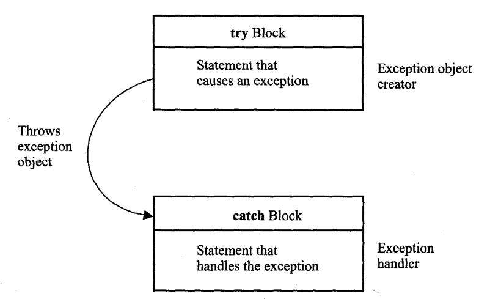

# Try-catch Statement in Java
The purpose of exception handling mechanism is to provide a means to detect and report an “exceptional circumstance” so that appropriate action can be taken. The mechanism suggests incorporation of a separate error handling code that performs the following tasks:

1. Find the problem (Hit the exception).
2. Inform that an error has occurred (Throw the exception)
3. Receive the error information (Catch the exception)
4. Take corrective actions (Handle the exception)
The error handling code basically consists of two segments, one to detect errors and to throw exceptions and the other to catch exceptions and to take appropriate actions.

- Java exception handling is managed via five keywords: try, catch, throw, throws, finally.
- Program statements that you want to monitor for exceptions are contained within a try block.
- If an exception occurs within the try block, it is thrown. Your code can catch this exception (using catch) and then throw it in some rational manner.
- System-generated exceptions are automatically thrown by Java run-time system.
- To manually throw an exception, use the keyword throw; Any exception that is thrown out of a method must be specified as such by a throws clause.
- Any code that absolutely must be executed before a method returns is put in finally block.
## Java Exception Keywords
### try
- The try block contains set of statements where an exception can occur.
- A try block is always followed by a catch block, which handles the exception that occurs in associated try block.
- A try block must be followed by catch blocks or finally block or both.
### catch
- A catch block is where you handle the exceptions, this block must follow the try block.
- A single try block can have several catch blocks associated with it.
- You can catch different exceptions in different catch blocks.
- When an exception occurs in try block, the corresponding catch block that handles that particular exception executes.
- For example if an arithmetic exception occurs in try block then the statements enclosed in catch block for arithmetic exception executes.
### finally
- A finally block contains all the crucial statements that must be executed whether exception occurs or not.
- The statements present in this block will always execute regardless of whether exception occurs in try block or not such as closing a connection, stream etc.
### throw
- The “throw” keyword is used to throw an exception.
- We can define our own set of conditions or rules and throw an exception explicitly using throw keyword.
- For example, we can throw ArithmeticException when we divide number by 5, or any other numbers, what we need to do is just set the condition and throw any exception using throw keyword.
- Throw keyword can also be used for throwing custom exceptions,
### Throws
- The “throws” keyword is used to declare exceptions.
- It doesn’t throw an exception.
- It specifies that there may occur an exception in the method.
- It is always used with method signature.
- This is the general form of an exception-handling block
~~~js
try
    {
    // block of code to monitor for errors
    }
catch (ExceptionTypel exOb)
    {
    // exception handler for ExceptionTypel
    }catch (ExceptionType2 exOb)
    {
    // exception handler for ExceptionType2
    }
// . . . . . . . . .
finally
    {
    // block of code to be executed before try block ends
    }
~~~
## Common Scenarios of Java Exceptions
## ArithmeticException
~~~
int a=50/0;//ArithmeticException
~~~
## NullPointerException
~~~
String s=null;
System.out.println(s.length());//NullPointerException )
~~~
## NumberFormatException
~~~
String s=”abc”;
int i=Integer.parseInt(s);//NumberFormatException
~~~
## ArrayIndexOutOfBoundsException
~~~
int a[]=new int[5];
a[10]=50; //ArrayIndexOutOfBoundsException
~~~
## Exception Handling Mechanism
- Default Exception Handling
- Customized Exception Handling
- Default Exception Handling

- Whenever inside a method, if an exception has occurred, the method creates an Object known as Exception Object and hands it off to the run-time system(JVM).
- The exception object contains name and description of the exception, and current state of the program where exception has occurred.
- Creating the Exception Object and handling it to the run-time system is called throwing an Exception.
- There might be the list of the methods that had been called to get to the method where exception was occurred.
- This ordered list of the methods is called Call Stack
### Example-1: Write a java program to illustrate how default exception is thrown.
~~~js
//Write a java program to illustrate how default exception is thrown.
public class FunyCodeException {
    public static void main(String[] args) {
    String s=null;
    System.out.println(s.length());
   }
 }
Output:
Exception in thread "main" java.lang.NullPointerException: Cannot invoke "String.length()" because "s" is null at FunyCodeException.main(FunyCodeException.java:6)
~~~
## Customized Exception Handling
- Java exception handling is managed via five keywords: try, catch, throw, throws, and finally.
- Program statements that you think can raise exceptions are contained within a try block. If an exception occurs within the try block, it is thrown.
- Your code can catch this exception (using catch block) and handle it in some rational manner.
- System-generated exceptions are automatically thrown by the Java run-time system.
- To manually throw an exception, use the keyword throw.
- Any exception that is thrown out of a method must be specified as such by a throws clause.
- Any code that absolutely must be executed after a try block completes is put in a finally block.

### Example-2: Write a java program to illustrate simple exception using try catch block.
~~~js
//Write a java program to illustrate simple exception using try catch block.
public class FunyCodeException {
    public static void main(String[] args) {
    try {
      int a=100,b=0;
      System.out.println(a/b);
    }
    catch(Exception e) {
      System.out.println(e);
    }
  System.out.println("Rest of the code");
  }
 }
~~~
~~~
Output:
java.lang.ArithmeticException: / by zero
Rest of the code
~~~

### Example-3: Write a java program to illustrate null pointer exception using try catch block.
~~~js
//Write a java program to illustrate null pointer exception using try catch block.
public class FunyCodeException {
  public static void main(String[] args) {
    try {
      String s=null;
      System.out.println(s.length());
      }
    catch(NullPointerException e) {
      System.out.println(e);
     }
      System.out.println("Rest of the code");
     }
   }
~~~
~~~
Output:
java.lang.NullPointerException: Cannot invoke "String.length()" because "s" is null
Rest of the code
~~~
## Multiple Catch Blocks in Java
- A single try block can have any number of catch blocks.
- A generic catch block can handle all the exceptions. Whether it is
- ArrayIndexOutOfBoundsException or ArithmeticException or NullPointerException or any other type of exception
~~~
catch(Exception e){
//This catch block catches all the exceptions
}
~~~
- If no exception occurs in try block then the catch blocks are completely ignored.
- Corresponding catch blocks execute for that specific type of exception:
- catch(ArithmeticException e) is a catch block that can hanlde ArithmeticException
- catch(NullPointerException e) is a catch block that can handle NullPointerException
### Example-4: Write a java program to illustrate multiple catch block in single try block.
~~~js
//Write a java program to illustrate multiple catch block in single try block.
  public class FunyCodeException {
    public static void main(String[] args) {
      try {
        String s=null;
        System.out.println(s.length());
       }
    catch(ArithmeticException e) {
        System.out.println("Here Arithmetic Exception");
    }
    catch(ArrayIndexOutOfBoundsException e) {
        System.out.println("Here Array Index Out O fBounds Exception");
    }
    catch(NumberFormatException e) {
        System.out.println("Here Number Format Exception");
    }
    catch(NullPointerException e) {
        System.out.println("Here Null Pointer Exception");
    }
    catch(Exception e) {
        System.out.println("Other Exception");
    }
        System.out.println("Rest of the code");
    }
  }
~~~
~~~
Output:
Here Null Pointer Exception
Rest of the code
Finally Block
~~~
- A finally block must be associated with a try block, you cannot use finally without a try block.
- You should place those statements in this block that must be executed always.
- Finally block is optional, a try-catch block is sufficient for exception handling, however if you place a finally block then it will always run after the execution of try block.
- In normal case when there is no exception in try block then the finally block is executed after try block.
- However if an exception occurs then the catch block is executed before finally block.
- An exception in the finally block, behaves exactly like any other exception.
- The statements present in the finally block execute even if the try block contains control transfer statements like return, break or continue.
- A try-finally block is possible without catch block.
- Which means a try block can be used with finally without having a catch block.

### Example-5: Write a Java program to illustrate finally block with try catch block.
~~~js
//Write a Java program to illustrate finally block with try catch block.
  public class FunyCodeException {
    public static void main(String[] args) {
     try {
        String s=null;
        System.out.println(s.length());
    }
    catch(NullPointerException e) {
        System.out.println("Here NullPointer Exception");
    }
    //this block will execute alaways either exception or not
    finally {
        System.out.println("I am from finally block");
    }
        System.out.println("Rest of the code");
    }
  }
~~~
~~~
Output:
Here NullPointer Exception
I am from finally block
Rest of the code
~~~
### Example-6: Write a Java program to illustrate finally block with return statement in try block.
~~~js
//Write a Java program to illustrate finally block with return statement in try block.
 public class FunyCodeException {
    int show() {
      try {
        return 100;
       }
    finally {
        System.out.println("I am from finally block");
       }
    }
    public static void main(String[] args) {
        FunyCodeException codeException=new FunyCodeException();
        System.out.println(codeException.show());
       }
    }
~~~
~~~
Output:
I am from finally block
100
~~~
### Example-7: Write a Java program to illustrate the working of finally block when an exception occurs in try block but is not handled in the catch block.
~~~js
// Write a Java program to illustrate the working of finally block when an exception occurs in try block but is not handled in the catch block.
  public class FunyCodeException {
    public static void main(String[] args) {
      try {
        String s=null;
        System.out.println(s.length());
       }
    catch(ArithmeticException e) {
        System.out.println("Here Arithmetic Exception");
    }
    finally {
        System.out.println("I am from finally block");
    }
        System.out.println("Rest of the code");
    }
   }
~~~
~~~
Output:
I am from finally block
Exception in thread "main" java.lang.NullPointerException: Cannot invoke "String.length()" because "s" is null at FunyCodeException.main(FunyCodeException.java:6)
~~~
## Nested Try-catch
- When a try catch block is present in another try block then it is called the nested try catch block.
- Each time a try block does not have a catch handler for a particular exception, then the catch blocks of parent try block are inspected for that exception, if match is found that that catch block executes.
- If neither catch block nor parent catch block handles exception then the system generated message would be shown for the exception, similar to what we see when we don’t handle exception.
- The syntax of nested try catch block is
~~~JS
//Main try block
try {
    try block-1;
    //try-catch block inside another try block
    try {
         try block-2;
          //try-catch block inside nested try block
            try {
         try block-3;
            }
    catch(Exception e2) {
    //handle try block-3;
       }
    }
    catch(Exception e1) {
    //handle try block-2;
    }
    }
    //Catch of Main(parent) try block
    catch(Exception e3) {
    ////handle try block-1;
    }
~~~
### Example-8: Write a java program to illustrate nested try block with exception.
~~~js
//Write a java program to illustrate nested try block with exception.
  public class FunyCodeException {
    public static void main(String[] args) {
      try {
          //try block-1
           try {
                //try block-2
                 try {
                     //try block-3
                    String s=null;
                    System.out.println(s.length());
                   }
                catch(ArithmeticException e) {
                    System.out.println("Here Arithmetic Exception");
                    System.out.println("Here try block-3 handled");
                }
             }
       catch(ArrayIndexOutOfBoundsException e) {
        System.out.println("Here Array Index Out Of Bounds Exception");
        System.out.println("Here try block-2 handled");
        }
      }
    catch(NumberFormatException e) {
        System.out.println("Here Number Format Exception");
        System.out.println("Here try block-1 handled");
      }
    catch(NullPointerException e) {
        System.out.println("Here Null Pointer Exception");
    }
    catch(Exception e) {
        System.out.println("Other Exception");
      }
    }
  }
~~~
~~~
Output:
Here Null Pointer Exception
~~~