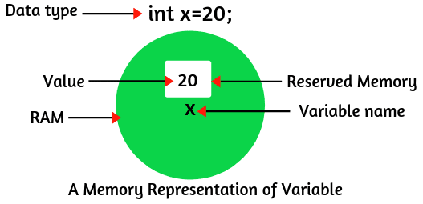

## Variable in Java
A variable is an identifier that denotes a storage location used to store a data value. Their value changes during the execution of a program, a variable may take different values at different times during the execution of the program. A variable name can be chosen by the programmer in a meaningful way.

- Every variable must be declared before they used. Following is the basic form of a variable declaration − dataType variableName;
- Here data type is one of Java’s datatypes i.e. int, float, char, double etc. and variable is the name of the variable.
- Some examples of variable names are: average, height, total_height, classStrength.
- Following are valid examples of variable declaration and initialization in Java −
~~~
int a, b, c;         // Declares three ints, a, b, and c.
int a = 10, b = 10;  // Example of initialization
byte B = 22;         // initializes a byte type variable B.
double pi = 3.14159; // declares and assigns a value of PI.
char a = 'a';        // the char variable a iis initialized with value 'a'
~~~
## Rules to Define Variable
- Variable names may consist of alphabets, digits, the underscore(_) and dollar characters, subject to the following conditions:
- They must not begin with a digit.
- Uppercase and lowercase are distinct. This means that the variable Total is not the same as total or TOTAL.
- It should not be a keyword.
- White space is not allowed.
- Variable names can be of any length.

## Variable Scope
Java variable  scope are actually classified into three types:
1. Instance variables,
2. Class variables and
3. Local variables.

## Instance Variable
Instance variables are declared in a class, but outside a method, constructor or any block.
- When a space is allocated for an object in the heap, a slot for each instance variable value is created.
- Instance variables are created when an object is created with the use of the keyword ‘new’ and destroyed when the object is destroyed.
- Instance variables can be declared in class level before or after use.
- Access modifiers can be given for instance variables.
- The instance variables are visible for all methods, constructors and block in the class.
- Instance variables have default values. For numbers, the default value is 0, for Booleans it is false, and for object references it is null.
- Instance variables can be accessed directly by calling the variable name inside the class.

## Class variable
- Class variables are global to a class and belong to the entire set of objects that class creates. Only one memory location is created for each class variable.
- Sometimes, you want to have variables that are common to all objects. This is accomplished with the static modifier.
- Fields that have the static modifier in their declaration are called static fields or class variables.
- They are associated with the class, rather than with any object. Every instance of the class shares a class variable, which is in one fixed location in memory.
- Any object can change the value of a class variable, but class variables can also be manipulated without creating an instance of the class.

## Local Variables
- Variables declared and used inside methods are called local variables.
- They are called so because they are not available for use outside the method definition.
- Local variables can also be declared inside program blocks that are defined
- between an opening brace { and a closing brace }.
- These variables are visible to the program only from the beginning of its program block to the end of the program block.
- When the program control leaves a block, all the variables in the block will cease to exist. The area of the program where the variable is accessible (i.e., usable) is called its scope.
