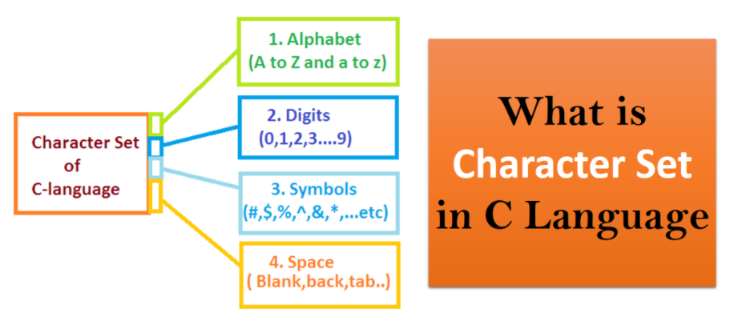
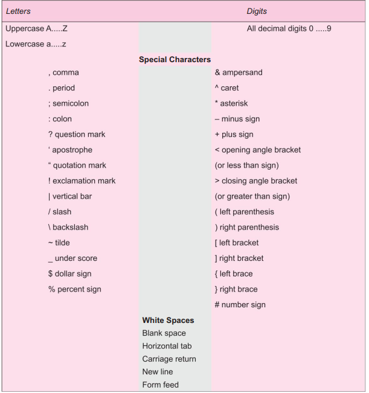
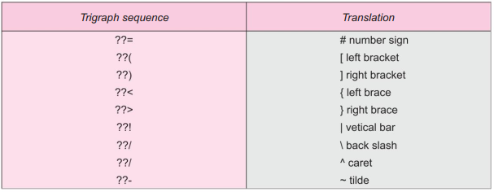

## Character Set in C
The set of characters that may appear in a legal C program is called the character set for C.
A character set defines the valid characters that can be used in source programs or
interpreted when a program is running.

- The source character set is the set of characters available for the source text. The execution
character set is the set of characters available when executing a program.

- The source character set does not necessarily match the execution character set;
for example, when the execution character set is not available on the devices used
to produce the source code.

- The characters that can be used to form words, numbers and expressions depend
upon the computer on which the program is run.

- However, a subset of characters is available that can be used on most personal, micro, mini and mainframe computers.
- Different character sets exist; for example, one character set is based on the [American Standard Code for Information
Interchange (ASCII)](https://en.wikipedia.org/wiki/ASCII) definition of characters, while another set includes the Japanese [kanji characters](https://en.wikipedia.org/wiki/Kanji).
- The character set in use makes no difference to the [compiler](https://en.wikipedia.org/wiki/Compiler); each character simply has a unique value. C treats each characterasa different integer value.
The ASCII character set has fewer than 255 characters, and these characters can be represented in 8 bits or less.
- However, in some extended character sets, so many characters exist that some characters’ representation requires more than 8 bits.

The characters in C are grouped into the following categories:

- Letters
- Digits
- Special characters
- White spaces

The entire character set is given in Table 1. The compiler ignores white spaces unless they are a part of a string constant. White spaces may be used to separate words,
but are prohibited between the characters of [keywords](https://funycode.com/token-and-keyword-in-c/) and [identifiers](https://funycode.com/identifier-in-c/).

## Table- C Character Set

- Many non-English keyboards do not support all the characters mentioned in above table 1.
- ANSI C introduces the concept of “trigraph” sequences to provide a way to enter certain characters that are not available on some keyboards.
Each trigraph sequence consists of three characters (two question marks followed by another character) as shown in Table 2.

## Table-2 ANSI C Trigraph Sequences

- For example, if a keyboard does not support square brackets, we can still use them in a program using the [trigraphs](https://docs.microsoft.com/en-us/cpp/c-language/trigraphs#:~:text=Trigraphs%20are%20sequences%20of%20three,representations%20for%20some%20punctuation%20characters.) ??( and ??).
