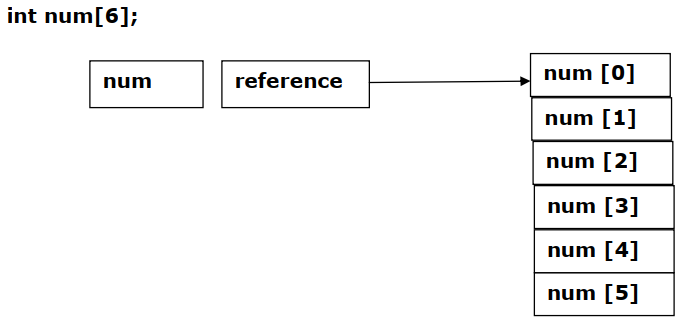
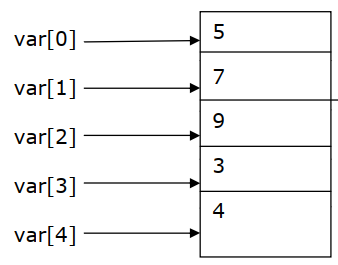

## Array in C
Many applications requires the processing of multiple data items that have common characteristics in such a situation it is convenient to place data items into an array. So individual data items can be char, int, floating point numbers and so on. The C language provides a capability called ‘array’ that enables the user to design a set of similar data types.

- Array in C is a group of related data item that share a common name.
- An ordered finite collection of data items, each of the same type, is called an array, and Only one name is assigned to an array and individual elements are referenced by specifying a Subscript.
- A subscript is also called an index. The complete set of values items is referred to as an array , the individual value are called elements.
- Arrays in C can be of any variable type.
- A loop with the subscript as the control variable can be used to read the entire array, perform calculations and print out the result.
## Important Note

- An array is a collection of similar elements.
- The first element in the array is numbered 0, so the last element is 1 less than the size of the array.
- An array is also known as a subscripted variable.
- Before using an array its type and dimension must be declared.
- However big an array its elements are always stored in contiguous memory locations. This is a very important point which we would discuss in more detail later on.
## An array has the following properties:

- The type of an array is the data type of its elements.
- The location of an array is the location of its first element.
- The length of an array is the number of data elements in the array.
- The size of an array is the length of the array times the size of an element.
## Array can be
1. One Dimension array
2. Multidimension array

## One Dimensional Array
- A list of items can be given one variable name using only one subscript and such a variable is called array.

- In mathematics, we often deal with variables that are single-subscripted. Like any other variable arrays must be declared explicitly before they are used. The general form of declaration is:
~~~
data-type Array-Name[Array-Size];
~~~
- Here data-type is the type specifier that indicates what data type the declared array is such as int, float double or char.
- Array-Name is the name of the declared array and rules of declaring the variable applies to array name.
- Array-Size defines how many elements the array contains. This is always an integer For example, an array of integers is declared in the following statement,
~~~
int array_int[8];
~~~
- Where int specifies the data type of the array whose name is array_int.
- The size of the array is 8, which means that the array can store eight elements (that is, integers in this case). The other examples are
~~~js
char C[10]         An array of characters
float plum[6]      An array of float numbers
double page[12]    An array of double numbers
~~~
## Array Index
- An array is implemented as continuous storage, the index-based access.

- To access element n, in array, position or index of array is important the index of the first element (sometimes called the “origin”) varies by language.
- There are three main implementations: zero-based, one-based, and n-based arrays, for which the first element has an index of zero, one, or a programmer-specified value respectively.
- The zero-based array is more natural and adopted by the C programming language.
- For ex, consider the array declaration int num[6];This array consists of five elements and index of first element is 0 , second is one and so on. This described in the below figure.

## Initialization of One Dimensional Array
- There are two categories of array namely,
   - Static array
   - Dynamic array
- Declaration for static array specifies the array size, which cannot be altered afterwards.  But for dynamic arrays the size can be altered. Using dynamic memory the dynamic array’s size can be modified. Once an array is declared, it must be initialized. Otherwise array will contain the garbage values.

- There are two different ways in which we can initialize the static array:

   - Compile time
   - Run time
## Compile Time Initialization
- This initialization is done while writing the program itself. Following is the syntax of initialization of the array.
~~~js
data-type array-name[size] = { list of values separated by comma };
int var[5] = {5, 7, 9, 3, 4};
~~~
- Here, the array variables are initialized with the values given in front of it. That is, the 0th element of array will contain 5, 1st will contain 7 and so on.
- Remember, the array indexing or subscripting is always done from 0th position.
- The values of the array will be get stored in following manner.

- In the array declaration, the size can also be omitted. In such cases the compiler will automatically identify the total number of elements and size will be given to it. For example:
~~~
int max[ ] = {8, 6, 7, 4, 5, 3, 0, 1};
~~~
- Compile time initialization can also be done partially. Such as
~~~js
float x[5] = {1.2, 6.9, 4.1};
x[0]=1.2, x[1]=6.9, x[2]=4.1, x[3]=0, x[4]=0
~~~
## Run Time Initialization
- An array can initialize at run time by the program or by taking the input from the keyboard. Generally, the large arrays are declared at run time in the program itself. Such as
~~~js
int sum[20];
for (i = 0;i<20;i++)
    sum[i] = 1;
~~~
- Here, all the elements of the array ‘sum’ are initialized with the value one.
- The loop control structures are applicable in these cases. The scanf function can also be used to input the values from the user.
- In such cases, the loop control structure is applicable. For example:
~~~js
int sum[10], x;
printf(“Enter 10 numbers: ”);
for(x=0;x<10;x++)
    scanf(“%d”, &sum[x]);
~~~
- Here, the array ‘sum’ is initialized by taking the values as input from the keyboard.
## Entering Data Into The Array
- To enter the data into array, consider the below lines.
~~~js
for (i=0; i<= 29; i++)
    {
    printf (“\n Enter marks”)
    scanf (“%d”, &marks [i]);
    }
~~~
- The above section will read about 30 elements numbered from 0 to 29 in to the array named marks. This will take input from the user repeatedly 30 times.
## Reading Data From Array
~~~js
for ( i=0; i <= 29; i++);
    Printf(The value entered into array marks [%d] is %d”, i,marks[i]);
~~~
### Example-1: Write a program to initialize ten elements of an array.
~~~js
//Write a program to initialize ten elements of an array.
#include<stdio.h>
main()
    {
    int i;
    int list[10];
    for (i=0; i<10; i++)
        {
        list[i] = i + 1;
        printf( "list[%d] is initialized with %d.\n", i, list[i]);
        }
    }
~~~
~~~
Output:
list [0] is initialized with 1.
list [1] is initialized with 2.
list [2] is initialized with 3.
list [3] is initialized with 4.
list [4] is initialized with 5.
list [5] is initialized with 6.
list [6] is initialized with 7.
list [7] is initialized with 8.
list [8] is initialized with 9.
list [9] is initialized with 10.
~~~
### Analysis

- An integer array, called list is initialized to ten elements. In order to enter the values into array in the run time, for loop is set to iterate for ten times.
- The statement list[j] = i + 1; assigns the values to array array. In the first iteration i=0,which is assigned as array index and the value is i+1 ie0+1=1 is assigned as the value for array index list[0].This value is printed.
- For the next iteration index is 2 and the computed value is 2.
- This process continues till for loop condition is invalid.
### Example-2: Write a program to read 10 data from users and to find sum of them using array.
~~~js
//Write a program to read 10 data from users and to find sum of them using array.
#include<stdio.h>
main( )
    {
    int val[10], i, total=0;
    printf("Enter any ten numbers:");
    for(i=0; i<10; i++)
        scanf("%d", &val[i]); // input numbers
    for(i=0; i<10; i++)
        total = total + val[i]; // find total
    printf("\nTotal is: %d", total);
    }
~~~
~~~
Output:
Enter any ten numbers: 1 2 3 4 5 6 7 8 9 10
Total is: 55
~~~
## The Size of an Array

- An array is stored in consecutive memory locations. Given an array, like this:
~~~
data-type Array-Name[Array-Size];
~~~
- It is possible to calculate the total bytes of the array by the following expression:
~~~
sizeof(data-type) * Array-Size
Here sizeof is a library function, data-type is the data type of the array.
~~~
- Array-Size specifies the total number of elements the array can take.
- The result returned by the expression is the total number of bytes the array takes. Another way to calculate the total bytes of an array is simpler; it uses the following expression:
~~~
sizeof(Array-Name)
Here Array-Name is the name of the array.
~~~
- Consider the below program to know how to calculate the memory space taken by an array.
### Example-3: Write a C program to find the array size of integer variable.
~~~js
//Write a C program to find the array size of integer variable
#include<stdio.h>
main()
    {
    int total_byte;
    int list_int[10];
    total_byte = sizeof (int) * 10;
    printf( "The size of int is %d-byte long.\n", sizeof (int));
    printf( "The array of 10 ints has total %d bytes.\n",total_byte);
    }
~~~
~~~
Output:
The size of int is 4-byte long.
The array of 10 int has total 40 bytes.
~~~