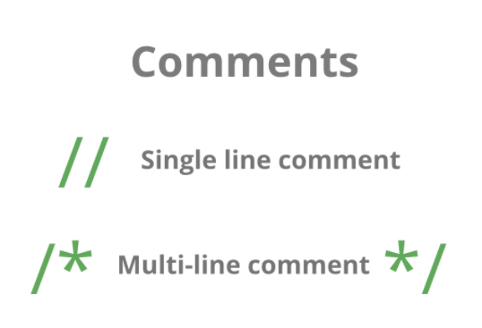
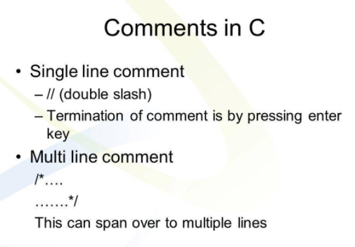
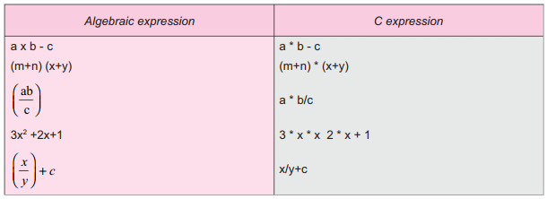

## Comments in C
Comments in C Programming are to provide a piece of information about the code. A comment can help the other programmers
to understand the program flow. In C Programming Language, there are two types of commenting options, and they are Single
Line and Multi-line. In C there are two types of comments:

- Single line comment
- Multi-line comment

## Comments are used for better understanding of the code.
- A person reading a large code will be bemused if comments are not provided about details of the program.
- Comments are a way to make code more readable by providing more description. Comments can include a description of an [algorithm](https://www.efaculty.in/c-language/algorithm-in-c-language/#:~:text=Algorithm%20is%20a%20step%2Dby,more%20than%20one%20programming%20language.) to make code understandable.
- After a long time gap if you see your own code without comments, then it will take time to understand the code.
- So, Comments can be helpful for one’s own self too if code is to be reused after a long gap.
## Single line comments
The Single Line comments start with two [forward slashes](https://sites.cs.ucsb.edu/~pconrad/topics/BackslashVsForwardSlash/)(//). Most of times single line comment used at the end of the line or before the line.
The [Compiler](https://en.wikipedia.org/wiki/Compiler) ignores everything from // to the end of the line.
For example:-
Single line comments can be provided by using / /………………..
## Multiple line comments
The Multi-Line Comments placed in between /*……… */. Use this Slash and asterisk to write a multi-line comment. Multiple line comments can be
provided by using /*………………….*/

## Rules for Writing Comments
- Program contains any number of comments at any place.
- Nested Comments are not possible, that means comments within comments.
- Comments can be splits over more than one line.
- Comments are not case sensitive.
- Single line comments start with “//”

## Important Note
- A well-documented program is a good practice as a programmer.
- It makes a program more readable and error finding become easier. One important part of good documentation is Comments.
- In computer programming, a comment is a programmer-readable explanation or annotation in the source code of a computer program.
Comments are statements that are not executed by the compiler and interpreter.
## Expression in C
An arithmetic expression is a combination of variables, constants, and operators arranged as per the syntax of the language.
C can handle any complex mathematical expressions.

In c language expression evaluation is mainly depends on priority and associativity.
- An expression is a sequence of operands and operators that reduces to a single value. For example, the expression, 10+15 reduces to the value of 25.
- An expression is a combination of variables constants and operators written according to the syntax of C language.
- Every expression results in some value of a certain type that can be assigned to a variable.
## Types of Expression Evaluation in C
Based on the operators and [operators](https://funycode.com/operator-in-c/) used in the expression, they are divided into several types. Types of Expression Evaluation in C are:
- Integer expressions – expressions which contains integers and operators
- Real expressions – expressions which contains floating point values and operators
- Arithmetic expressions – expressions which contain operands and arithmetic operators
- Mixed mode arithmetic expressions – expressions which contain both integer and real operands
- Relational expressions – expressions which contain relational operators and operands
- Logical expressions – expressions which contain logical operators and operands
- Assignment expressions and so on… – expressions which contain assignment operators and operands

