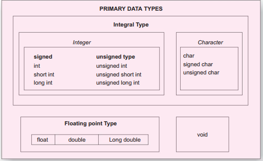
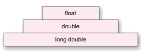
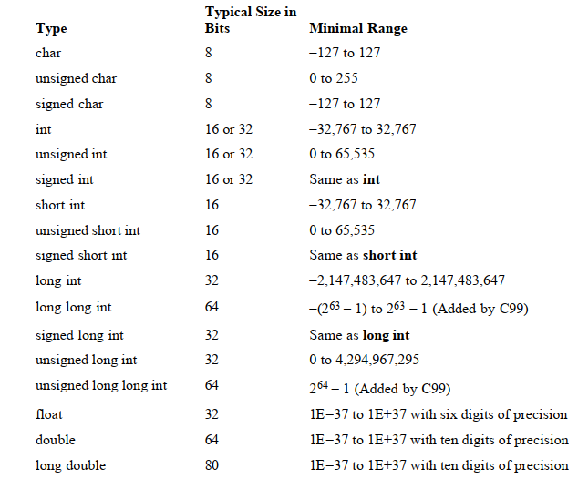

## Data Types in C
Data types refer to an extensive system used for declaring [variables](https://funycode.com/variable-in-c/) or functions of different types. The type of a variable determines how much space it
occupies in storage and how the bit pattern stored is interpreted.
- C language is rich in its data types. Storage representations and [machine instructions](https://en.wikipedia.org/wiki/Machine_code) to handle constants differ from machine to machine.
- The variety of data types available allow the programmer to select the type appropriate to the needs of the application as well as the machine.
- [ANSI C](https://en.wikipedia.org/wiki/ANSI_C) supports three classes of data types:
- Primary (or fundamental) data types
- Derived data types
- User-defined data types
## Primary (or fundamental) data types
- All C [compilers](https://whatis.techtarget.com/definition/compiler#:~:text=A%20compiler%20is%20a%20special,a%20time%20using%20an%20editor.) support five fundamental data types, namely integer (int), character (char), floating point (float), double-precision floating point (double)and void.
- Many of them also offer extended data types such as long int and long double.


## Integer data types
Integers are whole numbers with a range of values supported by a particular machine.
- Generally, integers occupy one word of storage, and since the word sizes of machines vary (typically, 16 or 32 bits) the size of an integer that can be stored
depends on the computer.
- If we use a 16 bit word length, the size of the integer value is limited to the range –32768 to +32767 (that is, –215 to +215–1).
- A signed integer uses one bit for sign and 15 bits for the magnitude of the number.
- Similarly, a 32 bit word length can store an integer ranging from -2,147,483,648 to 2,147,483,647.
- In order to provide some control over the range of numbers and storage space, C has three classes of integer storage, namely short int, int, and long int,
in both signed and unsigned forms.
- ANSI C defines these types so that they can be organized from the smallest to the largest.
- For example, short int represents fairly small integer values and requires half the amount of storage as a regular int number uses.
- Unlike signed integers, unsigned integers use all the bits for the magnitude of the number and are always positive. Therefore, for a 16 bit machine,
the range of unsigned integer numbers will be from 0 to 65,535.
```js
Syntax: int variable_name
Example: int num1;
short int num2;
long int num3;
```
## Floating Point Data Types
Floating point (or real) numbers are stored in 32 bits (on all 16 bit and 32 bit machines), with 6 digits of precision.
- Floating point numbers are defined in C by the [keyword](https://funycode.com/token-and-keyword-in-c/) float. When the accuracy provided by a float number is not sufficient,
the type double can be used to define the number.



- A double data type number uses 64 bits giving a precision of 14 digits. These are known as double precision numbers.
- Remember that double type represents the same data type that float represents, but with a greater precision. To extend the precision further, we may use long double which uses 80 bits.
- Floating point numbers are represented within the computer’s memory using the [IEEE standard](https://standards.ieee.org/).
```js
Syntax: float variable_name
Example: float num1;
double num2;
long double num3;
```
## Character Data Type
A single character can be defined as a character(char) type data.
- Characters are usually stored in 8 bits (one byte) of internal storage.
- The qualifier signed or unsigned may be explicitly applied to char. While unsigned chars have values between 0 and 255, signed
chars have values from –128 to 127.
Syntax

```js
Syntax
char variable_name;
char ch = 'a‘;
```
## Void Type
The void type has no values.
- This is usually used to specify the type of [functions](https://funycode.com/function-basic/).
- The type of a function is said to be void when it does not return any value to the calling function.
- It can also play the role of a generic type, meaning that it can represent any of the other standard types.
## Derived data types
## Arrays
- An [array](https://funycode.com/array-in-c/) is a collection of similar data-type, means an array is a block of consecutive memory locations, all given one symbolic name.
- Each location in the block is called as an element of the array and each element is of the same type. Arrays can be created from any of the C
data-types such as int, float etc.
## Pointers
- A [pointer](https://funycode.com/pointer-in-c/) is a variable that represents the address location of a variable or an array element.
## Structures
- A [structure](https://funycode.com/structure-in-c/) is a collection of data items of different data types using a single name.
- Structure is used for packaging data of different types which are logically related to each other.
## User defined type declaration
C language supports a feature where user can define an identifier that characterizes an existing data type.
- This user defined data type identifier can later be used to declare variables.
- The [typedef](https://en.wikipedia.org/wiki/Typedef) is a keyword used in C programming to provide some meaningful names to the already existing variable in the C program.
- It behaves similarly as we define the alias for the commands.
- In short, we can say that this keyword is used to redefine the name of an already existing variable.
```js
typedef
```
- In the above syntax, ‘existing_name’ is the name of an already existing variable while ‘alias name’ is another name given to the existing variable.

- For example, suppose we want to create a variable of type unsigned int, then it becomes a tedious task if we want to declare multiple variables of this type.
To overcome the problem, we use a typedef keyword.
## Data type modifiers
Modifiers are keywords in c which changes the meaning of basic data type in c.
- It specifies the amount of memory space to be allocated for a variable. Modifiers are prefixed with basic data types to modify the memory allocated for a variable.
- There are five data type modifiers in C Programming Language:
long
short
signed
unsigned
long long


- Modifiers are prefixed with basic data types to modify (either increase or decrease) the amount of storage space allocated to a variable.
- For example, storage space for int data type is 4 byte for 32 bit processor. We can increase the range by using long int which is 8 byte.
We can decrease the range by using short int which is 2 byte.
