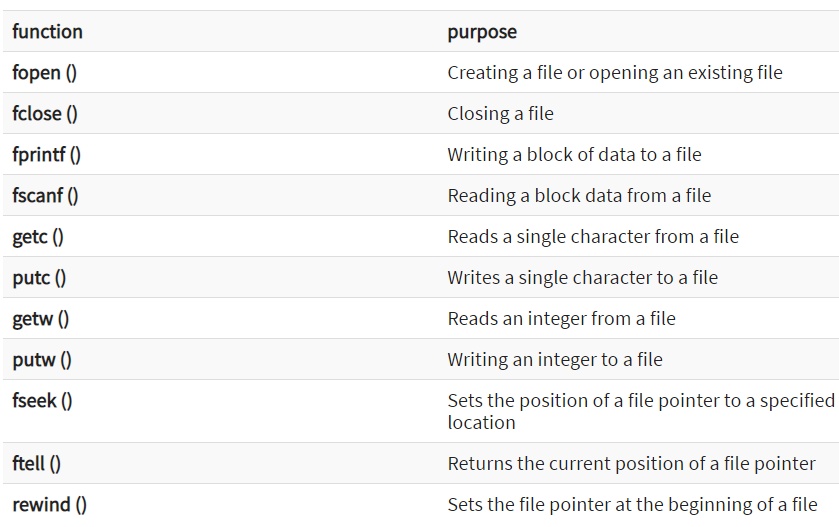

File in C
A file in C is an external collection of related data treated as a unit. A file is a place on a disk where a group of related data is stored and retrieved whenever necessary without destroying data.

- The primary purpose of a file is to keep record of data. Record is a group of related fields.
- Field is a group of characters which convey meaning. Files are stored in auxiliary or secondary storage devices.
- The two common forms of secondary storage are disks (hard disk, CD and DVD) and tapes.
- Each file ends with an end of file (EOF) at a specified byte number, recorded in file structure.
- A file must first be opened properly before it can be accessed for reading or writing.
- When a file is opened an object (buffer) is created and a stream is associated with the object.
## File Types
- There are two kinds of files depending upon the format in which data is stored:
1. Text files
2. Binary files

## Text files

- A text file stores textual information like alphabets, numbers, special symbols, etc. actually the ASCII code of textual characters its stored in text files.
- Examples of some text files include c, java, c++ source code files and files with .txt extensions . The text file contains the characters in sequence.
- The computer process the text files sequentially and in forward direction. One can perform file reading, writing and appending operations.
- These operations are performed with the help of inbuilt functions of c.
## Binary files

- Text mode is inefficient for storing large amount of numerical data because it occupies large space.
- Only solution to this is to open a file in binary mode, which takes lesser space than the text mode.
- These files contain the set of bytes which stores the information in binary form.
- One main drawback of binary files is data is stored in human unreadable form.
- Examples of binary files are .exe files, video stream files, image files etc. C language supports binary file operations with the help of various inbuilt functions .
- The different modes of opening files are :
## “r” (read) mode:
- The read mode (r) opens an existing file for reading. When a file is opened in this mode, the file marker or pointer is positioned at the beginning of the file (first character).
- The file must already exist: if it does not exist a NULL is returned as an error.
- If we try to write a file opened in read mode, an error occurs.
~~~js
Syntax: fp=fopen (“filename”,”r”);
~~~

## “w” (write) mode

- The write mode (w) opens a file for writing. If the file doesn‟t exist, it is created. If it already exists, it is opened and all its data is erased; the file pointer is positioned at the beginning of the file
- It gives an error if we try to read from a file opened in write mode.

~~~js
Syntax: fp=fopen (“filename”,”w”);
~~~
## “a” (append) mode

- The append mode (a) opens an existing file for writing instead of creating a new file.
- However, the writing starts after the last character in the existing file ,that is new data is added, or appended, at the end of the file.
- If the file doesn‟t exist, new file is created and opened. In this case, the writing will start at the beginning of the file.
~~~
Syntax: fp=fopen (“filename”,”a”);
~~~
## “r+” (read and write) mode

- In this mode file is opened for both reading and writing the data. If a file does not exist then NULL, is returned.
~~~js
Syntax: fp=fopen (“filename”,”r+”);
~~~
## “w+” (read and write) mode

- In this mode file is opened for both writing and reading the data.
- If a file already exists its contents are erased and if a file does not exist then a new file is created.
~~~js
Syntax: fp=fopen (“filename”,”w+”);
~~~
## “a+” (append and read) mode

- In this mode file is opened for reading the data as well as data can be added at the end.

~~~
Syntax: fp=fopen (“filename”, “a+”);
~~~
## File Operations
- There are different operations that can be carried out on a file. These are:

- Creation of a new file
- Opening an existing file
- Reading from a file
- Writing to a file
- Moving to a specific location in a file (seeking)
- Closing a file
## File Handling Function
- In order to perform the basic file operations C supports a number of functions .Some of the important file handling functions available in the C library are as follows :
