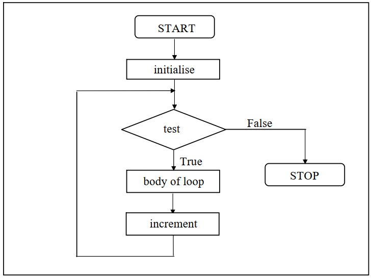
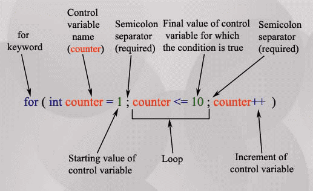
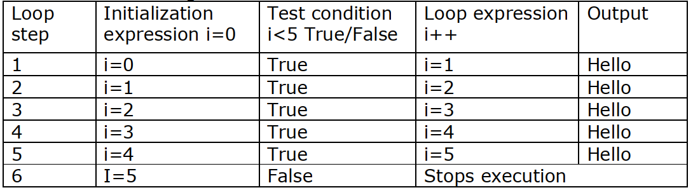

## Loop Statement in C
The versatility of the computer lies in its ability to perform a set of instructions repeatedly. This involves repeating some portion of the program either a specified number of times or until a particular condition is being satisfied. This repetitive operation is done through a loop control instruction. There are three methods by way of which we can repeat a part of a program-

- For loop
- While loop
- Do while loop
## For loop
The for statement is the most commonly used looping statement in C.

- This statement includes an expression that specifies an initial value for an index, another expression that determines whether or not the loop is continued, and a third expression that allows the index to be modified at the end of each pass.
- A for loop is a repetition control structure that allows you to efficiently write a loop that needs to execute a specific number of times.
- It is a block of code that iterates a list of commands as long as the loop control condition is true.
- It is frequently used to traverse the data structures like the array and linked list.
## Flow Diagram
- The flow diagram of for loop statement is given below-

- Initialization is usually an assignment statement that is used to set the loop control variable.

- The condition is a relational expression that determines when the loop will exit.

- The increment/decrement part defines how the loop control variable will change each time loop is repeated.

- Loop continues to execute as long as the condition is true.

- Once the condition is false, program continues with the next statement after for loop.
~~~js
The syntax of for loop is

for(initialization; Test condition; loop expression)
    statement sequence
~~~

## Syntax Explanation

### Step-1: Initialization:
- This is some kind of expression which initializes the control variable or (index variable) This statement is carried out only once before the start of the loop. e.g. counter = 0;
### Step-2: Condition:
- The condition is evaluated at the beginning of every loop and the loop is only carried out while this expression is true. e.g. counter < 20;
### Step-3: Loop expression
- This is some kind of expression for altering the value of the control variable. This expression is evaluated at the end of each iteration. In C it can be absolutely anything. e.g. counter ++ or counter *= 20 or counter /= 2.3 …
### Step-4: Statement sequence
- Statement sequence can consist only one statement or a group of statements. If it contains a group of statements, they must be embraced in braces ({}). If it contains only one statement, braces need not be enclosed.
### Example-1: Write a program in C to print hello five times using for loop.
~~~js
//Write a program in C to print hello five times using for loop
#include<studio.h>
int main()
    {
    int i;
    for(i=0; i<5; i++)
    printf("Hello \n");
    }
~~~
~~~
Output:
Hello
Hello
Hello
Hello
Hello
~~~
### Explanation

- Inside the body of the main() function, the statement declares an integer variable i..
- In the for statement the first expression is initialization statement i.e i=0, expression that initializes the integer variable i to 0.
- The second expression which is conditional expression in the for statement is i<5.
- This expression returns TRUE value(=1)for i as long as the relation indicated by the less-than operator (<) holds.
- If the value of i is less than5, which means the relational expression remains true, the for statement will start another loop. Otherwise, it will stop looping and exit.
- The third expression in the for statement is i++ in this case. This expression is evaluated and the integer variable i is increased by 1 each time after the statement inside the body of the for statement is executed.

### Example-2: Write a C program to calculate of simple interest for 3 sets of p, n and r.
~~~js
// Write a C program to calculate of simple interest for 3 sets of p, n and r
#include<studio.h>
main ( )
    {
    int p, n, count ;
    float r, si ;
    for ( count = 1 ; count <= 3 ; count = count + 1 )
        {
        printf ( "Enter values of p, n, and r: " ) ;
        scanf ( "%d %d %f", &p, &n, &r ) ;
        si = p * n * r / 100 ;
        printf ( "Simple Interest = .%fTk\n", si ) ;
        }
    }
~~~
~~~
Output:
Enter values of p, n, and r: 100 2 7
Simple Interest = 14.000000Tk
Enter values of p, n, and r: 1000 2 5
Simple Interest = 100.000000Tk
Enter values of p, n, and r: 10000 2 4
Simple Interest =  800.000000Tk
~~~
### Explanation
- Let us now examine how the for statement gets executed:

- When the for statement is executed for the first time, the value of count is set to an initial value 1.
- Now the condition count <= 3 is tested. Since count is 1 the condition is satisfied and the body of the loop is executed for the first time.
- Upon reaching the closing brace of for, control is sent back to the for statement, where the value of count gets incremented by 1.
- Again the test is performed to check whether the new value of count exceeds 3.
- If the value of count is still within the range 1 to 3, the statements within the braces of for are executed again.
- The body of the for loop continues to get executed till count doesn’t exceed the final value 3.
- When count reaches the value 4 the control exits from the loop and is transferred to the statement (if any) immediately after the body of for.
## Loop Variations
- For loop is a powerful programming tool. Many variations can be done in the for loop. They are listed below.
~~~js
for(i=1;i<4; i=i+1)
Here in the initialization part instead of i=i+1, the statements i++ or i+=1 can also be used.
~~~
~~~js
for(i=1;i<4; )
    {
    Printf(“ helo for loop”);
    i=i+1;
    }
Here in the for loop statement increment is not given, but given in the body of the statement. Semicolon after the condition is mandatory.
~~~
~~~js
int i=2;
for(;i<4; i=i+1)
    Printf(“ helo for loop”);
Here in the for loop statement initialization is not given, but given before the statement. Semicolon before the condition is mandatory.
~~~
~~~js
int i=2;
for(;i<4;)
    {
    Printf(“ helo for loop”);
    i=i+1;
    }
Here in the for loop statement initialization and increment is not given. But both the semicolons are mandatory.
~~~
## Multiple Initialization, condition and Increment/decrement in for loop
- We can have multiple initialization in the for loop as shown below.
~~~js
for (i=1,j=1;i<10 && j<10; i++, j++)
~~~
### Explanation

- It is initializing two variables. Note: both are separated by comma (,).
- It has two test conditions joined together using AND (&&) logical operator. Note: You cannot use multiple test conditions separated by comma, you must use logical operator such as && or || to join conditions.
- It has two variables in increment part. Note: Should be separated by comma.
- For example
~~~js
#include<studio.h>
int main()
    {
    int i,j;
    for (i=1,j=1 ; i<3 || j<5; i++,j++)
        {
        printf("%d, %d\n",i ,j);
        }
    return 0;
    }
~~~
## Infinitive for loop
- In the for loop if conditional expression is absent, the condition is assumed to be true. This turns out to be infinite loop. This is as shown below.
~~~js
for(  ; ; )
~~~
- If break statement is used inside the loop , infinite loop is terminated.

### Example-3: The following will continue up to infinity time-
~~~js
//The following will continue up to infinity time-
#include<studio.h>
void main ()
    {
    for(;;)
        {
        printf("welcome to Funycode World");
        }
    }
~~~
## The Comma Operator in for Loop
- The comma (,) operator is basically used in conjunction with for loop statement. This permits two expressions to be used in initialization and count section of the for loop. Only one test expression is allowed in the for loop. The syntax of this is given below.
~~~
for (expression1a, expression1b; expression2; expression3a, expression3b)
~~~
- Here expression 1a and expression 1b and expression 3a expression 3b are separated comma operator.

- For example consider the below for statement
~~~js
for(i=0,j=2;j<=0;j--,i++)
Here i and j are the two different variables used and they are separated by comma operator. Consider the following example-
~~~
~~~js
#include<studio.h>
main()
    {
    int i, j;
    for (i=0, j=1; i<8; i++, j++)
        printf("%d - %d = %d\n", j, i, j - i);
    }
~~~
~~~
Output:
1 - 0 = 1
2 - 1 = 1
3 - 2 = 1
4 - 3 = 1
5 - 4 = 1
6 - 5 = 1
8 - 7 = 1
~~~

## The Nested for Loop
- The concept of using a loop within a loop is called nested loop. If a for loop contains another for loop statement, such loop is called nested for loop.
- A nested for loop can contain any number of for loop statements within itself.
- Usually only two loops are used. In this the first loop is called outer loop and the second is called inner loop.
- These types of loops are used to create matrix. In this the outer loop is used for counting rows and the internal loop is used for counting columns.
- The syntax and example program is given below.
~~~js
for (initializing ; test condition ; increment / decrement)
    {
    statement;
    for (initializing ; test condition ; increment / decrement)
        {
        body of inner loop;
        }
    statement;
    }
~~~
### Example-4: Write a program to generate a matrix of order4*4 containg symbol*(asterisk).
~~~js
//Write a program to generate a matrix of order4*4 containg symbol*(asterisk).
#include<studio.h>
void main ( )
    {
    int i, j;
    for (j=1; j<=4; j++) /*outer for loop*/
        {
        for (i=1; i<=5; i++) /*inner for loop*/
            {
            printf ("*");
            }
        printf ("\n");
        }
    }
~~~
~~~
Output:
* * * *
* * * *
* * * *
* * * *
~~~