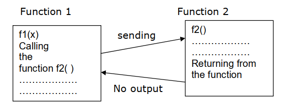

## Structure of Function
The structure and usage of functions can be well understood by dividing it into three sections namely:

1. Function definition
2. Function declaration
3. Function call/invocation
4. Function declaration
- The program or a function that calls a function is referred to as the calling program or calling function.

- The calling program should declare any function that is to be used later in the program this is known as the function declaration or function prototype.
~~~
The general form of a function declaration is
[return-type] function-name(parameter-type list)
Where, return-type define the data type of the value which is returned.
~~~
- Function-name define the name of the function defined.
- Parameter declaration define the types and names of- the parameters of the function, separated by commas. Thus the declaration
~~~
int Cube(int);
declares function Cube which returns integer value with one argument of type integer.
~~~
- Function declaration is also called as prototypes.

- In some programming situations we want that a called function should not return any value. This is made possible by making use of the keyword void. Example
~~~js
void reverse ( ) ;
~~~
## Function prototype describes-
- how the function is called
- tells everything you need to know to make  function call result function parameter formal type name type parameter
- formal parameter is a place holder to stand for the actual parameter
- function prototype terminates with semi-colon
## Function Definition
- The function definition consists of the whole description and code of a function.

- It tells that what the function is doing and what are the input outputs for that.
- A function is called by simply writing the name of the function followed by the argument list inside the parenthesis.
## Function definitions have two parts:
1. Function Header
2. The first line of code is called Function Header.
~~~js
int sum( int x, int y)
~~~
- (i) It has three parts
- (i). The name of the function i.e. sum
- (ii). The parameters of the function enclosed in parenthesis
- (iii). Return value type i.e. int

## Function Body
- Whatever is written with in { } is the body of the function.

## Function Call
- The function is called (or invoked) from main ().

- To invoke a function in main, the function name is written, followed by parentheses.
- The syntax of the function call is very similar to that of declaration, except that the return data type is not used.
- A semicolon is placed at the end of the call expression.
- When a function is invoked, control is transferred to the first the statement in the functions body.
- Computer immediately begins executing statements from the beginning of the called function.
- Each time the function is called; execution always starts at the beginning of the function.
- Execution continues inside the called function until either:
   – It reaches the right } at the end of the function
   – Or a return statement.
- Either way, the function stops at this point and execution picks up right where it had left off in the original function (e.g., back in main)
- If function is returning a value, variable can be assigned to the return value of the function.
## User Defined Functions Categories
- A function depending on whether arguments are present or not and whether a value is returned or not may belong to any one of the following categories:
1. Functions with no arguments and no return values.
2. Functions with arguments and no return values.
3. Functions with arguments and return values.
4. Functions with no arguments and return values

## Functions with no arguments and no return values:-
- When a function has no arguments, it does not return any data from calling function. When a function does not return a value, the calling function does not receive any data from the called function. That is there is no data transfer between the calling function and the called function. Example

### Example-1: Write a C program to implement function with no arguments and no return values.
~~~js
//Write a C program to implement function with no arguments and no return values.
#include<stdio.h>
void printmsg()
    {
    printf ("Hello ! I Am A Function .");
    }
int main()
    {
    printmsg();
    return 0;
    }
~~~
~~~
Output : Hello ! I Am A Function .
~~~
## Functions with arguments and no return values:-
- When a function has arguments data is transferred from calling function to called function. The called function receives data from calling function and does not send back any values to calling function. Because it doesn’t have return value. Example

### Example-2: Write a C program to implement function with arguments and no return values.
~~~js
//Write a C program to implement function with arguments and no return values.
#include<stdio.h>
void add(int,int);
void main()
    {
    int a, b;
    printf(“enter value”);
    scanf(“%d%d”,&a,&b);
    add(a,b);
    }
void add (intx, inty)
    {
    int z ;
    z=x+y;
    printf ("The sum =%d",z);
    }
~~~
~~~
output : enter values 2 3
The sum = 5
~~~
## Functions with arguments and return values:-
- In this data is transferred between calling and called function. That means called function receives data from calling function and called function also sends the return value to the calling function. Example

### Example-3: Write a C program to implement function with arguments and return values.
~~~js
//Write a C program to implement function with arguments and return values.
#include<stdio.h>
int add(int, int);
main()
    {
    int a,b,c;
    printf(“enter value”);
    scanf(“%d%d”,&a,&b);
    c=add(a,b);
    printf ("The sum =%d",c);
    }
int add (int x, int y)
    {
    int z;
    z=x+y;
    return z;
    }
~~~
~~~
output : enter values 2 3
The sum = 5
~~~
## Function with no arguments and return type:-
- When function has no arguments data cannot be transferred to called function. But the called function can send some return value to the calling function. Example

### xample-4: Write a C program to implement function with no arguments and return values.
~~~js
//Write a C program to implement function with arguments and return values.
#include<stdio.h>
int add( );
main()
    {
    int c;
    c=add();
    printf ("The sum =%d",c);
    }
int add ()
    {
    int x,y,z;
    printf(“enter value”);
    scanf(“%d%d”,&a,&b);
    z=x+y;
    return z;
    }

~~~
~~~
Output: enter values 2 3
The sum = 5
~~~