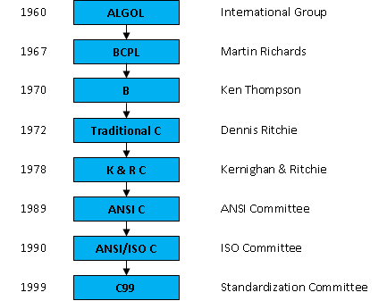

## History of C Programming Language

The C programming language was devised in the early 1970s as a system implementation
language for the nascent Unix operating system. Derived from the type less language
[BCPL](https://en.wikipedia.org/wiki/BCPL), it evolved a type structure; created on a tiny machine as a tool to improve a
meager programming environment. History of C language is interesting to know.
Here we are going to discuss a brief history of the c language.

- The root of all modern languages is ALGOL, introduced in the early 1960s.
ALGOL was the first computer language to use a block structure. ALGOL gave
the concept of structured programming to the computer science community.

- In 1967, [Martin Richards](https://en.wikipedia.org/wiki/Martin_Richards_(computer_scientist)) developed a language called BCPL
(Basic Combined Programming Language) primarily for writing system software.
- In 1970, [Ken Thompson](https://en.wikipedia.org/wiki/Ken_Thompson) created a language using many features of BCPL and called it simply B.
- B was used to create early versions of UNIX operating system at [Bell Laboratories](https://www.bell-labs.com/).
- Both BCPL and B were “typeless” system programming languages. C was evolved from ALGOL, BCPL and B by [Dennis Ritchie](https://en.wikipedia.org/wiki/Dennis_Ritchie)
at the Bell Laboratories in 1972.
- For many years, C was used mainly in academic environments, but eventually with the release of many C compilers for
commercial use and the increasing popularity of UNIX, it began to gain widespread support among computer professionals.
- Today, C is running under a variety of operating system and hardware platforms.
- During 1970s, C had evolved into what is now known as “traditional C”.
- The language became more popular after publication of the book ‘The C Programming Language’ by [Brian Kerningham and
Dennis Ritchie](https://en.wikipedia.org/wiki/Brian_Kernighan) in 1978.
- The book was so popular that the language came to be known as “K&R C”among the programming community.
- The rapid growth of C led to the development of different versions of the language that were similar but often incompatible.
This posed a serious problem for system developers.
- To assure that the C language remains standard, in 1983, [American National Standards Institute (ANSI)](https://ansi.org/) appointed a technical
committee to define a standard for C.
- The committee approved a version of C in December 1989 which is now known as ANSI C.
- It was then approved by the [International Standards Organization (ISO)](https://www.iso.org/home.html) in 1990. This version of C is also referred to as C89.
- However, work on C continued quietly along, with a new standard for C being developed. The end result was the 1999 standard for C,
usually referred to as C99.
