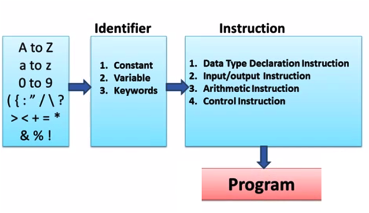

## Identifier in C

An identifier is a sequence of characters that represents a name for the [variable](https://funycode.com/variable-in-c/), [function](https://funycode.com/function-basic/), label, type definition,structure, enumeration,
or union tag, [structure](https://funycode.com/structure-in-c/), enumeration, or union member, enumeration [constant](https://funycode.com/constant-in-c/), [macro](https://funycode.com/preprocessor-in-c/), macro parameter.



- These are user-defined names and consist of a sequence of letters and digits, with a letter as a first character.
- Both uppercase and lowercase letters are permitted, although lowercase letters are commonly used.
- The underscore character is also permitted in identifiers. It is usually used as a link between two words in long [identifiers](https://funycode.com/identifier-in-c/).
- The length of these identifiers can vary from one to several characters. The first character must be a letter or an underscore,
and subsequent characters must be either letters, digits, or underscores.
- Here are some correct and incorrect identifier names:
```js
Correct                    Incorrect
count                        1count
test23                       hi!there
high_balance                 high . . . balance
```
- In C, identifiers may be of any length. However, not all characters will necessarily be significant. C defines two kinds of identifiers: external and internal.
- An external identifier will be involved in an external link process. These identifiers, called external names, include function names and global variable names that are shared between source files.
- If the identifier is not used in an external link process, then it is internal.
- This type of identifier is called an internal name and includes the names of local variables, for example.
- In [C89](https://en.wikipedia.org/wiki/C89), at least the first 6 characters of an external identifier and at least the first 31 characters of an internal identifier will be significant.
- [C99](https://en.wikipedia.org/wiki/C99) has increased these values. In C99, an external identifier has at least 31 significant characters, and an internal identifier has at least 63 significant characters. As a point of interest, in [C++](https://en.wikipedia.org/wiki/C%2B%2B),
at least the first 1,024 characters of an identifier are significant.
- These differences may be important if you are converting a program from C89 to C99, or from C to C++.

In an identifier, upper- and lowercase are treated as distinct. Hence, count , Count, and COUNT are three separate identifiers. An identifier cannot be the same as a C [keyword](https://funycode.com/token-and-keyword-in-c/) and should not have the same
name as functions that are in the C library.

## Rules for Identifiers

- The first character must be an alphabet (uppercase or lowercase) or can be an underscore.
- All succeeding characters must be alphabets or digits.
- No [special characters](https://www.computerhope.com/jargon/s/specchar.htm#:~:text=A%20special%20character%20is%20a,characters%20may%20have%20multiple%20uses.) or punctuation symbols is allowed except the underscore” _”.
- No two successive underscores are allowed.
- Keywords should not be used as identifiers.
