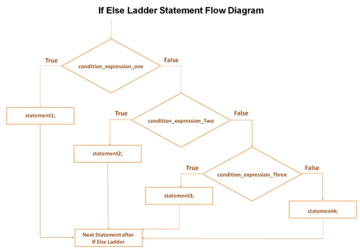

## Else-If Ladder Statement
Else-if ladder is one of the conditional [control-flow statements](https://funycode.com/if-statement/). It is used to make a decision among multiple choices.
- The if-else-if ladder statement is an extension to the [if-else](https://funycode.com/if-else-statement/)statement. This chain generally looks like a ladder hence it is also called as an else-if ladder.
- The test-expressions are evaluated from top to bottom. Whenever a true test-expression if found, statement associated with it is executed.
- When all the n test-expressions becomes false, then the default else statement is executed. There are multiple else-if blocks possible.
- It is similar to the [switch case](https://funycode.com/switch-statement-in-c/)statement where the default is executed instead of else block if none of the cases is matched.
## Flow Diagram
The flow of control else if ladder statement is determined as follows:


## Explanation
- First of all condition_expression_One is tested and if it is true then statement1 will be executed and control comes out out of whole if else ladder.
- If condition_expression_One is false then only condition_expression_Two is tested. Control will keep on flowing downward, If none of the conditional expression is true.
- The last else is the default block of code which will gets executed if none of the conditional expression is true.
## Syntax
```js
if(condition 1)
  {
  statement 1;
  }
else if(condition 2)
  {
  statement 2;
  }
else if(condition 3)
  {
  statement 3;
  }
else if(condition n)
  {
  statement n;
  }
else
  {
  default statement;
  }
stmt- x;
}
```
## Explanation
- if and else are keywords.
- There should be a space between else and if, if they come together, condition1, condition2, condition3 are relational expressions or logical expressions or any other expressions that return either true or false.
- It is important to note that the condition  should be enclosed within parentheses.
- Statement 1, statement 2,statement 3……,statement n and default statement are either simple statements or compound statements or null statements.
- stmt-x is a valid C statement
### Example-1: Write a C program to enter a subject marks and check the corresponding class.
```js
//Write a C program to enter a subject marks and check the corresponding class.
#include<studio.h>
int main()
    {
    int marks;
    printf("Enter subject marks:");
    scanf("%d",&marks);
    if(marks>75)
          {
           printf("First class");
          }
    else if(marks>65)
          {
           printf("Second class");
          }
    else if(marks>55)
          {
           printf("Third class");
          }
    else
          {
           printf("Fourth class");
          }
    return 0;
    }
```
```
Output:
Enter Subject marks:
70
Second Class
```
### Example-2: Write a program to enter a number and check weather the number is equal to 100 or 50 or 100 or not using else if ladder statement.
```js
// Write a program to enter a number and check weather the number is equal to 100 or 50 or 100 or not using else if ladder statement
#include<studio.h>
int main()
    {
    int number;
    printf("Enter a number:");
    scanf("%d",&number);
    if(number==100)
          {
           printf("The Number is equals to 100");
          }
    else if(number==500)
          {
           printf("The Number is equal to 50");
          }
    else if(number==1000)
          {
           printf("The Number is equal to 1000");
          }
    else
          {
          printf("The number is not equal to 100, 500 or 1000");
          }
    return 0;
    }
```
```
Output:
Enter a number:
100
The Number is equal to 100.
```
### Example-3: Write a C program to enter a number and check weather the number are divisible by 3 and 7.
```js
//Write a C program to enter a number and check weather the number are divisible by 3 and 7.
#include<studio.h>
void main( )
    {
    int a;
    printf("Enter a number:");
    scanf("%d",&a);
    if( a%3==0 && a%7==0)
          {
           printf("The number is divisible by both 3 and 7");
          }
    else if( a%3==0 )
          {
           printf("The number is divisible by 3");
          }
    else if(a%7==0)
          {
           printf("The number is divisible by 7");
          }
    else
          {
           printf("%d is not divisible by 3 or 7");
          }
    }
```
```
Output:
Enter a number: 21
The number is divisible by both 3 and 7
```