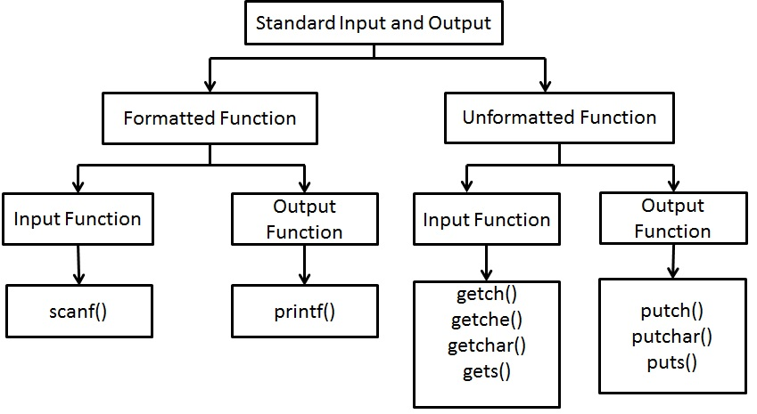

## Input/output Function in C
In c language input and output functions are accomplished through library function. Printf and scanf in C are the most widely used output and input function in C programming language.

- The header file for I/O function is . In C there are two types of I/O functions. They are console I/O and file I/O.
- Console I/ o function takes I/P from keyboard and produces o/p on the screen.
- The console Input / Output functions are also called as Standard input / output functions.
- The console I / O function are classified as shown below.
## Formatted I/O Functions
- Formatted I/O means reading and writing data in formats which are desired by the user. The function used to input action is scanf() and output action is printf().

## The printf() Function
- Printf in C is used to print or display data on the console in a formatted form. The format of printf in C is
~~~js
printf( “control string”, list of arguments);
~~~
- Control string contains the formatting instructions within quotes. This can contain

   - Characters that are simply printed as they are
   - Conversion specifications with begins with format specifier (%) sign.
   - Escape sequences.
- The percentage (%) followed by conversion character is called format specifier. This indicates the type of the corresponding data item. Most frequently used format specifiers are listed.
~~~
Format specifier	                Meaning
% d or % i	                        decimal integers
% u	                                unsigned decimal integer
% x	                                unsigned hexadecimal (lower case letter)
% X	                                unsigned hexadecimal (upper case letter)
% o	                                octal
% c	                                character
% f	                                floating point
% s	                                strings
% lf	                            double
% ld	                            long signed integer
% lu	                            long unsigned integer
% p	                                displays pointer
% %	                                prints a % sign
% e	                                scientific notation (e lower case)
% E	                                scientific notation (e upper case)
~~~
## Application of printf() Function
- The printf() function is used to print the different types of output. This is given below.

- Printing given data
- The printf() statement cab be used without format specifier, just to print the given data.
- Printing numbers
## Escape Sequence in printf() Function
- In addition to format specification, escape sequence can also be used in printf in C.

- These are specified in the control string portion of the printf() and are used mainly for screen formatting.
- All escape sequence are provided with slash ( / ).
- Since back slash is considered as an “escape” character. These sequences are called escape sequences.
- Usage of \t moves the cursor to next tab problem
- \n makes the a cursor to go to new line.
- \r moves the cursor to the beginning of the line in which it is currently placed.
- \a alters the user by sounding the inbuilt speaker of system.
- \b moves the cursor one position to the left of its current opposition.
- The character of single quote and back slash can be printed by using escape sequence \’, \”, \\ respectively.
~~~js
printf(“Teacher asked, \” did you understand ?\” ”);
This will print
Teacher asked, “did you understand?”
~~~
~~~js
printf(“The sequence is a<b, where \’b\’ is > 0”);
This will print
The sequence is a<b, where ‘b’ is >o
~~~
~~~js
printf(“Hi,\n How are \n You?”);
This will print
Hi
How are
You
~~~
## The scanf() Function
- The scanf in C reads the input data from standard input device. i.e. keyboard. The general format of the scanf in C function is

~~~j
sscanf( “format string” list of arguments );

~~~
- where format string consists of format specifiers and arguments consists of address of variables.
- To this corresponding address the data read from keyboard is sent.
- The address of the variable is denoted by ampersand symbol ‘&’ (it is called as ‘’address of the operator).
- Note that the values that are supplied through keyboard must be separated by either blank tabs or newlines. Escape sequences are not included in scanf() function.
~~~js
To read integer data: int i ;
    - - -
    scanf(“%d”, &i);
To read floating point data:
    float f;
    - - -
    scanf(“%f”, &f);
To read character data;
    char sam, john;
    - - -
    scanf(“%c”, &sam, &john);
To read more than one data types at a time
    int i;
    float b;
    char c;
    string s;
- - -
scanf(“%d %f %c %s”, &i, &b, &c, &s );
~~~
## Unformatted I / O Function
- A simple reading of data from keyboard and writing to I / O device, without any format is called unformatted I / O functions. This is classified as string I / O and character I /O.

## Character Input/Output(I/O)
- In order to read and output a single character character I / O functions are used. The functions under character I / O are

   - getchar()
   - putchar()
   - getch()
   - getche()
  ## The getchar( ) function
- Single characters can be entered into the computer using the C library function getchar(). The getchar() function is a part of the standard C I/O library.

- It returns a single character from a standard input device typically a keyboard.
- The function does not require any arguments, though a pair of empty parentheses must follow the word getchar().
~~~
The general syntax
Character variable=getchar();
~~~
- Where character variable refers to some previously declared character variable.
~~~js
Example:
A C program contains the following statements
char c;
…………….
C=getchar();
~~~
## The putchar( ) function:
- Single characters can be displayed using the C library function putchar().

- This function is complementary to the character input function getchar().
- The putchar function, like getchar(), is a part of the standard C I/O library.
- It transmits a single character to a standard output device.
- The character being transmitted will normally be represented as a character type variable.
- It must be expressed as an argument to the function, enclosed in parentheses, following the word putchar. The general syntax is
~~~
putchar(character variable)
~~~
- where character variable refers to some previously declared character variable.
~~~
A C program contains the following statements
Char c;
………
putchar(c);
~~~
## Alternatives to getchar()
- The two common alternative functions to getchar() are
   - getch()
   - getche()

- The getch() function reads a single character at a time and it waits for key press. It does not echo the character on the screen. The getche() is same as getch() but the key is echoed. This is illustrated below.
~~~
char ch;
Ch = getch()
putchar(ch);
~~~
## String I / O
- In order to read and write string of characters the functions gets() and puts() are used gets() function reads the string and puts() function takes the string as argument and writes on the screen. This is illustrated below char name [50]
~~~js
puts (“Enter your name”);
gets (name);
puts(“ The name entered is “);
~~~