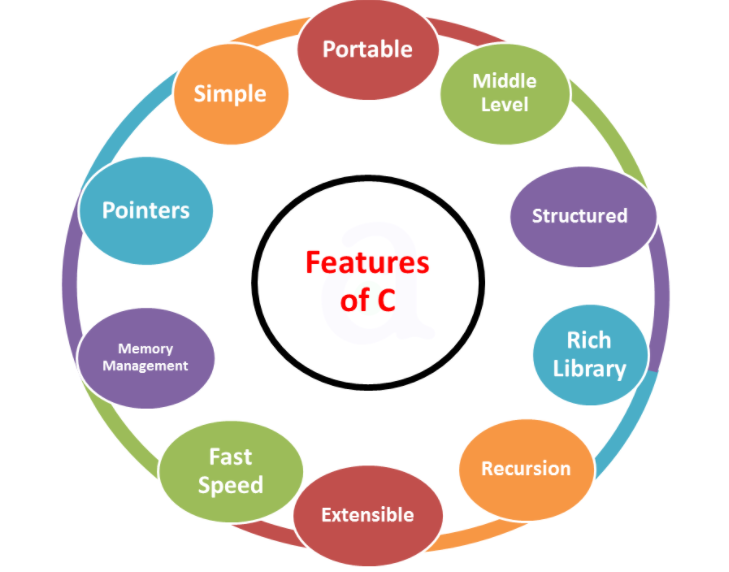
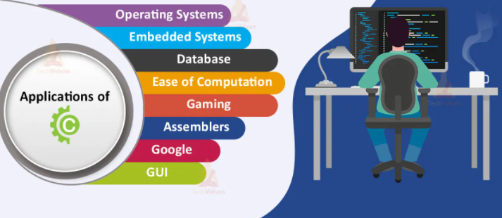

## Introduction to C Programming Language

C is a general-purpose high level language that was originally
developed by [Dennis Ritchie](https://en.wikipedia.org/wiki/Dennis_Ritchie) for the Unix operating system. It was first implemented on the Digital Equipment Corporation PDP-11 computer in 1972. The Unix operating system and virtually all Unix applications are written in the C language.

- ‘C’ seems a strange name for a programming language. But this strange sounding language is one of the most popular computer languages today because it is a structured, high-level, [machine independent language.](https://sites.google.com/site/infotechmr11/grade-9/programming-languages#:~:text=Third%20Generation%20(3GL)%20%E2%80%93%20high,can%20run%20on%20any%20computer.)

- It allows software developers to develop programs without worrying about the hardware platforms where they will be implemented.

- C is a powerful, flexible, portable and elegantly structured programming language. Because C combines the features of high-level language with the elements of an assembler, it is suitable for both systems and applications programming.

- It is undoubtedly the most widely used general-purpose language today in operating systems, and embedded system development.

- Its influence is evident in almost all modern programming languages. Since its standardization in 1989, C has undergone a series of changes and improvements in order to enhance the usefulness of the language.

- The version that incorporates the new features is now referred to as [C11.](https://en.wikipedia.org/wiki/C11_(C_standard_revision))

- It has emerged as the most widely used powerful programming language in software development.

- It is a small, yet powerful languages. It features modern control flow and [data types](https://funycode.com/data-types-in-c/) that allow the development of well-structured programs.

- Its data types and control structures are directly supported by most computers, resulting in the construction of efficient programs.

- It is independent of any particular machine architecture or operating system, which makes it easy to write portable programs. In this combination of rich control structures and data types, ability to get close to computer hardware, efficiency, portability, and conciseness that has contributed to the popularity of C.

- C has now become a widely used professional language for various reasons.
    - Easy to learn
    - Structured language
    - It produces efficient programs.
    - It can handle low-level activities.
    - It can be compiled on a variety of computers.

## Feature of C

- The increasing popularity of C is probably due to its many desirable qualities.

- It is a robust language whose rich set of built-in [functions](https://funycode.com/function-basic/) and [operators](https://funycode.com/operator-in-c/) can be used to write any complex program.

- The C compiler combines the capabilities of an [assembly language](https://techterms.com/definition/assembly_language#:~:text=An%20assembly%20language%20is%20a,also%20be%20written%20from%20scratch.) with the features of a high-level language and therefore it is well suited for writing both system software and business packages. In fact, many of the [C compilers](https://en.wikipedia.org/wiki/List_of_compilers) available in the market are written in C.

- Programs written in C are efficient and fast. This is due to its variety of data types and powerful operators.
It is many times faster than BASIC. For example, a program to increment a variable from 0 to 15000 takes about
one second in C while it takes more than 50 seconds in an interpreter [BASIC.](https://en.wikipedia.org/wiki/BASIC)

- There are only 32 [keywords](https://funycode.com/token-and-keyword-in-c/) in [ANSI C](https://en.wikipedia.org/wiki/ANSI_C) and its strength lies in its built-in functions. Several standard functions
are available which can be used for developing programs.

- C is highly portable. This means that C programs written for one computer can be run on another with little or no modification. Portability is important if we plan to use a new computer with a different operating system.

- C language is well suited for structured programming, thus requiring the user to think of a problem in terms of function modules or blocks. A proper collection of these modules would make a complete program.
This modular structure makes program debugging, testing and maintenance easier.

- Another important feature of C is its ability to extend itself. A C program is basically a collection of functions that are supported by the C library. We can continuously add our own functions to C library.
With the availability of a large number of functions, the programming task becomes simple.

## Applications of C

C was initially used for system development work, in particular the programs that make-up the operating system. C was adopted as a system development language because it produces code that runs nearly as fast
as code written in assembly language. Some examples of the use of C might be:

   - Operating Systems
   - Language Compilers
   - Assemblers
   - Text Editors
   - Print Spoolers
   - Network Drivers
   - Modern Programs
   - Data Bases
   - Language Interpreters
   - Utilities
