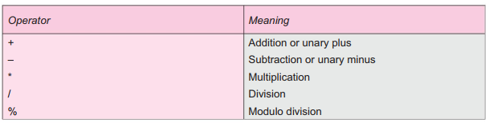
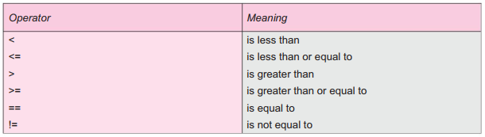
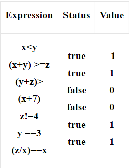
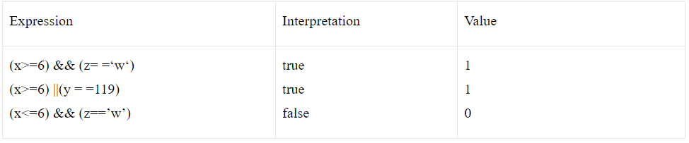
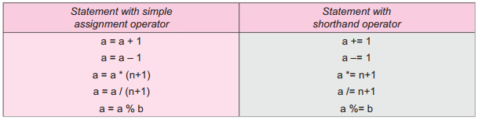
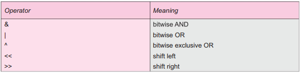

## Operator in C
C has a large number of built in operators. An operator is a symbol which acts on operands to produce certain result as output.

- The data items on which operators act upon are called operands. Some operators require two operands while others require only one operand.
- Most operators in c allow the individual operands to be expressions. A few operators permit only single variable as operand.
- For example, in the expression a+b; + is an operator, a and b are operands.
- The operators are fundamental to any mathematical computations. Operators form expressions by joining individual constants, variables.
- Operators in C  fall into different categories.
- Arithmetic operators,
- Relational operators,
- Logical operators,
- Assignment operators,
- Conditional operators,
- Increment and decrement operators,
- Bitwise operators and
- Special operators.

## Arithmetic operators
- There are five main arithmetic operators in C. They are in the following table-

- Operands can be integer quantities, floating-point quantities or characters.
- The modulus operator requires that both operands be integers & the second operand be nonzero.
- Similarly, the division operator (/) requires that the second operand be nonzero, though the operands need not be integers.
- Division of one integer quantity by another is referred to as integer division. With this division the decimal portion of the quotient will be dropped.
vIf division operation is carried out with two floating- point numbers, or with one floating-point number. & one integer, the result will be a floating-point quotient.
Example:
- If we take two variables say x and y and their values are 20 and 10 respectively, and apply operators like addition, subtraction, division, multiplication and modulus on them then their resulted values will be as follows:
~~~
        x=20,    y=10
        x+y      30
        x-y      10
        x*y      200
        x/y      2
        x %y     0
~~~
- If one or both operands represent negative values, then the addition, subtraction, multiplication and division operations will result in values whose signs are determined by the usual rules of algebra.
## Relational operators
- Relational operators are symbols that are used to test the relationship between two variables, or between a variable and a constant.

- The test for equality, is made by means of two adjacent equal signs with no space separating them.
- Operator in C has six relational operators as follows:

- RelationalThe first four operators fall within the same precedence group, which is lower than the arithmetic operators.
- The associativity of these operators is left-to-right, which will be clearly demonstrated in the form of a table later in this section.
- The equality operators == and != fall into a separate precedence group, beneath the relational operators. Their associativity is also from left to right. These relational operators are used to form logical expression representing condition that is either true or false.
- The resulting expression will be of type integer, since true is represented by the integer value and false is represented by the value 0.
~~~
Example: x=2, y=3, z=4.
~~~
Expression

## Logical Operators
- There are two logical operators in C language, they are and and or. They are represented by “&&” and “||” referred to as logical and, logical or, respectively.

- The result of a logical and operation will be true only if both operands are true, whereas the result of a logical or operation will be true if either operand is true or if both operands are true.
- The logical operators act upon operands that are themselves logical expressions.
Example:
~~~
Suppose x=7, y=5.5, z= ‘w’
~~~
Logical expressions using these variables are as follows:

- Each of the logical operators in c falls into its own precedence group. Logical ‘and’ has a higher precedence than logical ‘or’.
- Both precedence groups are lower than the group containing the equality operators.
- The associativity is left to right.
## Unary Operator
- ‘C’ also includes the unary operator ‘!’ that negates the value of a logical expression.

- This is known as logical negation or logical NOT operator in C.
- The associativity of negation operator is right to left.
- Precedence of operators in decreasing order is as follows:
~~~
1. -, ++ – – Operators ! size of (type)
2. * / %
3. + –
4. < <= > > =
5. == !=
6. &&
7. ||
~~~
- If you have trouble remembering all these rules of precedence you can always resort to parentheses in order to express your order explicitly.

## Assignment Operators
- There are several different assignment operators in C. All of them are used to form assignment expression, which assigns the value of an expression to an identifier.

- The most commonly used assignment operator is “=”.
- The assignment expressions that make use of this operator are written in the form:
- Identifier = expression,
- Where identifier generally represents a variable and expression represents a constant, a variable or a more complex expression.
- Assignment operator = and the equality operator == are distinctly different.
- The assignment operator in C is used to assign a value to an identifier, whereas the equality operator is used to determine if two expressions have the same value. These two operators cannot be used in place of one another.
- If the two operands in an assignment expression are of different data types, then the value of the expression on the right will automatically be converted to the type of the identifier on the left.
- The entire assignment expression will then be of this same data type.
- A floating point value may be truncated if assigned to an integer identifier, a double-precision value may be rounded if assigned to a floating-point identifier, and an integer quantity may be altered if assigned to a shorter integer identifier or to a character identifier.
- Assignment operator can be used in shorten form as the following-

## Conditional Operators
- There is one conditional operator (?:) in ‘C’ language.

- An expression that makes use of the conditional operator is called a conditional expression.
- A conditional expression is written in the form:
~~~
Expression 1? Expression 2: Expression 3
~~~
- When evaluating a conditional expression, expression 1 is evaluated first.
- If expression 1 is true, then expression 2 is evaluated and this becomes the value of the conditional expression.
- If expression 1 is false, then expression 3 is evaluated and this becomes the value of the conditional expression.

~~~
Example: ( i< 1) ? 0:200
i is integer variable here.
~~~
- The expression (i<1) is evaluated first, if it is true the entire conditional expression takes on the value 0.
- Otherwise, the entire conditional expression takes on the value 200.
- Conditional expression frequently appears on the right hand side of a simple assignment statement.
- The resulting value of the conditional expression is assigned to the identifier on the left.
- The conditional operator has its own precedence, just above the assignment operator. The associativity is right-to-left.
## Increment and decrement operators
- C has very useful two operators generally not found in any other programming languages.

- ++ Increment Operator: The increment operator adds 1 to the operand.
- -- Decrement Operator: The decrement operator subtracts 1 to the operand.
- Both of them are Unary operators and are extensively used in for and while loops. Example:
~~~
x++=>x=x+1. 3. y--=>y=y-1
++x=>x=x+1. 4. --y=>y=y-1
~~~
- In general, ++x and x++ are the same when used in forming statements independently, they behave differently when they are used in expressions on the right hand side of an assignment statement.
## Bitwise operators
- Manipulation of data at bit level is of major importance when it comes to high end applications using microprocessors and controllers etc.

- These operators are used for testing the bits, or shifting them right or left.
- They cannot be applied to data types float or double.
- Corresponding bits of both operands are combined by the usual logic operations. There are six bitwise operators:

## Special operators
There are many special operators such as comma, sizeof, pointer operators(& and *) and member selection operators(->) etc , out of which the first two will be discussed.

## The comma operator
- Comma (,) operator is used to link the related expressions together.

- Comma used expressions are linked from left to right and the value of the right most expression is the value of the combined expression.
- The comma operator has the lowest precedence of all operators.
~~~
Example:
sum=(X=5,Y=3,X+Y);
~~~
- The result will be sum=8. The comma operator is also used to separate variables during declaration.
~~~
for(i=0;i<8;i++).
~~~
## The size of operator
- The size of operator is not a library function but a keyword, which returns the size of the operand in bytes.

- The size of operator always, precedes its operand.
- The information obtained from this operator can be very useful when transferring a program to a different computer.
- This operator can be used for dynamic memory allocation. The various expressions and results of sizeof operator are
~~~
Expression            Result
sizeof(char)             1
sizeof(int)              2
sizeof(float)            4
sizeof(double)           8
~~~
~~~
Example:
int sum=100;
M=sizeof(sum);
~~~