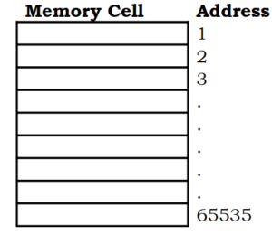
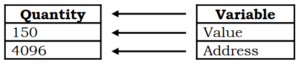

## Pointer in C
In c a pointer is a variable that points to or references a memory location in which data is stored. Each memory cell in the computer has an address that can be used to access that location so a pointer variable points to a memory location. We can access and change the contents of this memory location via the pointer.

- A pointer is a variable that contains the memory location of another variable.
- In c a pointer is a variable that points to or references a memory location in which data is stored.
- Each memory cell in the computer has an address that can be used to access that location so a pointer variable points to a memory location we can access and change the contents of this memory location via the pointer.
- Programmer start by specifying the type of data stored in the location identified by the pointer.
- The asterisk tells the compiler that you are creating a pointer variable. Finally programmer give the name of the variable.
## Pointer Concept
- Computer memory is sequential collection of storage cells as shown in figure. Each cell is commonly known as byte and has a number called as address associated with it.
- Typically the addresses are numbered sequentially starting from zero.
- The last address depends upon the memory size. A computer having 64KB memory will have its last address as 65535.

- Whenever we declare variable, the system allocates it somewhere in the memory. An appropriate location holds the value of variable.
- Since every byte has a unique address number, this location will have its own address number. Consider the following statement:
~~~
int quantity=150;

~~~
- This statement instructs the system complier system to find a location for integer variable quantity and store value 150 in that location.
- Let us assume that the system has chosen the address location 4096 for quantity, so it will be visualized as:

- During the execution of program computer always associates the name quantity with address 4096. We may have access to the value 150 by using either the name quantity or the address 4096.
- Since memory addresses are simply numbers they can be assigned to some variables which can be stored in memory like any other variables.
- Such variables that hold memory addresses are called as ‘pointer variables’ the pointer variable is nothing but a variable that contains an address which is location of another variable in memory.
## Advantages of Pointer

- Pointers are more efficient in handling arrays and data tables.
- Pointers can be used to return multiple values from a function via function arguments.
- Pointers permit references to functions and thereby facilitating passing of functions as arguments to other functions.
- The use of pointer arrays to character strings results in saving of data storage space in memory.
- Pointers allow C to support dynamic memory management.
- Pointers provide an efficient tool for manipulating dynamic data structures such as structures. linked lists, queues, stacks and trees.
- Pointers reduce length and complexity of programs.
- They increase the execution speed and thus reduce the program execution time.
## Application of Pointer

- Pointers can be used to pass information back and forth between a function and its reference point.
- In particular, pointers provide a way to return multiple data items from a function via function arguments.
- Pointers also permit references to other functions to be specified as arguments to a given function. This has the effect of passing functions as arguments to the given function.
- Pointers are also closely associated with arrays and therefore provide an alternate way to access individual array elements.
- Moreover, pointers provide a convenient way to represent multidimensional arrays, allowing a single multidimensional array to be replaced by a lower-dimensional array of pointers.
- This feature permits a group of strings to be represented within a single array, though the individual strings may differ in length.