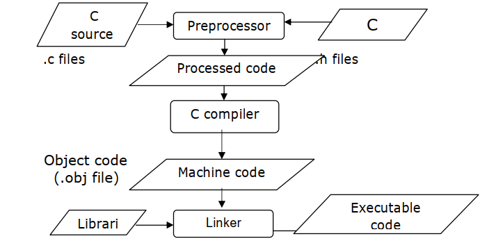

## Preprocessor in C
A unique feature of c language is the preprocessor. A program can use the tools provided by preprocessor to make his program easy to read, modify, portable and more efficient.

- The C preprocessor is a collection of special statements, called directives that are executed at the beginning of the compilation process.
- It operates under the control of preprocessor command lines and directives.
- Preprocessor directives are placed in the source program before the main line before the source code passes through the compiler it is examined by the preprocessor for any preprocessor directives.
- If there is any appropriate actions are taken then the source program is handed over to the compiler.
- Preprocessor directives follow the special syntax
1. rules that are listed below.
2. Executed by the pre-processor.
3. Occurs before a program is compiled.
4. Begin with #.
5. Would not end with semicolon.
6. Can be placed anywhere in the program.
7. Normally placed at the beginning of the h. program or before any particular function.
- The compilation process can be diagrammatically given as below.

## Important Properties
- The preprocessor directives enable the programmer to write programs that are easy to develop, read, modify and transport to a different computer system.
- We can make use of various preprocessor directives such as #define, #include, #ifdef – #else – #endif, #if and #elif in our program.
- The directives like #undef and #pragma are also useful although they are seldom used.
## Types of Preprocessor Directives
- A set of commonly used preprocessor directives are given below.
## Unconditional directives Preprocessor
    - #include- Inserts a particular header from another file
    - #define- Defines a preprocessor macro
    - #undef -Undefines a preprocessor macro
## The conditional directives

    - #ifdef -If this macro is defined
    - #ifndef- If this macro is not defined
    - #if- Test if a compile time condition is true
    - #else- The alternative for#if
    - #elif- #else an #if in one statement
    - #endif- End preprocessor conditional
## Preprocessor Directives
-  The preprocessor directives can be divided into three categories. They are
   - Macro substitution directives
   - File inclusion directives
   - Compiler control directives
## Macro Substitution Directives
- Macro in C is a process where an identifier in a program is replaced by a pre defined string composed of one or more tokens. The #define statement is used for this task. It has the following form

~~~
#define identifier string
~~~
- This definition is known as a macro definition.
- The preprocessor replaces every occurrence of the identifier in the source code by a string.
- The definition should start with the keyword #define followed by an identifier and a string with at least one blank space between them.
- Definition is not terminated by a semicolon. The string may be any text and identifier must be a valid c name.
- A #define directive is many a times used to define operators as shown below.
~~~js
#define AND &&
#define OR ||
main( )
    {
    int f = 1, x = 4, y = 90 ;
    if ( ( f < 5 ) AND ( x <= 20 OR y <= 45 ) )
    printf ( "\nYour PC will always work fine..." ) ;
    else
    printf ( "\nIn front of the maintenance man" ) ;
    }
~~~
- A #define directive could be used even to replace a condition, as shown below.
~~~js
#define AND &&
#define ARANGE ( a > 25 AND a < 50 )
main( )
    {
    int a = 30 ;
    if ( ARANGE )
    printf ( "within range" ) ;
    else
    printf ( "out of range" ) ;
    }
~~~
- A #define directive could be used to replace even an entire C statement. This is shown below.
~~~js
#define FOUND printf ( "The Yankee Doodle Virus" ) ;
main( )
    {
    char signature ;
    if ( signature == 'Y' )
    FOUND
    else
    printf ( "Safe... as yet !" ) ;
    }
~~~
- There are three different forms of macro substitution. They are,
    - Simple macro substitution
    - Argument macro substitution
    - Nested macro substitution
## Simple Macro Substitution
- Simple string replacement is commonly used to define constants. For example:
~~~js
#define PI 3.1415926
#define CAPITAL “BANGALORE”
#define AREA 12.36
~~~
- Writing macro definition in capitals is a convention not a rule. Macro in C is not ended by semicolon.
~~~js
//Consider the below program to understand the functioning of macro.
#include<stdio.h>
#define PI 3.14
#define ERROR_1 "File not found."
#define QUOTE "Hello World!"
main()
    {
    printf("Area of circle = %f * diameter", PI );
    printf("\nError : %s",ERROR_1);
    printf("\nQuote : %s\n",QUOTE);
    }
~~~
- Preprocessor step is performed before compilation and it will change the actual source code to below code. Compiler will see the program as given below.
~~~js
#include<stdio.h>
main()
    {
    printf("Area of circle = %f * diameter", 3.14 );
    printf("\error : %s","File not found.");
    printf("\nQuote : %s","Hello World!\n");
    system("pause");
    }
~~~
~~~
Output
Area of circle = 3.140000 * diameter
Error : File not found.
Quote : Hello World!
~~~
## Macro in C Inside the Quotes
- While programming, care should be taken such that macro is not included inside quotes because the macro inside a string does not replaced. For example ,
~~~js
# define P 5
sum= P+ value;
printf(“P= %d\n “, P);
~~~
- During preprocessing all the occurrences of P is replaced by 5 except for the P inside the string. In the string ” P= %d\n “,P is left unchanged. This is as shown below.
~~~js
sum= 5+ value;
printf(“P= %d\n “, 5);
~~~
## Macros With Parameters
- The preprocessor permits us to define more complex and more useful form of replacements it takes the following form.
~~~js
# define identifier(f1,f2,f3…..fn) string.
A simple example of a macro with arguments is
# define CUBE (x) (x*x*x)
If the following statements appears later in the program,

volume=CUBE(side);
The preprocessor would expand the statement to

volume =(side*side*side)
~~~
## Undefining a Macro
- A defined macro in C can be undefined using the statement #undef. For example to undefined a macro, CUBE we can write

~~~
# undef CUBE
~~~
- This is useful when we want to restrict the definition only to a particular part of the program.

## File Inclusion
- The preprocessor directive include< file name> can be used to include any file into user program if the functions or macro definitions are present in the source code. This represented as below.
~~~js
#include< filename >
For example,
#include<stdio.h>
#include<string.h>
main()
    {
    -----
    -----
    printf(“ ---“);
    x= strcpy(---);
    }
~~~

- In the above program printf() is defined in the standard library file stdio.h.and strcpy is defined in string.h. library file.
- Because of this stdio.h and string.h are used in the file inclusion macro.
## Macros with Arguments
- The macros that we have used so far are called simple macros. Macros can have arguments, just as functions can. Here is an example that illustrates this fact.
~~~js
#define AREA(x) ( 3.14 * x * x )
    main( )
    {
    float r1 = 6.25, r2 = 2.5, a ;
    a = AREA ( r1 ) ;
    printf ( "\nArea of circle = %f", a ) ;
    a = AREA ( r2 ) ;
    printf ( "\nArea of circle = %f", a ) ;
    }
~~~
~~~
Here’s the output of the program...
Area of circle = 122.656250
Area of circle = 19.625000
~~~
~~~js
#define ISDIGIT(y) ( y >= 48 && y <= 57 )
main( )
    {
    char ch ;
    printf ( "Enter any digit " ) ;
    scanf ( "%c", &ch ) ;
    if ( ISDIGIT ( ch ) )
        printf ( "\nYou entered a digit" ) ;
    else
        printf ( "\nIllegal input" ) ;
    }
~~~

### Here are some important points to remember while writing macros with arguments:

- Be careful not to leave a blank between the macro template and its argument while defining the macro. For example, there should be no blank between AREA and (x) in the definition,
~~~
#define AREA(x) ( 3.14 * x * x )
~~~
- If we were to write AREA (x) instead of AREA(x), the (x) would become a part of macro expansion, which we certainly don’t want.

- The entire macro expansion should be enclosed within parentheses.
~~~js
#define SQUARE(n) n * n
main( )
{
int j ;
j = 64 / SQUARE ( 4 ) ;
printf ( "j = %d", j ) ;
}
The output of the above program would be:
j = 64
- whereas, what we expected was j = 4
- What went wrong? The macro was expanded into
- j = 64 / 4 * 4 ;
- which yielded 64.
~~~
- Macro in C can be split into multiple lines, with a ‘\’ (back slash) present at the end of each line.
~~~js
#define HLINE for ( i = 0 ; i < 79 ; i++ ) \
printf ( "%c", 196 ) ;
    #define VLINE( X, Y ) {\
    gotoxy ( X, Y ) ; \
    printf ( "%c", 179 ) ; \
    }
main( )
    {
    int i, y ;
    clrscr( ) ;
    gotoxy ( 1, 12 ) ;
    HLINE
    for ( y = 1 ; y < 25 ; y++ )
    VLINE ( 39, y ) ;
    }
~~~
- This program draws a vertical and a horizontal line in the center of the screen.

## #if and #elif Directives
- The #if directive can be used to test whether an expression evaluates to a nonzero value or not. If the result of the expression is nonzero, then subsequent lines upto a #else, #elif or #endif are compiled, otherwise they are skipped. A simple example of #if directive is shown below:
~~~js
main( )
    {
    #if TEST <= 5
    statement 1 ;
    statement 2 ;
    statement 3 ;
    #else
    statement 4 ;
    statement 5 ;
    statement 6 ;
    #endif
    }
~~~

- If we so desire we can have nested conditional compilation directives. An example that uses such directives is shown below.
~~~js
#if ADAPTER == VGA
code for video graphics array
#else
#if ADAPTER == SVGA
code for super video graphics array
#else
code for extended graphics adapter
#endif
#endif
~~~
- The above program segment can be made more compact by using another conditional compilation directive called #elif.
- The same program using this directive can be rewritten as shown below.
- Observe that by using the #elif directives the number of #endifs used in the program get reduced.
~~~js
 #if ADAPTER == VGA
- code for video graphics array
 #elif ADAPTER == SVGA
- code for super video graphics array
 #else
- code for extended graphics adapter
 #endif
~~~
## Miscellaneous Directives

## #undef Directive
- On some occasions it may be desirable to cause a defined name to become ‘undefined’. This can be accomplished by means of the #undef directive. In order to undefine a macro that has been earlier
~~~
#defined, the directive,
#undef macro template
~~~
can be used. Thus the statement,
~~~
#undef PENTIUM
~~~
- would cause the definition of PENTIUM to be removed from the system. All subsequent #ifdef PENTIUM statements would evaluate to false.

## #pragma Directive
This directive is another special-purpose directive that you can use to turn on or off certain features. Pragmas vary from one compiler to another. There are certain pragmas available with Microsoft C compiler that deal with formatting source listings and placing comments in the object file generated by the compiler.

## #pragma startup and #pragma exit:
- These directives allow us to specify functions that are called upon program startup (before main( )) or program exit (just before the program terminates). Their usage is as follows:
~~~js
void fun1( ) ;
void fun2( ) ;
#pragma startup fun1
#pragma exit fun2
main( )
    {
    printf ( "\nInside maim" ) ;
    }
void fun1( )
    {
    printf ( "\nInside fun1" ) ;
    }
void fun2( )
    {
    printf ( "\nInside fun2" ) ;
    }
~~~
~~~
And here is the output of the program.
Inside fun1
Inside main
Inside fun2
~~~
## #pragma warn
This directive tells the compiler whether or not we want to suppress a specific warning. Usage of this pragma is shown below.
~~~js
#pragma warn –rvl /* return value */
#pragma warn –par /* parameter not used */
#pragma warn –rch /* unreachable code */
int f1( )
    {
    int a = 5 ;
    }
void f2 ( int x )
    {
    printf ( "\nInside f2" ) ;
    }
int f3( )
    {
    int x = 6 ;
    return x ;
    x++ ;
    }
void main( )
    {
    f1( ) ;
    f2 ( 7 ) ;
    f3( ) ;
    }
~~~
If you go through the program you can notice three problems immediately. These are:
1. Though promised, f1( ) doesn’t return a value.
2. The parameter x that is passed to f2( ) is not being used anywhere in f2( ).
3. Control can never reach x++ in f3( ).