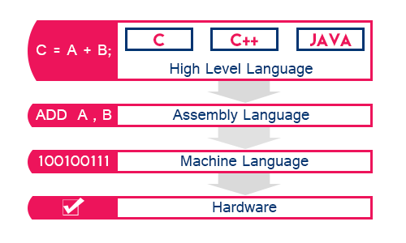

## Definition of Program

Program is a set of instruction that are used to perm particular task or
A computer program is a collection of instructions that can be executed by a computer to perform a specific task.

- Computer program is a series of instructions telling the computer what to do.
- Computers can be programmed to perform many kinds of tasks.
- Eg. [Word processing programs](https://www.techradar.com/news/the-best-free-word-processor) like Microsoft word; or a spreadsheet program like Microsoft Excel.

## Definition Software

- A piece of software is a program or a collection of programs plus associated data.

- It is created by a computer programmer who writes lines of code for the computer.
- Computer software is divided in to two broad categories: system software and application software. System software manages the computer resources.
- It provides the interface between the hardware and the users.
- Application software, on the other hand is directly responsible for helping users solve their problems.

## Definition of Programming Languages

- Computer programming languages allow us to give instructions to a computer in a language the computer understands.

- Just as many human-based languages exist, there are an array of computer programming languages that programmers can use to communicate with a computer.
- The portion of the language that a computer can understand is called a [binary](https://en.wikipedia.org/wiki/Binary_number).
- Translating programming language into binary is known as [compiling](https://en.wikipedia.org/wiki/Compiler).
- Each language, from C Language to [Python](https://www.python.org/), has its own distinct features, though many times there are commonalities between programming languages.

## Machine Language

- Machine Language: In the earliest days of computers, the only programming languages available were machine languages.

- Each computer has its own machine language, which is made of streams of 0‘s and 1‘s.
- Instructions in machine language must be in streams of 0‘s and 1‘s because the internal circuits of a computer are made of switches transistors and other electronic devices that can be in one of two states: off or on.
- The off state is represented by 0, the on state is represented by 1. The only language understood by computer hardware is machine language.
- It is very difficult to understand and also it is machine dependent that is code varies from one computer to another.

## Assembly Language

- An assembly language uses symbols or mnemonics to represent the various, machine language instructions.

- It is machine dependent that is code varies from one computer to another.
- Assembly languages use numbers, symbols, and abbreviations instead of 0s and 1s.
- For example: For addition, subtraction and multiplications it uses symbols likes Add, sub and Mul, etc.
- Since computer does not understand symbolic language it must be translated to the machine language.
- A special program called assembler translates symbolic code into machine language. Because symbolic languages had to be assembled into machine language they soon became known as assembly languages.
- Working with symbolic languages was also very tedious because each machine instruction has to be individually coded.

## High Level Languages

- It is a simple English language. By seeing that program, one should be able to understand what the program does and what data it uses.

- It is machine-independent language.
- High-level languages are designed to relieve the programmer from the details of the assembly language.
- High level languages share one thing with symbolic languages, they must be converted into machine language.
- The process of converting them is known as compilation. A program written in high level language is known as the source program and can be run on different machines using different translators.
- The translated program (from high-level language to machine-level language) is known as object code.
- Languages like FORTRAN,C, C++, JAVA, Python, etc., are examples of high-level languages.

## Compiler

- Compiler is a translator program which translates a high level programming language into equivalent machine language programs.
- It compiles a set of machine language instructions for every high level language program.
- Source code is the input or the programming instructor of a [procedural language.](https://www.computerhope.com/jargon/p/proclang.htm#:~:text=A%20procedural%20language%20is%20a,by%20script%20and%20software%20programmers.)
- The compiler translates the source code into machine level language which is known as [object code.](https://en.wikipedia.org/wiki/Object_code)
- Object code can be saved and executed as and when desired by the user.

## Linker

- A program used with a compiler to provide links to the libraries needed for an executable program.
- It takes one or more object code generated by a compiler and combines them into a single executable program.

## Interpreter

- It is a translator used for translating high level language into the desired output.
- It takes one statement, translates it into machine language instructions and then immediately executes the result.
- Its output is the result of program execution.

## Pseudo code

- Pseudo code is a programming analysis tool that is used for planning program logic.

- It is an imitation of actual computer instructions written in an ordinary natural language such as English.
- Pseudo code is also called as Program Design Language(PDL).

## Algorithm

- Algorithm design refers to a method or a mathematical process for problem-solving and engineering algorithms.
- A logical list of procedures or steps for solving a given problem is called as Algorithm.
- It is a step-by-step procedure, which defines a set of instructions to be executed in a certain order to get the desired output.
- Algorithms are generally created independent of underlying languages, i.e. an algorithm can be implemented in more than one programming language.

## Flow chart

- A flowchart consists of various types of boxes connected by arrows.
- Each box represents some operations which are described by the statements written within the box. Boxes of different shapes are used to indicate different types of operations.
- The arrow indicates the sequence in which operations are to be performed.
- The flowchart is drawn according to defined rules and using standard flowchart symbols prescribed by the American National Standard Institute, Inc.
