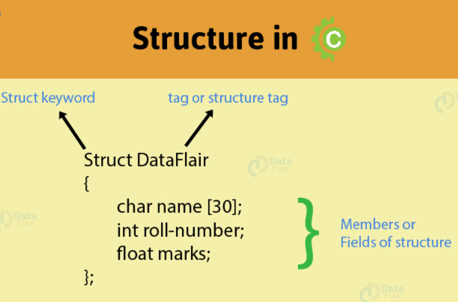

## Structure in C
An array is a collection of more than one homogenous element. The data items/elements of the same type and same length are the homogenous elements. To represent the heterogeneous elements under a single name, an array cannot be used. The solution for this problem is Structures.

- It is a derived data-type in C. Structure in C is a collection of different data type elements with different lengths.
- It is a convenient tool for handling a group of logically related data items. Structure helps to organize the complex data in more meaningful way.
- A structure is usually used when we wish to store dissimilar data together.
- Structure elements can be accessed through a structure variable using a dot (.) operator.
- Structure in C elements can be accessed through a pointer to a structure using the arrow (->) operator.
- All elements of one structure variable can be assigned to another structure variable using the assignment (=) operator.
- It is possible to pass a structure variable to a function either by value or by address.
- It is possible to create an array of structures.

## Uses of Structures
- The immediate application of Structures that comes to the mind is Database Management. That is, to maintain data about employees in an organization, books in a library, items in a store, financial accounting transactions in a company etc. They can be used for a variety of purposes like:

- Changing the size of the cursor
- Clearing the contents of the screen
- Placing the cursor at an appropriate position on screen
- Drawing any graphics shape on the screen
- Receiving a key from the keyboard
- Checking the memory size of the computer
- Finding out the list of equipment attached to the computer
- Formatting a floppy
- Hiding a file from the directory
- Displaying the directory of a disk
- Sending the output to printer
- Interacting with the mouse
- Defining a Structure
- To use the structure within a program, the special data type, called as structured data type has to be created.. The general format for defining the structured data type is given below.
~~~js
struct variable_name
    {
    data type member 1;
    data type member 2;
    ----------
    -----------
    data type member n;
    };
~~~
- The struct is a keyword. user defined variable name, are same as other variable name.
- Data type and members are any valid C data objects such as int, float, char. Once the structure is defined it can be used.
- The format is called as the template. Remember, this template is terminated by a semicolon.
- The keyword struct declares a structure to hold the details of different data elements. For example:
~~~js
struct book
    {
    char title[20];
    char author[15];
    int pages;
    float price;
    };
~~~
- Here, the fields: title, author, pages and price are called as structure elements or members.
- Each of these members belongs to different data types. The name of structure ‘book’ is called structure tag.
## Declaring Structure Variables
- Members of the structure cannot be accessed directly. To access the member of a structure in C within a program, a variable has to be declared. To declare a structured variable, the following format is used. It includes following elements:

1. The keyword struct
2. The structure tag name
3. List of variable names separated by commas
4. A terminating semicolon
- For example, the statement:
~~~js
struct book book1, book2, book3;
~~~
- This declares book1, book2 and book3 as variables of type struct book.
- The entire structure with variable is given below.
~~~js
struct book
    {
    char title[20];
    char author[15];
    int pages;
    float price;
    };
struct book book1, book2, book3;
~~~
- The other way to declare a structure variable is to combine both the structure definition and variables declaration in one statement.
- This is as shown below.
~~~js
struct book
    {
    char title[20];
    char author[15];
    int pages;
    float price;
    } book1, book2, book3;
~~~
## Accessing Structure Members
- The individual members of a structure can be accessed through the structure variable only. The link between a member and a variable is established through the operator ‘.’ is called as the dot operator or member operator or period operator. The syntax is Structure variable. member name.

~~~js
For example,
struct book
    {
    char title[20];
    char author[15];
    int pages;
    float price;
    } book1, book2, book3;
book1.price;
book2.author;
book3.pages;
book1.title;
~~~
- Note that it is possible to access all the members, through a single variable.
- There is no one to one correspondence between the the number of members to the number of variables. Any variable can access any member of the struct.
## Assigning Values to the Members
- Members of the structure can be assigned the values as given below.
~~~js
strcpy(book1.title, “ Java Programming”);
strcpy(book1.author, “patric”);
book1.pages = 375;
book1.price = 275.00;
//scanf can also be used to give values through the keyboard.
scanf(“%s”, book1.title);
scanf(“%s”, book1.author);
scanf(“%d”, &book1.pages);
~~~
- Like any other data type, a structure variable can be initialized at compile time. Consider the following example.
~~~js
struct time
    {
    int hrs;
    int mins;
    int secs;
    }t1,t2;
struct time t1 = {4, 52, 29};
struct time t2 = {10, 40, 21};
~~~
- This assigns value 4 to t1.hrs, 52 to t1.mins, 29 to t1.secs and value 10 to t2.hrs, 40 to t2.mins, 21 to t2.secs.
- There is one-to-one correspondence between the members and their initializing values.
- C does not permit the initialization of individual structure members within the template.
- The initialization must be done only in the declaration of actual variables.
## Additional Features of Structures

- The values of a structure variable can be assigned to another structure variable of the same type using the assignment operator.
~~~js
main( )
    {
    struct employee
        {
        char name[10] ;
        int age ;
        float salary ;
        } ;
    struct employee e1 = { "Sanjay", 30, 5500.50 } ;
    struct employee e2, e3 ;
    /* piece-meal copying */
    strcpy ( e2.name, e1.name ) ;
    e2.age = e1.age ;
    e2.salary = e1.salary ;
    /* copying all elements at one go */
    e3 = e2 ;
    printf ( "\n%s %d %f", e1.name, e1.age, e1.salary ) ;
    printf ( "\n%s %d %f", e2.name, e2.age, e2.salary ) ;
    printf ( "\n%s %d %f", e3.name, e3.age, e3.salary ) ;
    }
~~~
~~~
The output of the program would be...
Sanjay 30 5500.500000
Sanjay 30 5500.500000
Sanjay 30 5500.500000
~~~
- One structure can be nested within another structure. Using this facility complex data types can be created. The following program shows nested structures at work.
~~~js
main( )
    {
    struct address
        {
        char phone[15] ;
        char city[25] ;
        int pin ;
        } ;
    struct emp
        {
        char name[25] ;
        struct address a ;
        } ;
    struct emp e = { "jeru", "531046", "nagpur", 10 };
    printf ( "\nname = %s phone = %s", e.name, e.a.phone ) ;
    printf ( "\ncity = %s pin = %d", e.a.city, e.a.pin ) ;
    }
~~~
~~~
And here is the output...
name = jeru phone = 531046
city = nagpur pin = 10
~~~
- Like an ordinary variable, a structure variable can also be passed to a function.
~~~js
/* Passing individual structure elements */
main( )
    {
    struct book
        {
        char name[25] ;
        char author[25] ;
        int callno ;
        } ;
    struct book b1 = { "Let us C", "YPK", 101 } ;
    display ( b1.name, b1.author, b1.callno ) ;
    }
display ( char *s, char *t, int n )
    {
    printf ( "\n%s %s %d", s, t, n ) ;
    }
~~~
~~~
And here is the output...
Let us C YPK 101
~~~
- The way we can have a pointer pointing to an int, or a pointer pointing to a char, similarly we can have a pointer pointing to a struct. Such pointers are known as ‘structure pointers’.
~~~js
main( )
    {
    struct book
        {
        char name[25] ;
        char author[25] ;
        int callno ;
        } ;
    struct book b1 = { "Let us C", "YPK", 101 } ;
    struct book *ptr ;
    ptr = &b1 ;
    printf ( "\n%s %s %d", b1.name, b1.author, b1.callno ) ;
    printf ( "\n%s %s %d", ptr->name, ptr->author, ptr->callno ) ;
    }
~~~
## Passing address of a structure variable
~~~js
struct book
    {
    char name[25] ;
    char author[25] ;
    int callno ;
    } ;
main( )
    {
    struct book b1 = { "Let us C", "YPK", 101 } ;
    display ( &b1 ) ;
    }
display ( struct book *b )
    {
    printf ( "\n%s %s %d", b->name, b->author, b->callno ) ;
    }
~~~
~~~
And here is the output...
Let us C YPK 101
~~~
- Basic functioning of the structure can be well understood by the following programs.

## Example-1: Write a program to create a student structure having roll, name and age.
~~~js
//Write a program to create a student structure having roll, name and age.
#include<stdio.h>
main()
    {
    struct student
        {
        int roll_no;
        char name[10];
        int age;
        }s;
    printf(“Enter roll, name and age: ”);
    scanf(“%d %s %d”, &s.roll_no, s.name, &s.age);
    printf(“\nEntered information: \n”);
    printf(“Roll number: %d”, s.roll_no);
    printf(“\nName: %s”, s.name);
    printf(“\nAge: %d”,s.age);
    }
~~~
~~~
Result:
Input:
Enter roll, name and age:09kbt657, shyam,
Output:
Input information:
Roll number: 09kbt657
Name: shyam
age: 17
~~~
### Example-2: Write a program to create a date structure having month, year and day.
~~~js
//Write a program to create a date structure having month, year and day.
#include<stdio.h>
int main (void)
    {
    struct date
        {
        int month;
        int day;
        int year;
        };
    struct date today;
    today.month = 4;
    today.day = 25;
    today.year = 2009;
    printf ("Today's date is %i / %i / %.2i.\n",
    today.month, today.day, today.year % 100);
    return 0;
    }
~~~
~~~
Output
Today's date is 4/25/09.\
~~~
### Example-3: Write a program to create a book structure having name, author, page and price.
~~~js
//Write a program to create a book structure having name, author, page and price.
#include<stdio.h>
void main()
    {
    struct book
        {
        char name[20];
        char auth[20];
        int page;
        float price;
        };
    struct book b;
    printf("\n ENTER THE NAME OF THE BOOK: ");
    gets(b. name);
    printf("\n ENTER THE NAME OF THE AUTHOR: ");
    gets(b. auth);
    printf("\n ENTER THE NUMBER OF PAGES: ");
    scanf("%d", &b.page);
    printf("\n ENTER THE PRICE OF THE BOOK: ");
    scanf("%f", &b.price);
    printf("\n NAME OF THE BOOK: %s",b.name);
    printf("\n NAME OF THE AUTHOR: %s ", b.auth);
    printf("\n NUMBER OF PAGES: %d ", b.page);
    printf("\n PRICE OF THE BOOK: %0.2f ",b.price);
    }
~~~
~~~
Result:
Input
ENTER THE NAME OF THE BOOK: Complete Reference Java
ENTER THE NAME OF THE AUTHOR: Schildt
ENTER THE NUMBER OF PAGES:1000
ENTER THE PRICE OF THE BOOK:395
NAME OF THE BOOK: Complete Reference Java
NAME OF THE AUTHOR: Schildt
NUMBER OF PAGES:1000
PRICE OF THE BOOK:395
~~~