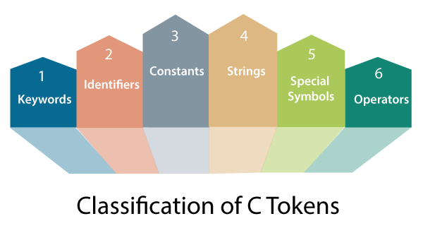
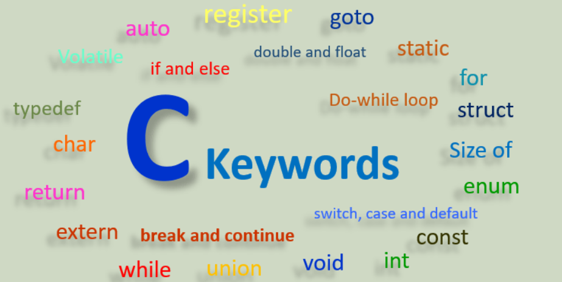

## Token in C
Tokens are the smallest elements of a program, which are meaningful to the [compiler](https://whatis.techtarget.com/definition/compiler#:~:text=A%20compiler%20is%20a%20special,a%20time%20using%20an%20editor.).
- It is each and every word and punctuation that you come across in your C program.
- The compiler breaks a program into the smallest possible units (tokens) and proceeds to the various stages of the compilation.
- The following are the types of tokens: Keywords, [Identifiers](https://funycode.com/identifier-in-c/), [Constant](https://funycode.com/constant-in-c/), [Strings](https://funycode.com/string-in-c/), [Operators](https://funycode.com/operator-in-c/), etc.

## Keyword in C

Keywords or Reserve words of the C language are the words whose meaning is already defined and explained to the C language compiler.
-  Keywords cannot be used as identifiers or variable names.
- They should only be used to carry the pre-defined meaning. For example, int is a reserve word.
- It indicates the data type of the variable as integer.
- Therefore, it is reserved to carry the specific meaning. Any attempt to use it other than the intended purpose will generate a compile time error.
- C language has 32 keywords. Following are some of them are

- Some C compilers may recognize other keywords.
- Consult a reference manual to obtain a complete list of keywords for your particular compiler.
- Note that the keywords are all lowercase. Since uppercase and lowercase characters are not equivalent, it is possible to utilize an uppercase keyword as an identifier.
- Normally, however, this is not done, as it is considered a poor programming practice.
## Important Note:

- A keyword name cannot be used as a variable name.
- Keywords must be written in lower case.
- It specifies the type/kind of entity.
