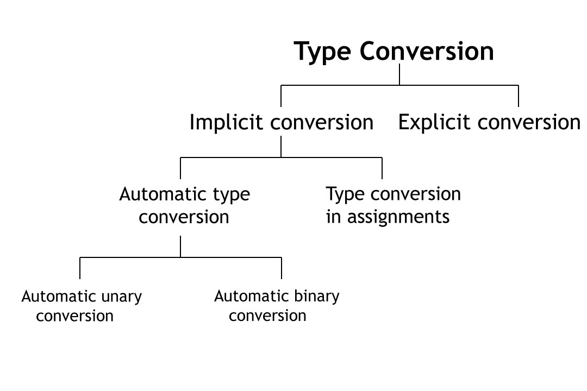
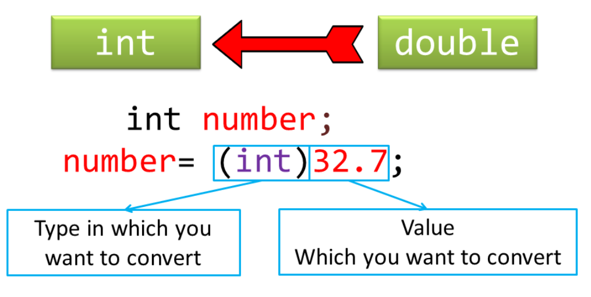
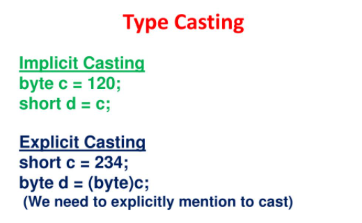

## Type Casting in C
Type Conversion refers to conversion from one type to another.

- The main idea behind type conversion is to make [variable](https://funycode.com/variable-in-c/) of one type compatible with variable of another type to perform an operation.
- For example, to find the sum of two variables, one of int type & other of float type.
- So, you need to type cast int variable to float to make them both float type for finding the sum.
- There are two types of type conversion:
   - Implicit Conversion
   - Explicit Conversion

## Implicit Type Conversion
The type conversion that is done automatically done by the compiler is known as implicit type conversion.
- This type of conversion is also known as automatic conversion.
- This occurs when an [expression](https://www.educba.com/expression-in-c/) contains variables of more than one type.
- So, in those scenarios automatic type conversion takes place to avoid loss of data. In automatic type conversion, all the data types present
in the expression are converted to data type of the variable with the largest data type.

- Below is the order of the automatic type conversion. You can also say, smallest to largest [data type](https://funycode.com/data-types-in-c/) for type conversion.

```js
bool -> char -> short int -> int -> unsigned int -> long -> unsigned  > long long -> float -> double -> long double
```
- Implicit conversions can lose information such as signs can be lost when signed type is implicitly converted to unsigned type and
[overflow](https://en.wikipedia.org/wiki/Integer_overflow) can occur when long is implicitly converted to float.



## Important Points about Implicit Conversions
- Implicit type of type conversion is also called as standard type conversion. We do not require any [keyword](https://en.wikipedia.org/wiki/Integer_overflow) or special statements in implicit type casting.
- Converting from smaller data type into larger data type is also called as type promotion. In the above example, we can also say that the value of s is promoted to
type integer.
- The implicit type conversion always happens with the compatible data types.
- We cannot perform implicit type casting on the data types which are not compatible with each other such as:
- Converting float to an int will truncate the fraction part hence losing the meaning of the value.
- Converting double to float will round up the digits.
- Converting long int to int will cause dropping of excess high order bits.

In all the above cases, when we convert the data types, the value will lose its meaning. Generally, the loss of meaning of the value is warned by the compiler.
‘C’ programming provides another way of typecasting which is explicit type casting.

## Explicit Type Conversion
In implicit type conversion, the data type is converted automatically.
- There are some scenarios in which we may have to force type conversion.
- Suppose we have a variable div that stores the division of two operands which are declared as an int data type.
```js
 int result, var1=10, var2=3;
 result=var1/var2;
```
-In this case, after the division performed on variables var1 and var2 the result stored in the variable “result” will be in an integer format.
- Whenever this happens, the value stored in the variable “result” loses its meaning because it does not consider the fraction part which is normally obtained in
the division of two numbers.
- To force the type conversion in such situations, we use explicit type casting.
- It requires a type casting operator. The general syntax for type casting operations is as:
```js
(type-name) expression
```
Here, The type name is the standard ‘C’ language data type. An expression can be a constant, a variable or an actual expression.
