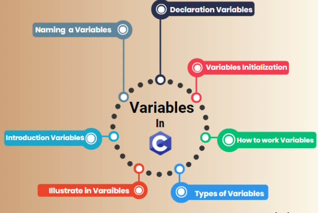
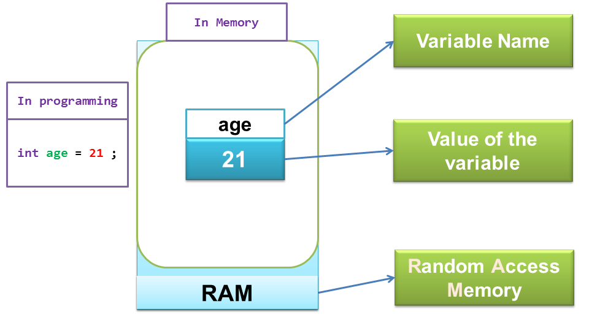
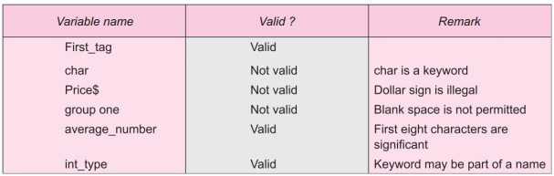

## Variable in C
A variable is an entity used by a program to store values used in the computation. Every variable in C has a type and it must be declared before it is used.

- A variable is an [identifier](https://funycode.com/identifier-in-c/) that is used to represent some specified type of information within a designated portion of the program.
- In its simplest form, a variable is an identifier that is used to represent a single data item; i.e., a numerical quantity or a [character constant](https://funycode.com/constant-in-c/).
- The data item must be assigned to the variable at some point in the program.
- The data item can then be accessed later in the program simply by referring to the variable name.
- A given variable can be assigned different data items at various places within the program.
- Thus, the information represented by the variable can change during the execution of the program. However, the [data type](https://funycode.com/data-types-in-c/) associated with the variable cannot change.


## Declarations and Definition
A declaration associates a group of variables with a specific data type. All variables must be declared before they can appear in executable statements.
- A declaration consists of a data type, followed by one or more variable names, ending with a semicolon. Thus, the declarations
```js
int mint;                //declare the variable mint to be of type int
char cherry;          //the variable cherry to be of type char
double trouble;     // the variable trouble to be of type double
float swim, snorkel;   //the variables swim and snorkel to be of type float
```
- The variables swim and snorkel could have been equivalently declared in two separate declarations:
```js
float swim; /* time spent swimming in minutes • */
float snorkel; /* time spent snorkeling in hours */
```
- Further examples of variable names and their correctness are given in Table-1.


- Variables can be initialized (assigned an initial value) in their declaration.
- The initializer consists of an equal sign followed by a constant expression as follows −
```js
type variable_name = value;
Some example are
int d = 3, f = 5;  // definition and initializing d and f.
byte z = 22;       // definition and initializes z.
char x = 'x';     // the variable x has the value 'x'.
```
## Rules for Constructing Variable Names
- They must begin with a letter. Some systems permit underscore as the first character.
- [ANSI](https://ansi.org/) standard recognizes a length of 31 characters. (In [C99](https://en.wikipedia.org/wiki/C99), at least 63 characters are significant.)
- Uppercase and lowercase are significant. That is, the variable Total is not the same as total or TOTAL.
- It should not be a keyword.
- White space is not allowed
## Variable Types
Variables can be declared in three places: inside functions, and outside of all functions. These positions
correspond to local variables, and global variables, respectively.
## Local Variables
- Variables that are declared inside a function are called local variables.
- Local variables can be used only by statements that are inside the block in which the variables are declared.
- In other words, local variables are not known outside their own code block. Remember, a block of code begins with an opening curly brace and terminates with a closing curly brace.
- Local variables exist only while the block of code in which they are declared is executing. That is, a local variable is created upon entry into its block and destroyed upon exit.
- Furthermore, a variable declared within one code block has no bearing on or relationship to another variable with the same name declared within a different code block.
## Global Variables
- Global variables are known throughout the program and may be used by any piece of code.
- Also, they will hold their value throughout the program’s execution. Global variables may create by declaring them outside of any function.
- Any expression may access them, regardless of what block of code that expression is in.
