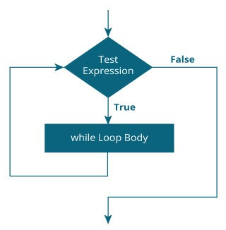

## While Loop in C
The while loop in C language is used to execute a block of code several times until the given condition is true.

- The while loop is mainly used to perform repetitive tasks. Unlike for loop, it doesn’t contains any initialization and update statements.
- It is a most basic loop in C programming. While loop has one control condition, and executes as long the condition is true.
- It is an entry-controlled loop. In while loop, a condition is evaluated before processing a body of the loop.
## Flow Diagram
- The flow diagram of while loop statement is given below-

- While loop evaluate the condition expression. If the value of condition expression is true then code block of while loop(statements inside {} braces) will be executed otherwise the loop will be terminated.
- While loop iteration continues unless condition expression becomes false or while look gets terminated using break statement.
~~~js
Syntax
The general form of while is as shown below:

initialize loop counter;
while (condition)
    {
    Statement-1;
    Statement-1;
    Increment/decrement loop counter;
    }
~~~
- The condition expression is evaluated before code block of while loop.
- It is a Boolean expression which decides whether to go inside the loop or terminate while loop.
- If condition expression evaluates to true, the code block inside while loop gets executed otherwise it will terminate while loop and control goes to the next statement after the while loop.
- While loop can contain any number of statements including zero statements.
## Important Note for While Loop

- The condition being tested may use relational or logical operators as shown in the following examples:
~~~js
while ( i <= 10 )
while ( i >= 10 && j <= 15 )
while ( j > 10 &&( b < 15 || c < 20 ) )
~~~
- The statements within the loop may be a single line or a block of statement.
- The while must test a condition that will eventually become false, otherwise the loop would be executed forever, indefinitely.
~~~js
main( )
    {
    int i = 1 ;
    while (i <= 10 )
        printf ( "%d\n", i ) ;
    }
~~~
- Instead of incrementing a loop counter, we can even decrement it and still manage to get the body of the loop executed repeatedly.
~~~js
main( )
    {
    int i = 5 ;
        while (i>0){
        printf ("\nMake the computer literate!" ) ;
        i = i - 1 ;
        }
    }
~~~js

- It is not necessary that a loop counter must only be an int. It can even be a float.
- Even floating point loop counters can be decremented. Once again the increment and decrement could be by any value, not necessarily 1.
## The Infinite while Loop
- We can also make a while loop infinite by putting 1 in the expression field, like this:
~~~js
while (1) {
    statement1;
    statement2;
    }
~~~
- Because the expression always returns 1, the statements inside the statement block will be executed over and over— that is, the while loop will continue forever.
- Of course, you can set certain conditions inside the while loop to break the infinite loop as soon as the conditions are met.
- The C language provides some statements, such as if and break statements, that you can use to set conditions and break the infinite while loop if needed.
### Example-1: Write a C program to print “welcome to while loop” in 5 times using while loop.
~~~js
//Write a C program to print "welcome to while loop" in 5 times using while loop.
#include<stdio.h>
int main ()
    {
    int n = 1;
    while( n <= 5 )
        {
        printf("welcome to while loop\n");
        n++;
        }
    return 0;
    }
~~~
~~~
Output:
welcome to while loop
welcome to while loop
welcome to while loop
welcome to while loop
welcome to while loop
~~~
### Example-2: Write a C program to print 1-10 using while loop.
~~~js
//Write a C program to print 1-10 using while loop.
#include<stdio.h>
int main()
    {
    int i=1;
    while(i<=10)
        {
        printf("%d \t",i);
        i++;
        }
    return 0;
    }
~~~
~~~
Output:
1 2 3 4 5 6 7 8 9 10
~~~
### Example-3: Write a C program to print 2 4 6 8……100 using while loop.
~~~js
//Write a C program to print 2 4 6 8......100 using while loop.
#include<stdio.h>
int main()
    {
    int i = 1;
    while(i <= 100)
        {
        if(i % 2 == 0)
            {
            printf("%d ", i);
            }
        i++;
        }
    return 0;
    }
~~~
~~~
Output:
2 4 6 8 ...........100
~~~