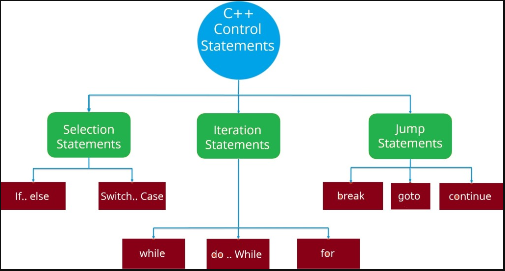
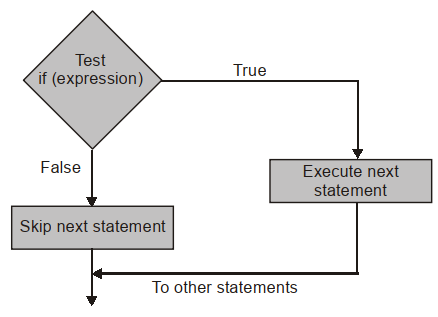
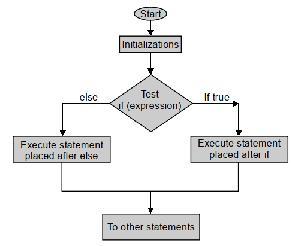

## If- Else Statement in C++
A program is usually not limited to a linear sequence of instructions. During its process it may bifurcate, repeat code or take decisions. For that purpose, C++ provides control structures that serve to specify what has to be done by our program, when and under which circumstances.

- With the introduction of control structures we are going to have to introduce a new concept: the compound-statement or block.
- A block is a group of statements which are separated by semicolons (;) like all C++ statements, but grouped together in a block enclosed in braces: { }:
- A statement can be either a simple statement (a simple instruction ending with a semicolon) or a compound statement (several instructions grouped in a block).
- In C++ three conditional expressions are provided. These are (i) if, (ii) if …. else and (iii) switch .
- The if condition gives the option of single choice, i.e. if the conditional expression is true the statement following the condition is carried out.
- If the condition is false the following statement is discarded and program goes to next statement.
- In if …. else there are two choices. One choice is with if and the second choice is with else.
- If the conditional expression is true the statement following if is carried out otherwise the statement following else is carried out.
- In switch condition more than two choices are generally provided. There is no limit to the number of choices.
- Each switch condition may have its own choice condition. Similar results may also be obtained by using a chain of if …. else statements. All these are explained below.
## If Statement
- We often say like this “if you get marks equal to 50% or more than 50% you can get admission in the course”.
- Another similar statement would be “If you know programming with C++ you are eligible for this job.”
- A close examination of above expressions shows that the first part of the sentence is the condition prefixed with if , i.e. if this happens or if it is true then the second statement will follow.
- In case, the condition is not true the following statement is discarded and program proceeds to next statement.
- In a program it is written as given below.
~~~
if (conditional expression )
statement;
~~~
- The first line of code is the condition.
- If the expression in the parentheses is true, the statement following the expression would be carried out, otherwise the statement would be ignored and the program would proceed further.
## Flow Diagram
The flow diagram of if statement is given below-

- Above figure illustrates the execution of if condition.
- You would also note that the conditional expression is put in brackets and there is no semicolon at the end of line, while the following statement ends with semicolon.
- The condition mentioned above has been used in the following program in which the user is asked to enter the marks obtained by him / her.
- If marks are more than or qual to 50%, the next line of the program will be executed, i.e. it will be displayed on the monitor.
If the expression is not true nothing is displayed on monitor.
### Example-1: Write a C++ program to enter a marks and check weather candidate eligible or not for admission. (Minimum marks 50 for admission.
~~~js
//Write a C++ program to enter a marks and check weather candidate eligible or not for admission. (Minimum marks 50 for admission.
#include<iostream>
using namespace std;
int main()
        {
        int Marks;
        cout<<“Write your marks: ”;
        cin>>Marks;
        if (Marks >= 50) // conditional expression
        cout << “You are eligible for admission.”<< endl;
        return 0;
        }
~~~
~~~
Output:
Write your marks: 60
You are eligible for admission.
~~~
### Example-2: Write a C++ program to illustrate multiple if statement.
~~~js
// Write a C++ program to illustrate multiple if statement.
#include<iostream>
using namespace std;
int main()
        {
        int n , m ,p;
        cout<<“Enter three integers.”;
        cin>>m>>n>>p;
        if(n == m) // If n is equal to m Display the following.
        cout<<“n and m are equal”<<endl;
        if(m !=n) // If m is not equal to n, display the following
        cout << “n and m are not equal. ”<<endl;
        if (m >=p) // If m is greater than or equal to p.
        cout <<“m is greater than p”<<endl;
        if ( p>=m)
        cout<< “p is greater than m.”<<endl;
        return 0;
        }
~~~
~~~
Output:
Enter three integers.30 30 40
n and m are equal
p is greater than m.
~~~
## If -Else Statement

- In many of the real life situations two or more options are available.

- Single if…else condition may be used when there are two choices and a chain of if …else expressions may be used for more than two choices.
- The code for two choices ( if …else) may be written as below.

~~~
if (expression)
statement1 ;
else
statement2 ;
~~~
## Flow Diagram
- The execution of an if … else expression is illustrated in the following-

### Example-3: Write a C++ program to illustrate if-else statement.
~~~js
//Write a C++ program to illustrate if-else statement.
#include<iostream>
using namespace std;
int main()
{
        int Marks;
        cout<<“Write your marks: ”;
        cin>>Marks;
        if (Marks>= 50) // conditional statement
        cout << “You are eligible admission.”<< endl;
        else
        cout << “You are not eligible for admission.” <<endl;
        return 0;
        }
~~~
~~~
Output:
Write your marks: 46
You are not eligible for admission.
~~~
### Example-4: Write a C++ program to Illustrates the test for divisibility for integers using if-else statement.
~~~js
//Write a C++ program to Illustrates the test for divisibility for integers using if-else statement.
#include<iostream>
using namespace std ;
int main()
        {
        int n, m ;
        cout << “Enter two integer numbers: ” ;
        cin>>n >>m ;
        if (n % m)
        cout<<“Number”<<n<< “ is not divisible by”<<m<else
        cout<< “Number “<<n<<“ is divisible by ”<< m<return 0 ;
        }
~~~
~~~
Output:
Enter two integer numbers: 66 3
Number 66 is divisible by 3
~~~
## Conditional Operator
- If there are two options to choose from, the conditional selection operator ( ? : ) may be used in place of if … else .

- The code is quite compact and convenient.
- It is illustrated below.
~~~
condition ? statement1 : statement2
~~~
- The above code means that if the condition evaluates true then statement1 will be carried out, otherwise the statement2 will be carried out.
- Note that the two statements are separated by colon (:). Suppose you give the name ‘max’ to the greater of the two numbers m and n, then for selecting the greater of the two the code may be written as below.
~~~
m>n ? max = m : max = n ;
~~~
- That is if (m>n) is true then the greater of the two numbers is m or max = m and if it is not true then the greater of the two is n or max = n.
### Example-5: Write a C++ program to Illustrates conditional selection operator.
~~~js
//Write a C++ program to Illustrates conditional selection operator.
#include<iostream>
using namespace std;
int main()
        {
        int A, B, C, D ,max, Max;
        cout<< “Write four whole numbers : “ ;
        cin>>A>>B>>C>>D ;
        cout<<“Maximum of first two numbers = “ << (A > B ? A:B) << endl;
        max = ((A > B ? A : B) > C ? (A > B ? A : B) : C);
        cout <<“Maximum of first three numbers =” << max << endl;
        Max = ((A> B ?A : B) > (C>D ? C:D)?(A>B ? A:B):(C>D ? C:D ));
        cout<< “Maximum of four numbers = “ << Max << endl;
        return 0;
        }
~~~
~~~
Output:
Write four whole numbers : 60 45 90 10
Maximum of first two numbers = 60
Maximum of first three numbers =90
Maximum of four numbers = 90
~~~
### Example-6: Write a C++ program to illustrates a choice between two functions using conditional operator.
~~~js
// Write a C++ program to illustrates a choice between two functions using conditional operator.
#include<iostream>
using namespace std ;
void MS1 ()
        {
        cout<<“I will be the first.\n”;
        }
        void MS2 ()
        {
        cout<<“You will be the first.\n”;
        }
int main()
        {
        int mymarks,yourmarks;
        cout<<“Write mymarks and yourmarks ”;
        cin>>mymarks >>yourmarks;
        mymarks>yourmarks ? MS1(): MS2() ;
        return 0 ;
        }
~~~
~~~
Output:
Write mymarks and youmarks 92 88
I will be the first.
~~~
### Example-7: Write a C++ program to illustrates if else chain.
~~~js
// Write a C++ program to illustrates if else chain.
#include<iostream>
using namespace std;
int main()
        {
        int m ;
        cout<<“Name the day which is day number ”;
        cin>>m ;
        if (m == 1)
        cout<<“It is Monday”<<endl;
        else if (m == 2)
        cout<<“It is Tuesday”<<endl;
        else if (m == 3)
        cout<<“It is Wednesday”<<endl;
        else if (m == 4)
        cout<<“It is Thursday”<<endl;
        else if (m == 5)
        cout<<“It is Friday”<<endl;
        else if (m == 6)
        cout<<“It is Saturday”<<endl;
        else
        cout<<“It is Sunday”<<endl;
        return 0;
        }
~~~
~~~
Output:
Name the day which is day number 4
It is Thursday
~~~
### Example-7: Write a C++ program to illustrates grade according to marks using if else chain.
~~~js
// Write a C++ program to illustrates grade according to marks using if else chain.
#include<iostream>
using namespace std;
int main()
        {
        int Marks;
        cout << “Enter the marks: ”;
        cin>>Marks ;
        if (Marks >= 90)
        cout<<“Excellent, keep it up”;
        else if (Marks >= 80 )
        cout<<“Congratulations, you have got A grade.”<<endl;
        else if (Marks >= 60 )
        cout<<“Very good, You have secured first class. ”<<endl;
        else if (Marks >= 40 )
        cout<< “You have passed. You need to work hard.”<<endl; /* The program will fail if the order in which the statements are written above is altered.*/
        return 0;
        }
~~~
~~~
Output:
Enter the marks: 75
Very good, You have secured first class.
~~~
