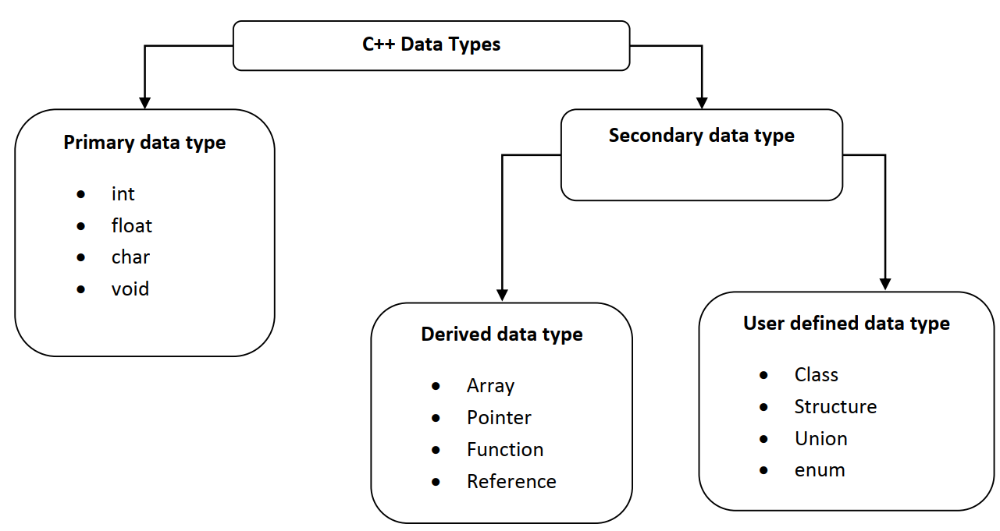
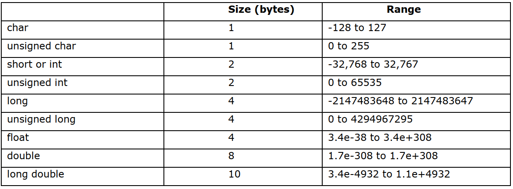

## Data Types in C++
Data types in C++ refer to an extensive system used for declaring variables or functions of different types. The type of a variable determines how much space it occupies in storage and how the bit pattern stored is interpreted.

- When computer programs store data in variables, each variable must be assigned a specific data type.
- Some common data types include integers, floating point numbers, characters, strings, and arrays.
- They may also be more specific types, such as dates, timestamps, boolean values, and varchar (variable character) formats.
- Some programming languages require the programmer to define the data type of a variable before assigning it a value.
- Other languages can automatically assign a variable’s data type when the initial data is entered into the variable.
- C++ divide data types into three parts
   - Primary data type
   - Derived data type
   - User defined data type

## Primary/Inbuilt Data types
- The primary data type of C++ is as follow (data type size vary to processor to processor). The size of data types may not the same in 32 bit processor with the 64bit processor-

## Derived Data types
- We cannot use the derived data type without use of primary data type. The Derived data types are Arrays, Function, and Pointers.
- Array: An array is a fixed-size sequenced collection of elements of the same data type
- Pointer: Pointer is a special variable which contains address of another variable.
- Function: A Group of statements combined in one block for some special purpose.

## User Defined Data types
- We have following type of user defined data type in C++ language.
- The user defined data type is defined by programmer as per his/her requirement.
- Structure: Structure is a collection of logically related data items of different data types grouped together and known by a single name.
- Union: Union is like a structure, except that each element shares the common memory.
- Class: A class is a template that specifies the fields and methods of things or objects. A class is a prototype from which objects are created.
- enum: Enum is a user-defined type consisting of a set of named constants called enumerator.
- In other words enum is also used to assign numeric constants to strings
~~~
Syntax of enumeration: enum enum_tag {list of variables};
Example of enumeration: enum day-of-week {mon=1,tue,wed,thu,fri,sat,sun};
~~~
### Example-1: Write a C++ program to illustrate the the size of each datatypes using sizeof() function.
~~~js
// Write a C++ program to illustrate the the size of each datatypes using sizeof() function.
#include<iostream>
using namespace std;
//The program finds the memory allocated for different data types
int main()
    {
    cout<<"Number of bytes reserved for following types."<<endl;
    cout<<" For character : \t" <<sizeof(char)<<"\n";
    cout<<" For signed character : \t"<<sizeof(signed char)<<"\n";
    cout<<" For wide character : \t"<cout<<" For integer : \t"<<sizeof(int)<<"\n";
    cout<<" For short : \t"<<sizeof(short)<<"\n";
    cout<<" For long : \t"<<sizeof(long)<<"\n";
    cout<<" For float : \t"<<sizeof(float)<<"\n";
    cout<<" For double : \t"<<sizeof(double)<<"\n";
    cout<<" For long double : \t"<<sizeof(long double)<<"\n";
    cout<<" For unsigned short : \t"<<sizeof(short unsigned)<<"\n";
    cout<<" For unsigned integer : \t"<<sizeof(int unsigned)<<"\n";
    cout<<" For unsigned long : \t"<<sizeof(long unsigned)<<"\n";
    }
~~~
~~~
Output:
Number of bytes reserved for following types.
For character : 1
For signed character : 1
For wide character : 2
For integer : 4
For short : 2
For long : 4
For float : 4
For double : 8
For long double : 12
For unsigned short : 2
For unsigned integer : 4
For unsigned long : 4
~~~

### Example-2:Write a C++ program to Illustrates use of variables of type char
~~~js
//Write a C++ program to Illustrates use of variables of type char
#include<iostream>
using namespace std;
int main()
    {
    char ch1,ch2,ch3, ch4, ch5 ,ch6,ch7,ch8;
    ch1= 'A'; //The value of character A in ASCII code is 65.
    ch2 = 'z'; // Value of ‘z’ in ASCII code is 122.
    ch3 = ch2;
    ch4 = ch2 - '9'; // here ‘9’ is character and not number 9.
    ch5 = ')'*2;
    ch6 = ch1 + 10; //’A’=65,so 65 +10 = 85 =’K’
    ch7 = ch2 % ch1; /* This operation gives remainder of
    122/65 which is 57= ‘9’ */
    ch8 = '9'*2; // ‘9’ = 57 on ASCII code so 57 × 2 = 114 = ‘r’
    cout<<" ch3 = "<cout<<" ch6 = "<<ch6<< "\tch7 = "<<ch7<<"\tch8 = "<<ch8<<endl;
    return 0;
    }
~~~
~~~
Output:
ch3 = z ch4 = A ch5 = R
ch6 = K ch7 = 9 ch8 = r
~~~

### Example-3: Write a C++ program to illustrates declaration of different types of variables.
~~~js
//Write a C++ program to illustrates declaration of different types of variables.
#include<iostream>
using namespace std;
int main ()
    {
    int Dia = 10 ; // variable Dia stand for diameter.
    double PI = 3.14159265358979323;
    float pi = 3.14159265;
    double Area_circle = PI* Dia*Dia / 4;
    cout<<"PI = "<<PI<<"\t pi = "<<pi<<endl;
    char ch = 'S'; // ch is the name of a variable with value ‘S’
    cout << "ch = " << ch <<endl;
    cout<< "Area_circle = " << Area_circle<< endl;
    int m, n, p; // m, n, p are names of variables of type int
    m = 4; // 4 is value of m
    n = 3;
    p = m*m + n*n ;
    cout <<"p = "<
    return 0;
    }
~~~
~~~
Output:
PI = 3.14159 pi = 3.14159
ch = S
Area_circle = 78.5398
p = 25
~~~
