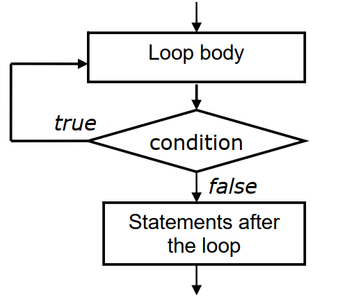

## Do-While Loop In C++
This is exit-controlled loop statement in which the condition of the loop statement is written at the end of the loop. It takes the following general form:
~~~js
do
    {
    //loop statements or loop body
    }
while(condition);
~~~
- Here, when the program control is reached at do statement the loop body or the statements inside the loop are executed first.
- Then at the end the condition is the ‘while’ is checked.
- If it is true, then program control again transfers to execute the loop statements.
- This process continues until the condition becomes false.
- In short, we can say that the loop statements are executed at least once without checking condition for its trueness.
## Flow Diagram
- The flow diagram of do while loop statement is given below-

### Example-1: Write a C++ program to print 1 2 3 4 ..30 using do while loop statement.
~~~js
// Write a C++ program to print 1 2 3 4 ..30 using do while loop statement.
#include<iostream>
using namespace std;
void main()
    {
    int num = 1;
    do
        {
        printf(“\n%d”,num);
        num++;
        }
    while(num<=30);
    }
~~~
~~~
Output:
1 2 3 4 ..........30

~~~
### Example-2: Write a C++ program to illustrate do while loop statement.
~~~js
//Write a C++ program to illustrate do while loop statement.
#include<iostream>
using namespace std;
void main()
    {
    int x =0,i =0 , y;
    cout<<“i\tx\ty” <<endl;
    do // start of do – – while loop
        {
        x =2*i;
        y = x*x;
        cout <<“”<<i<< “\t”<i++;
        }
    while ( i<=3 ); //Test condition of do –– while loop
    }
~~~
~~~
Output:
i x y
0 0 0
1 2 4
2 4 16
3 6 36
~~~
### Example-3: Write a C++ program to Illustrates calculation of factorial numbers with do—while loop.
~~~js
//Write a C++ program to Illustrates calculation of factorial numbers with do---while loop.
#include<iostream>
using namespace std;
    int main()
    {
    int x =0,i=0,factorial=1, limit = 500;
    cout<<“i”<<“\tx”<<“\t” << “Factorial x” <<endl;
    do
    {
        i =i+1;
        x +=1;
        factorial *= x;
        cout <<i<<“\t”<
    }
    while (factorialreturn 0;
    }
~~~
~~~
Output:
i x Factorial x
1 1 1
2 2 2
3 3 6
4 4 24
5 5 120
6 6 720
~~~
### Example-4: Write a C++ program to  Illustrates use of exit(0) to terminate the endless loop and the program.
~~~js
//Write a C++ program to  Illustrates use of exit(0) to terminate the endless loop and the program.
#include<iostream>
using namespace std;
int main( )
    {
    cout<<“i\tx\ty” <<endl;
    int x =0,i=0 ,y;
    while (true) // Endless while loop
        {
        x = i*i ;
        y = x*x;
        if (y>300)
        exit(0); // 0 or any integer value can be argument
        cout <<i<<“\t”<<x<<“\t”<< y<<endl;
        i++;
        }
    return 0;
    }
~~~
~~~
Output:
i x y
0 0 0
1 1 1
2 4 16
3 9 81
4 16 256
~~~
### Example-5: Write a C++ program to  illustrates endless while loop with break statement.
~~~js
//Write a C++ program to  illustrates endless while loop with break statement.
#include<iostream>
using namespace std;
int main()
    {
    int x =0,i =1,y;
    cout<<“i”<<“\tx”<<“\t” << “y” <<endl;
    while (true) //Endless loop
        {
        x +=i;
        y = x*x ;
        cout <<i<<“\t”<  i++;
        if(i>= 6)
        break; // break statement
        }
    return 0;
    }
~~~
~~~
Output:
i x y
1 1 1
2 3 9
3 6 36
4 10 100
5 15 225
~~~
