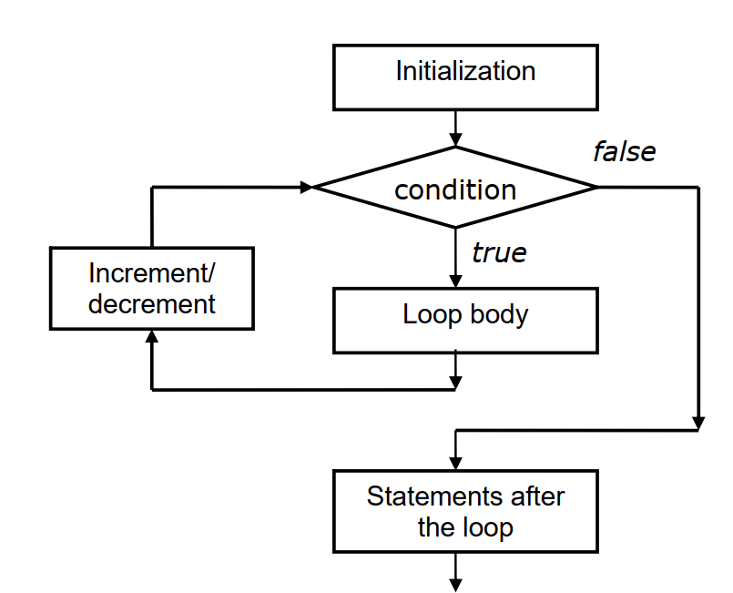

## For Loop Statement in C++
The ‘for loop is an entry controlled loop structure which provides more concise loop structure. It following general form:
~~~js
for(initialization ; condition ; increment/decrement)
    {
    //loop statements or loop body
    }
~~~
## The execution of ‘for’ loop statement takes as follows:

- Initialization of loop control variables is done first using assignment operators such as: i = 1 or count = 0 etc. Remember this part is executed only once.
- The condition given afterwards is checked then. If this condition is true, the statements inside the loop are executed. Else program control will get transferred nest statement after the loop.
- The condition can be combination of relational as well as logical operators such as: count < 10
- When the body of the loop is executed, program control will get transferred back to ‘for’ statement for executing the third statement that is, ‘increment/decrement’.
- In this part the loop control variable’s value is incremented or decremented. Then program controls the condition again to check whether it is true or not.
- If true, the loop body executed again. And the process is continued again until the condition evaluates to false.
## Flow Diagram
- The flow diagram of for loop is given below-

### Example-1: Write a C++ program to illustrates for loop for sum of numbers from 1 to 10.
~~~js
//Write a C++ program to illustrates for loop for sum of numbers from 1 to 10.
#include<iostream>
using namespace std;
main()
    {
    int n = 10;
    sum=0 ;
    for (int i=0;i<=n; i++) // beginning of loop statement
        sum += i; // end of loop statements
        cout<<“sum = ”<<sum<<endl;
    return 0;
    }
~~~
~~~
Output:
sum = 55
~~~
### Example-2: Write a C++ program to Illustrates an endless for loop.
~~~js
//Write a C++ program to Illustrates an endless for loop.
#include<iostream>
using namespace std;
int main()
    {
    int i =0,sum=0 ;
    for(;;) //endless for loop
        {
        sum += i;
        if (sum >25) break; // break included to end the loop.
        cout<<“i= ”<<i<<“ sum = ” <<sum<<endl;
        i++;
        }
    return 0;
    }
~~~
~~~
Output:
i= 0 sum = 0
i= 1 sum = 1
i= 2 sum = 3
i= 3 sum = 6
i= 4 sum = 10
i= 5 sum = 15
i= 6 sum = 21
~~~
### Example-3: Write a C++ program to  Illustrates compound condition in for (expression).
~~~js
//Write a C++ program to  Illustrates compound condition in for (expression).
#include<iostream>
using namespace std;
int main()
    {
    int n, m ;
    for (n=2,m=0;n<=8,m<=3 ;n++,m++)
        cout<<“n = “<<n<<“, m = “<<m<<“, product = “ <<n*m<<endl;
    return 0;
    }
~~~
~~~
Output:
n = 2, m = 0, product = 0
n = 3, m = 1, product = 3
n = 4, m = 2, product = 8
n = 5, m = 3, product = 15
~~~
### Example-4: Write a C++ program to  Illustrates compound condition in for (expression).
~~~js
//Write a C++ program to  Illustrates compound condition in for (expression).
#include<iostream>
using namespace std;
int main()
    {
    int Product;
    for (int i=0,j=0; i<= 4 &&j <= 16; i++, j= j+2)
        {
        Product = i*j;
        cout<<“ i = ”<<i<< “\tj = ”<<endl;
            return 0;
        }
    }
~~~
~~~
Output:
i = 0 j = 0 Product = 0
i = 1 j = 2 Product = 2
i = 2 j = 4 Product = 8
i = 3 j = 6 Product = 18
i = 4 j = 8 Product = 32
~~~
### Example-5: Write a C++ program to  Illustrates nested for loops.
~~~js
#include<iostream>
using namespace std;
int main()
    {
    int n, m ;
    for (n=1;n<=3;n++)
      for(m=1; m<=2; m++)
        {
        cout<<setw(5);
        cout<<“n = “<< n<<“ m= “<<endl;
        }
    return 0;
    }
~~~
~~~
Output:
n = 1 m= 1 product = 1
n = 1 m= 2 product = 2
n = 2 m= 1 product = 2
n = 2 m= 2 product = 4
n = 3 m= 1 product = 3
n = 3 m= 2 product = 6
~~~

