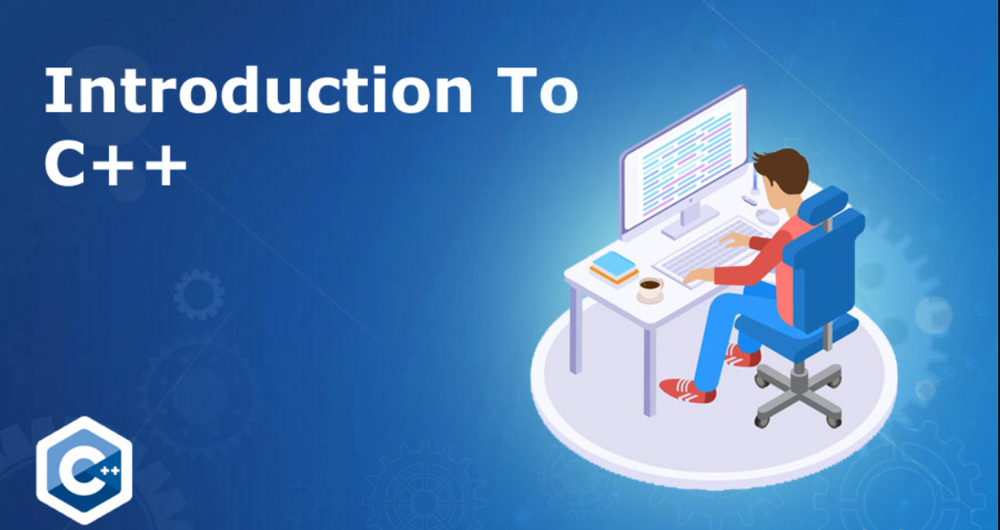
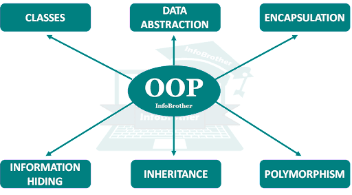

## Introduction to C++ Programming Language

C++ is an object-oriented programming language. It was developed by Bjarne Stroustrup at AT&T Bell Laboratories in Murray Hill, New Jersey, USA, in the early 1980’s.

## History of C++

- Stroustrup, an admirer of Simula67 and a strong supporter of C, wanted to combine the best of both the languages and create a more powerful language that could support object-oriented programming features and still retain the power and elegance of C.
- The result was C++.
- Therefore, C++ is an extension of C with a major addition of the class construct feature of Simula67.
- Since the class was a major addition to the original C language, Stroustrup initially called the new language ‘C with classes’.
- However, later in 1983, the name was changed to C++.
- The idea of C++ comes from the C increment operator ++, thereby suggesting that C++ is an augmented version of C.
- C+ + is a superset of C. Almost all c programs are also C++ programs.
- However, there are a few minor differences that will prevent a c program to run under C++ complier.
- The most important facilities that C++ adds on to C care classes, inheritance, function overloading and operator overloading.
- These features enable creating of abstract data types, inherit properties from existing data types and support polymorphism, thereby making C++ a truly object-oriented language.
## Features of C++
- Some of the features & key-points to note about the C++ programming language are as follows:
## Object-Oriented Programming
- C++ is object oriented programming language. OOPs makes development and maintenance easier where as in Procedure-oriented programming language it is not easy to manage if code grows as project size grows. The OOP concepts are:

## Data Abstraction

- Just represent essential features without including the background details.
- They encapsulate all the essential properties of the objects that are to be created.
- The attributes are sometimes called ‘Data members’ because they hold information.
- The functions that operate on these data are sometimes called ‘methods’ or ‘member functions’.
- It is used to implement in class to provide data security.
## Encapsulation

- Wrapping up of a data and functions into single unit is known as encapsulation.
- In C++ the data is not accessible to the outside world.
- Only those functions can access it which is wrapped together within single unit.
## Inheritance

- Inheritance is the process, by which class can acquire the properties and methods of another class
- The mechanism of deriving a new class from an old class is called inheritance.
- The new class is called derived class and old class is called base class.
- The derived class may have all the features of the base class.
- Programmer can add new features to the derived class.
- For example, Student is a base class and Result is derived class.’
## Polymorphism

- A Greek word Polymorphism means the ability to take more than one form.
- Polymorphism allows a single name to be used for more than one related purpose.
- The concept of polymorphism is characterized by the idea of ‘one interface, multiple methods’,
- That means using a generic interface for a group of related activities.
- The advantage of polymorphism is that it helps to reduce complexity by allowing one interface to specify a general class of action’. It is the compiler’s job to select the specific action as it applies to each situation.
- It means ability of operators and functions to act differently in different situations.

## Static Binding

- Static Binding defines the properties of the variables at compile time.
- Therefore they can’t be changed.
## Dynamic Binding

- Dynamic Binding means linking of procedure call to the code to be executed in response to the call.
- It is also known as late binding, because It will not bind the code until the time of call at run time.
- In other words properties of the variables are determined at runtimes.
- It is associated with polymorphism and inheritance.
## Platform Dependent
- Platform dependent language means the language in which programs can be executed only on that operating system where it is developed & compiled.
- It cannot run or execute it on any other operating system.
## High-level programming language
- It is important to note that C++ is a high-level programming language, unlike C which is a mid-level programming language.
- It makes it easier for the user to work in C++ as a high-level language as we can closely associate it with the human-comprehensible language, that is, English.
## Powerful & Fast
- C++ is a fast language as compilation and execution time is less.
- Also, it has a wide variety of data types,  functions & operators.
## Pointers
- Pointers are variables that store the address of another variable.
- Pointer points to the memory location of a variable. C++ supports pointer and provides solutions to lots of problems that demand access to memory location.
## Compiler based
- C++ is a compiler-based programming language.
- Without compilation, no C++ program can be executed.
- The compiler first compiles the C++ program and then it is executed.
## Popular
- After learning C, it is the base language for many other popular programming languages which supports the feature of object-oriented programming.
- Bjarne Stroustrup found Simula 67, the first object-oriented language ever, lacking simulations and decided to develop C++.
## Case sensitive
- Just like C, it is pretty clear that the C++ programming language treats the uppercase and lowercase characters in a different manner.
- For instance, the meaning of the keyword ‘cout’ changes if we write it as ‘Cout’ or “COUT”. Other programming languages like HTML and MySQL are not case sensitive.
## Application of C++
- C++ has now emerged as one of the most advanced and most popular computer language developed so far and has highest diversity in its applications.
- C++ is a versatile language for handling very large programs; it is suitable for virtually any programming task including development of editors, compilers, databases, communication systems and any complex real life applications systems.
- Since C++ allow us to create hierarchy related objects, we can build special object-oriented libraries which can be used later by many programmers.
- While C++ is able to map the real-world problem properly, the C part of C++ gives the language the ability to get closed to the machine-level details.
- C++ programs are easily maintainable and expandable. When a new feature needs to be implemented, it is very easy to add to the existing structure of an object.
- It is expected that C++ will replace C as a general-purpose language in the near future.
## A Partial List of Field of Applications of C+

- Operating Systems and component in windows XP and other OS components.
- Software for e-commerce.
- Customer service software such as electronic ticketing, car and flight reservations, etc.
- Telecommunication services.
- Real time control applications.
- 2-D and 3-D animations and games.
- Multiprocessor multimedia software.
- Portable set up box and digital TV software.
- CAD software.
- Software for medical instruments and systems.
- Java virtual machine (JVM).
- Telephones services.
- Mobile phones billing systems and other infrastructural facilities.
- Irrigation control systems.
- Speech recognition and dictation systems.

