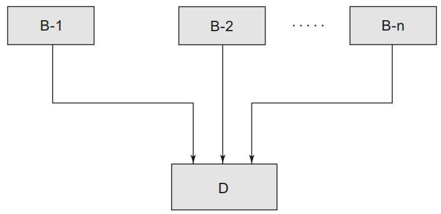

## Multiple Inheritance in C++
A class can inherit the attributes of two or more classes. This is known as multiple inheritance. Multiple inheritance allows us to combine the features of several existing classes as a starting point for defining new classes. It is like a child inheriting the physical features of one parent and the intelligence of another.

The syntax of a derived class with multiple base classes is as follows:
~~~js
class D: visibility B-1, visibility B-2 ...
    {
    .....
    ..... (Body of D)
    .....
    };
~~~
- Where, visibility may be either public or private. The base classes are separated by commas.
### Example-1: Write a C++ program to illustrate multiple inheritance.
~~~js
//Write a C++ program to illustrate multiple inheritance.
#include <iostream>
using namespace std;
class M
    {
    protected:
    int m;
    public:
    void get_m(int);
    };
class N
    {
    protected:
    int n;
    public:
    void get_n(int);
    };
class P : public M, public N
    {
    public:
    void display(void);
    };
void M :: get_m(int x)
    {
    m = x;
    }
void N :: get_n(int y)
    {
    n = y;
    }
void P :: display(void)
    {
    cout << "m = " << m << "\n";
    cout << "n = " << n << "\n";
    cout << "m*n = " << m*n << "\n";
    }
int main()
    {
    P p;
    p.get_m(10);
    p.get_n(20);
    p.display();
    return 0;
    }
~~~
~~~
Output:
m = 10
n = 20
m*n = 200
~~~
## Ambiguity Resolution in Inheritance

- Occasionally, we may face a problem in using the multiple inheritance, when a function with the same name appears in more than one base class.
- Consider the following two classes.
~~~js
class M
    {
    public:
    void display(void)
    {
    cout << “Class M\n”;
    }
    };
class N
    {
    public:
    void display(void)
        {
        cout << “Class N\n”;
        }
    };
~~~

- Which display() function is used by the derived class when we inherit these two classes?
- We can solve this problem by defining a named instance within the derived class, using the class resolution operator with the function
### Example-2: Write a C++ program to illustrate multiple inheritance with ambiguity resolution.
~~~js
//Write a C++ program to illustrate multiple inheritance.
#include <iostream>
using namespace std;
class M
    {
    public:
    void display(void)
        {
        cout << "Class M\n";
        }
    };
class N
{
public:
void display(void)
    {
    cout << "Class N\n";
    }
};

class P: public M,public N{

    };
int main()
    {
    P p;
    p.M::display();
    p.N::display();
    return 0;
    }
~~~
~~~
Output:
Class M
Class N
~~~
### Example-3: Write a C++ program to illustrate another example of multiple inheritance with ambiguity resolution.
~~~js
//Write a C++ program to illustrate another example of multiple inheritance with ambiguity resolution.
#include <iostream>
using namespace std;
class A
    {
    protected :
    int num;
    public :
    void show( )
        {
        cout<<"show of A\n";
        cout<<"num of A="<<num<<endl;
        }
    };
class B
    {
    protected :
    int num;
    public :
    void show( )
        {
        cout<<"show of B\n";
        cout<<"num of B="<<num<<endl;
        }
    };
class C : public A, public B
    {
    int num;
    public :
    C( )
        {
        A :: num=20;
        B :: num=30;
        num=40;
        }
    void show( )
        {
        cout<<"Show of C"<<endl;
        cout<<"num of C="<<num<<endl;
        }
    };
int main( )
    {
    C o1;
    o1.A :: show( );
    o1.B :: show( );
    o1.show( );
    }
~~~
~~~
Output:
show of A
num of A=20
show of B
num of B=30
Show of C
num of C=40
~~~
## Hierarchical Inheritance
- This type of inheritance was explained in the earlier sections of this chapter. When number of classes have a direct access to one common class, then this type of inheritance is visible. The main base class can be modified alone if required and all derived classes will see that effect.

### Example-4: Write a C++ program to illustrate  example of hierarchical inheritance.
~~~js
//Write a C++ program to illustrate  example of hierarchical inheritance.
#include <iostream>
#include <string.h>
using namespace std;
class University
    {
    protected :
    char uname[40];
    public :
    University( )
        {
        strcpy(uname,"NMIMS University Mumbai");
        }
    };
class college1 :public University
    {
    char cname[50];
    public :
    college1( )
        {
        strcpy(cname, "MPSTME Shirpur Campus");
        }
    void show_college1( )
        {
        cout<<"College Name :="<<cname<<endl;
        cout<<"Affiliated to :="<<uname<<endl;
        }
    };
class college2 :public University
    {
    char cname [50];
    public :
    college2( )
        {
        strcpy(cname,"R C Patel");
        }
    void show_college2( )
        {
        cout<<"College Name ="<<cname<<endl;
        cout<<"Affiliated to :="<<uname <<endl;
        }
    };

int main( )
    {
    college1 c1;
    c1.show_college1( );
    college2 c2;
    c2.show_college2 ( );
    }
~~~
~~~
Output:
College Name :=MPSTME Shirpur Campus
Affiliated to :=NMIMS University Mumbai
College Name =R C Patel
Affiliated to :=NMIMS University Mumbai
~~~
